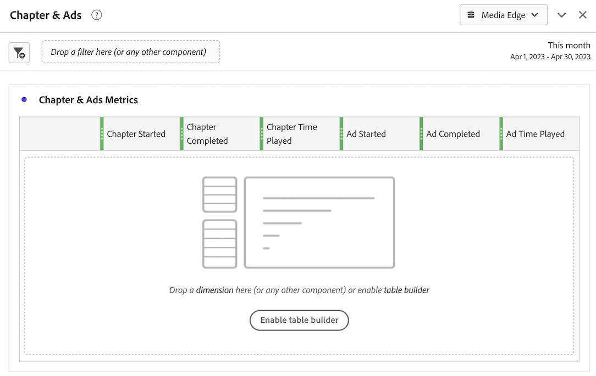

# Instale o Media Analytics com Experience Platform Edge

A Adobe Experience Platform Edge permite enviar dados destinados a vários produtos para um local centralizado. A Experience Edge encaminha as informações apropriadas para os produtos desejados. Esse conceito permite consolidar os esforços de implementação, especialmente abrangendo várias soluções de dados.

O gráfico a seguir ilustra como uma implementação do Media Analytics pode usar o Experience Platform Edge para disponibilizar dados no Analysis Workspace, no Adobe Analytics ou no Customer Journey Analytics:

Para obter uma visão geral de todas as opções de implementação, incluindo métodos de implementação que não usam o Experience Platform Edge, consulte [Implementar mídia de transmissão para Adobe Analytics ou Customer Journey Analytics](/help/implementation/overview.md).

Independentemente de você usar o SDK da Web da Adobe Experience Platform, o SDK móvel da Adobe Experience Platform, o SDK Roku da Adobe Experience Platform ou a API para implementar mídia de transmissão com o Experience Edge, primeiro é necessário concluir as seguintes seções:

## Configurar o esquema no Adobe Experience Platform

Para padronizar a coleta de dados para uso em aplicativos que utilizam a Adobe Experience Platform, a Adobe criou o padrão aberto e documentado publicamente, o Experience Data Model (XDM).

Para criar e configurar um esquema:

1. No Adobe Experience Platform, comece a criar o esquema conforme descrito em [Criar e editar esquemas na interface](https://experienceleague.adobe.com/docs/experience-platform/xdm/ui/resources/schemas.html?lang=en).

1. Na página Detalhes do esquema, ao criar o esquema, escolha [!UICONTROL **Evento de experiência**] ao escolher a classe base para o esquema.

   

1. Selecione [!UICONTROL **Próximo**].

1. Especifique um nome para exibição de esquema e uma descrição e selecione [!UICONTROL **Concluir**].

1. No [!UICONTROL **Composição**] área, no [!UICONTROL **Grupos de campos**] , selecione [!UICONTROL **Adicionar**], em seguida, pesquise e adicione os seguintes novos grupos de campos ao esquema:
   * `Adobe Analytics ExperienceEvent Template`
   * `Implementation Details`
   * `MediaAnalytics Interaction Details`

   Depois de adicionar os grupos de campos, eles devem ser exibidos no [!UICONTROL **Grupos de campos**] seção, como se segue:

   

1. Selecionar [!UICONTROL **Salvar**] para salvar as alterações.

1. (Opcional) Você pode ocultar determinados campos que não são usados pela API do Media Edge. Ocultar esses campos facilita a leitura e a compreensão do schema, mas não é obrigatório. Esses campos se referem apenas àqueles no `MediaAnalytics Interaction Details` fieldgroup.

+++ Expanda aqui para exibir instruções nos campos que você pode ocultar.

   1. No [!UICONTROL **Estrutura**] , selecione a `Media Collection Details` e selecione [!UICONTROL **Gerenciar campos relacionados**].

      

   1. Ative a opção para [!UICONTROL **Mostrar nomes de exibição para campos**], em seguida, atualize o esquema da seguinte maneira:

      * No `Media Collection Details` > `Advertising Details` oculte os seguintes campos de relatório: `Ad Completed`, `Ad Started`, e `Ad Time Played`.

      * No `Media Collection Details` > `Advertising Pod Details` oculte o seguinte campo de relatório: `Ad Break ID`

      * No `Media Collection Details` > `Chapter Details` oculte os seguintes campos de relatório: `Chapter Completed`, `Chapter ID`, `Chapter Started`, e `Chapter Time Played`.

      * No `Media Collection Details` oculte o `List Of States` campo.

        

      * No `Media Collection Details` > `List Of States End` e `Media Collection Details` > `List Of States Start` oculte os seguintes campos de relatório: `Player State Count`, `Player State Set`, e `Player State Time`.

        

      * No `Media Collection Details` > `Qoe Data Details` oculte os seguintes campos de relatório: `Average Bitrate`, `Average Bitrate Bucket`, `Bitrate Change Impacted Streams`, `Bitrate Changes`, `Buffer Impacted Streams`, `Buffer Events`, `Dropped Frame Impacted Streams`, `Drops Before Starts`, `Errors`, `External Error IDs`, `Error Impacted Streams`, `Media SDK Error IDs`, `Player SDK Error IDs`, `Stalling Impacted Streams`, `Stalling Events`, `Total Buffer Duration`, e `Total Stalling Duration`.

      * No `Media Collection Details` > `Session Details` oculte os seguintes campos de relatório: `10% Progress Marker`, `25% Progress Marker`, `50% Progress Marker`, `75% Progress Marker`, `95% Progress Marker`, `Ad Count`, `Average Minute Audience`, `Content Completes`, `Chapter Count`, `Content Starts`, `Content Time Spent`, `Estimated Streams`, `Federated Data`, `Media Segment Views`, `Media Downloaded Flag`, `Media Starts`, `Media Session ID`, `Media Session Server Timeout`, `Media Time Spent`, `Pause Events`, `Pause Impacted Streams`, `Pev3`, `Pccr`, `Total Pause Duration`, `Unique Time Played`, e `Video Segment`.

   1. Selecionar [!UICONTROL **Confirmar o**] para salvar as alterações.

   1. No [!UICONTROL **Estrutura**] , ative a opção para [!UICONTROL **Mostrar nomes de exibição para campos**], em seguida, selecione a `List Of Media Collection Downloaded Content Events` campo.

   1. Selecionar [!UICONTROL **Gerenciar campos relacionados**], em seguida, atualize o esquema da seguinte maneira:

      * No `List Of Media Collection Downloaded Content Events` > `Media Details` > `Advertising Details` oculte os seguintes campos de relatório: `Ad Completed`, `Ad Started`, e `Ad Time Played`.

      * No `List Of Media Collection Downloaded Content Events` > `Media Details` > `Advertising Pod Details` oculte o seguinte campo de relatório: `Ad Break ID`

      * No `List Of Media Collection Downloaded Content Events` > `Media Details` > `Chapter Details` oculte os seguintes campos de relatório: `Chapter Completed`, `Chapter ID`, `Chapter Started`, e `Chapter Time Played`.

      * No `List Of Media Collection Downloaded Content Events` > `Media Details` oculte o `List Of States` campo.

      * No `List Of Media Collection Downloaded Content Events` > `Media Details` > `List Of States End` e `Media Collection Details` > `List Of States Start` oculte os seguintes campos de relatório: `Player State Count`, `Player State Set`, e `Player State Time`.

      * No `List Of Media Collection Downloaded Content Events` > `Media Details` > `Qoe Data Details` oculte os seguintes campos de relatório: `Average Bitrate`, `Average Bitrate Bucket`, `Bitrate Change Impacted Streams`, `Bitrate Changes`, `Buffer Events`, `Buffer Impacted Streams`, `Drops Before Starts`, `Dropped Frame Impacted Streams`, `Error Impacted Streams`, `Errors`, `External Error IDs`, `Media SDK Error IDs`, `Player SDK Error IDs`, `Stalling Events`, `Stalling Impacted Streams`, `Total Buffer Duration`, e `Total Stalling Duration`.

      * No `List Of Media Collection Downloaded Content Events` > `Media Details` > `Session Details` oculte os seguintes campos de relatório: `10% Progress Marker`, `25% Progress Marker`, `50% Progress Marker`, `75% Progress Marker`, `95% Progress Marker`, `Ad Count`, `Average Minute Audience`, `Chapter Count`, `Content Completes`, `Content Starts`, `Content Time Spent`, `Estimated Streams`, `Federated Data`, `Media Downloaded Flag`, `Media Segment Views`, `Media Session ID`, `Media Session Server Timeout`, `Media Starts`, `Media Time Spent`, `Pause Events`, `Pause Impacted Streams`, `Pccr`, `Pev3`, `Total Pause Duration`, `Unique Time Played`, e `Video Segment`.

      * No `List Of Media Collection Downloaded Content Events` > `Media Details`  oculte o `Media Session ID` campo.

   1. Selecionar [!UICONTROL **Confirmar o**] para salvar as alterações.

   1. No [!UICONTROL **Estrutura**] , selecione a `Media Reporting Details` selecione [!UICONTROL **Gerenciar campos relacionados**].

   1. Ative a opção para [!UICONTROL **Mostrar nomes de exibição para campos**], em seguida, atualize o esquema da seguinte maneira:

      * No `Media Reporting Details` oculte os seguintes campos: `Error Details`, `List Of States End`, `List of States Start`, e `Media Session ID`.

   1. Selecionar [!UICONTROL **Confirmar o**] > [!UICONTROL **Salvar**]  para salvar as alterações.

1. Continuar com [Criar um conjunto de dados na Adobe Experience Platform](#create-a-dataset-in-adobe-experience-platform).

## Criar um conjunto de dados na Adobe Experience Platform

1. Certifique-se de configurar um esquema conforme descrito em [Configurar o esquema no Adobe Experience Platform](#set-up-the-schema-in-adobe-experience-platform).

1. No Adobe Experience Platform, comece a criar o conjunto de dados conforme descrito em [Guia da interface do usuário de conjuntos de dados](https://experienceleague.adobe.com/docs/experience-platform/catalog/datasets/user-guide.html?lang=pt-BR#create).

   Ao selecionar um esquema para seu conjunto de dados, escolha o esquema criado anteriormente, conforme descrito em [Configurar o esquema no Adobe Experience Platform](#set-up-the-schema-in-adobe-experience-platform).

1. Continuar com [Configurar um fluxo de dados no Customer Journey Analytics](#configure-a-datastream-in-adobe-experience-platform).

## Configurar um fluxo de dados no Adobe Experience Platform

1. Certifique-se de ter criado um conjunto de dados conforme descrito em [Criar um conjunto de dados na Adobe Experience Platform](#create-a-dataset-in-adobe-experience-platform).

1. Crie um novo fluxo de dados conforme descrito em [Configurar um fluxo de dados](https://experienceleague.adobe.com/docs/experience-platform/edge/datastreams/configure.html?lang=pt-BR).

   Ao criar o fluxo de dados, certifique-se de fazer as seguintes seleções de configuração:

   * No [!UICONTROL **Esquema de evento**] ao criar o fluxo de dados, certifique-se de selecionar o esquema criado no [Configurar o esquema no Adobe Experience Platform](#set-up-the-schema-in-adobe-experience-platform). Selecione [!UICONTROL **Salvar**].

     >[!IMPORTANT]
     >
         > Não selecionar [!UICONTROL **Salvar e adicionar mapeamento**] porque isso resultará em erros de mapeamento para o campo Timestamp.
     
     

   * Adicione um dos seguintes serviços ao fluxo de dados, dependendo se você estiver usando Adobe Analytics ou Customer Journey Analytics:

      * [!UICONTROL **Adobe Analytics**] (se estiver usando o Adobe Analytics)

        Se estiver usando o Adobe Analytics, defina um conjunto de relatórios, conforme descrito em [Criar um conjunto de relatórios](https://experienceleague.adobe.com/en/docs/analytics/admin/admin-tools/manage-report-suites/c-new-report-suite/t-create-a-report-suite).

      * [!UICONTROL **Adobe Experience Platform**] (se estiver usando o Customer Journey Analytics)

     Para obter informações sobre como adicionar um serviço a um fluxo de dados, consulte a seção &quot;Adicionar serviços a um fluxo de dados&quot; no [Configurar um fluxo de dados](https://experienceleague.adobe.com/docs/experience-platform/edge/datastreams/configure.html?lang=en#view-details).

     

   * Expandir [!UICONTROL **Opções avançadas**], em seguida, habilite o [!UICONTROL **Media Analytics**] opção.

     

1. Agora você está pronto para implementar o [API Media Edge](/help/implementation/edge/implementation-edge-api.md) ou [SDK do Media Edge](/help/implementation/edge/edge-mobile-sdk.md) para começar a coletar dados do media analytics.

   Depois de coletar alguns dados, você pode [Criar uma conexão no Customer Journey Analytics](#create-a-connection-in-customer-journey-analytics).

## Criar uma conexão no Customer Journey Analytics

>[!NOTE]
>
>O procedimento a seguir é necessário somente se estiver usando o Customer Journey Analytics.

1. Certifique-se de ter criado um fluxo de dados conforme descrito em [Configurar um fluxo de dados no Customer Journey Analytics](#configure-a-datastream-in-adobe-experience-platform).

1. No Customer Journey Analytics, crie uma conexão conforme descrito em [Criar uma conexão](https://experienceleague.adobe.com/docs/analytics-platform/using/cja-connections/create-connection.html?lang=pt-BR).

   Ao criar a conexão, as seguintes seleções de configuração são necessárias para implementar a Mídia de transmissão:

   1. Selecione o conjunto de dados criado anteriormente, conforme descrito em [Criar um conjunto de dados na Adobe Experience Platform](#create-a-dataset-in-adobe-experience-platform).

   1. Certifique-se de que o [!UICONTROL **Importar todos os novos dados**] está ativada.

1. Continuar com [Criar uma visualização de dados no Customer Journey Analytics](#create-a-new-data-view-in-customer-journey-analytics).

## Criar uma visualização de dados no Customer Journey Analytics

>[!NOTE]
>
>O procedimento a seguir é necessário somente se estiver usando o Customer Journey Analytics.

1. Certifique-se de ter criado uma conexão no Customer Journey Analytics, conforme descrito em [Criar uma conexão no Customer Journey Analytics](#create-a-connection-in-customer-journey-analytics).

1. No Customer Jornada Analytics, crie uma visualização de dados conforme descrito em [Criar ou editar uma visualização de dados](https://experienceleague.adobe.com/docs/analytics-platform/using/cja-dataviews/create-dataview.html?lang=pt_BR).

   Ao criar a visualização de dados, as seguintes seleções de configuração são necessárias para implementar a Mídia de transmissão:

   1. No [!UICONTROL **Conexão**] selecione a conexão criada anteriormente, conforme descrito em [Criar uma conexão no Customer Journey Analytics](#create-a-connection-in-customer-journey-analytics).

      Pode levar até 15 minutos para que a conexão criada esteja disponível para seleção.

   1. No [!UICONTROL **Componentes**] , na guia [!UICONTROL **Campos de esquema**] seção, procure cada componente listado nas tabelas abaixo e arraste-o para a [!UICONTROL **Métricas**] painel. Se houver vários campos com o mesmo nome, use o caminho XDM para garantir que seja o campo correto.

      **Conteúdo principal - Métricas de conteúdo**

      | Nome do componente | Caminho XDM |
      |----------|---------|
      | Inícios da mídia | mediaReporting.sessionDetails.isViewed |
      | Visualizações do segmento de mídia | mediaReporting.sessionDetails.hasSegmentView |
      | Início do conteúdo | mediaReporting.sessionDetails.isPlayed |
      | Conclusões de conteúdo | mediaReporting.sessionDetails.isCompleted |
      | Tempo gasto no conteúdo | mediaReporting.sessionDetails.timePlayed |
      | Tempo gasto com a mídia | mediaReporting.sessionDetails.totalTimePlayed |
      | Tempo de reprodução exclusivo | mediaReporting.sessionDetails.uniqueTimePlayed |
      | Marcador de progresso 10% | mediaReporting.sessionDetails.hasProgress10 |
      | Público-alvo médio por minuto | mediaReporting.sessionDetails.averageMinuteAudience |

      **Capítulo e anúncios - Métricas de capítulo e anúncios**

      | Nome do componente | Caminho XDM |
      |----------|---------|
      | Capítulo iniciado | mediaReporting.chapterDetails.isStarted |
      | Capítulo concluído | mediaReporting.chapterDetails.isCompleted |
      | Tempo de reprodução do capítulo | mediaReporting.chapterDetails.timePlayed |
      | Anúncio iniciado | mediaReporting.advertisingDetails.isStarted |
      | Anúncio concluído | mediaReporting.advertisingDetails.isCompleted |
      | Hora de reprodução do anúncio | mediaReporting.advertisingDetails.timePlayed |

      **QoE - métricas de QoE**

      | Nome do componente | Caminho XDM |
      |----------|---------|
      | Hora de início | mediaReporting.qoeDataDetails.timeToStart |
      | Quedas antes de começar | mediaReporting.qoeDataDetails.isDroppedBeforeStart |
      | Fluxos afetados pelo buffer | mediaReporting.qoeDataDetails.hasBufferImpactedStreams |
      | Fluxos afetados pela mudança na taxa de bits | mediaReporting.qoeDataDetails.hasBitrateChangeImpactedStreams |
      | Alterações da taxa de bits | mediaReporting.qoeDataDetails.bitrateChangeCount |
      | Taxa média de bits | mediaReporting.qoeDataDetails.bitrateAverage |
      | Queda de quadros | mediaReporting.qoeDataDetails.droppedFrames |
      | Erros | mediaReporting.qoeDataDetails.errorCount |
      | Fluxos afetados por erros | mediaReporting.qoeDataDetails.hasErrorImpactedStreams |
      | Fluxos afetados pela queda de quadros | mediaReporting.qoeDataDetails.hasDroppedFrameImpactedStreams |

      **Estado do player - Métricas do estado do player**

      | Nome do componente | Caminho XDM |
      |----------|---------|
      | Conjunto do estado do player | mediaReporting.states.isSet |
      | Contagem do estado do player | mediaReporting.states.count |
      | Tempo do estado do player | mediaReporting.states.time |

   1. Atualize os rótulos (na caixa [!UICONTROL **Rótulos de contexto**] menu suspenso) para os componentes na tabela a seguir. Procure e arraste para o painel quaisquer componentes que ainda não estejam no painel métricas.

      | Nome do componente | Rótulo do contexto |
      |---------|----------|
      | Tempo limite do servidor de sessão de mídia | Media: Seconds Since Last Call (Mídia: segundos desde a última chamada) |
      | Tempo gasto com a mídia | Mídia: Tempo gasto com a mídia |
      | Duração total do buffer | Media: Total Buffer Duration |
      | Hora de início | Media: Time To Start |
      | Duração total da pausa | Media: Duração Total Da Pausa |

   1. Para adicionar detalhamentos ao projeto Customer Journey Analytics, adicione as seguintes dimensões à [!UICONTROL **Dimension**] painel:

      | Caminho XDM | Nome do componente |
      |---------|----------|
      | mediaReporting.states.name | Nome do estado do player |
      | mediaReporting.sessionDetails.ID | ID da sessão de mídia |

      Além das dimensões nessa tabela, é possível adicionar outras dimensões que você deseja disponibilizar para filtrar dados por em projetos Customer Journey Analytics.

1. Selecionar [!UICONTROL **Salvar e continuar**] > [!UICONTROL **Salvar e concluir**] para salvar as alterações.

1. Continuar com [Criar e configurar um projeto no Customer Journey Analytics](#create-and-configure-a-project-in-customer-journey-analytics).

## Criar e configurar um projeto no Customer Journey Analytics

1. Certifique-se de ter criado uma visualização de dados no Customer Journey Analytics, conforme descrito em [Criar uma visualização de dados no Customer Journey Analytics](#create-a-new-data-view-in-customer-journey-analytics).

1. No Customer Journey Analytics, no [!UICONTROL **Workspace**] , na guia [!UICONTROL **Projetos**] , selecione [!UICONTROL **Criar projeto**].

1. Selecionar [!UICONTROL **Projeto em branco**] > [!UICONTROL **Criar**].

1. No novo projeto, selecione a visualização de dados criada anteriormente.

   Ao criar painéis em seu projeto, você pode usar quaisquer componentes adicionados à visualização de dados, conforme descrito em [Criar uma visualização de dados no Customer Journey Analytics](#create-a-new-data-view-in-customer-journey-analytics).

   Os 4 painéis a seguir são exemplos de painéis que você pode criar:

   

   

   

   

1. Selecione o **Painéis** no painel à esquerda e arraste na caixa [!UICONTROL **Visualizadores simultâneos de mídia**] e o painel [!UICONTROL **Tempo gasto com a reprodução da mídia**] painel.

   Os 2 painéis devem ter esta aparência:

   

   

1. Compartilhe o projeto conforme descrito em [Compartilhar projetos](https://experienceleague.adobe.com/docs/analytics-platform/using/cja-workspace/curate-share/share-projects.html?lang=en).

   >[!NOTE]
   >
   >   Se os usuários com os quais você deseja compartilhar não estiverem disponíveis, verifique se eles têm acesso de usuário e administrador ao Customer Journey Analytics na Adobe Admin Console.

1. Continuar com [Enviar dados para o Experience Platform Edge](#send-data-to-experience-platform-edge).

## Enviar dados para o Experience Platform Edge

Dependendo do tipo de dados que você deseja enviar para o Experience Platform Edge, é possível usar qualquer um dos seguintes métodos:

### Web: usar o SDK da Web do Adobe Experience Platform

* [Introdução](https://developer.adobe.com/client-sdks/documentation/media-for-edge-network/)

* [Enviar dados da Web para o Edge com o SDK da Web da Adobe Experience Platform](/help/implementation/edge/edge-web-sdk.md)

* [Migrar para mídia de transmissão do Adobe para extensão Edge Network](https://developer.adobe.com/client-sdks/documentation/adobe-media-analytics/migration-guide/)

### Dispositivo móvel: usar o SDK móvel da Adobe Experience Platform

Use os seguintes recursos de documentação para concluir a implementação para iOS e Android:

* [Introdução](https://developer.adobe.com/client-sdks/documentation/media-for-edge-network/)

* [Referência da API](https://developer.adobe.com/client-sdks/documentation/media-for-edge-network/api-reference/)

* [Migrar para mídia de transmissão do Adobe para extensão Edge Network](https://developer.adobe.com/client-sdks/documentation/adobe-media-analytics/migration-guide/)

### Roku: SDK Roku do Adobe Experience Platform

* [Introdução](https://developer.adobe.com/client-sdks/documentation/media-for-edge-network/)

* [SDK Roku do Adobe Experience Platform](https://github.com/adobe/aepsdk-roku/tree/main)

* [Migrar para mídia de transmissão do Adobe para extensão Edge Network](https://developer.adobe.com/client-sdks/documentation/adobe-media-analytics/migration-guide/) <!-- is the information here also applicable for Roku? -->

### API: Web e outros

No momento, a API é a única maneira compatível de enviar dados da Web para o Experience Platform Edge.

A API também está disponível se você quiser usar uma implementação personalizada das APIs de borda.

Para obter mais informações sobre a API de borda de mídia, consulte os seguintes recursos:

* [Visão geral da API do Media Edge](https://experienceleague.adobe.com/docs/experience-platform/edge-network-server-api/media-edge-apis/overview.html)

* [Introdução à API do Media Edge](https://experienceleague.adobe.com/docs/experience-platform/edge-network-server-api/media-edge-apis/getting-started.html)

* [Guia de solução de problemas da API Media Edge](https://experienceleague.adobe.com/docs/experience-platform/edge-network-server-api/media-edge-apis/troubleshooting.html)

* [Uso do arquivo de especificação da API aberta para APIs do Media Edge](https://experienceleague.adobe.com/docs/experience-platform/edge-network-server-api/media-edge-apis/swagger.html)
