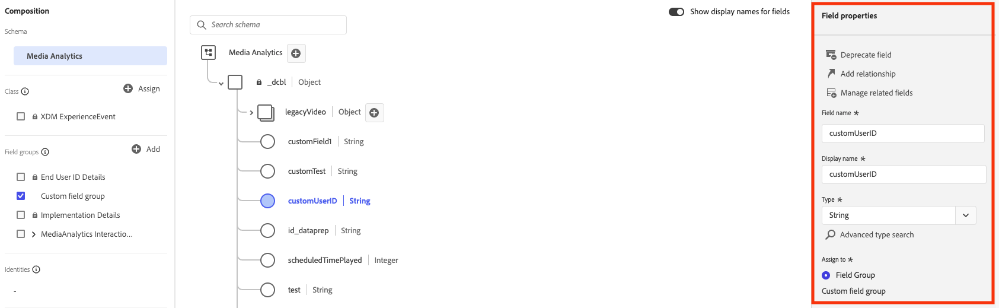
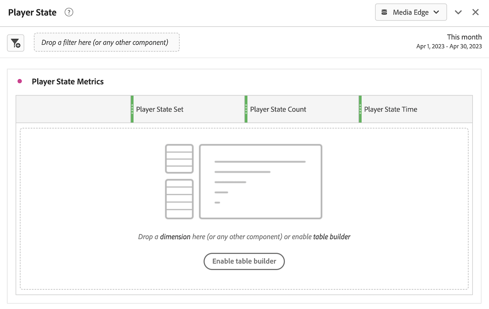

# Implementar a coleção de mídia de transmissão usando o Edge Network

A rede de borda da Adobe Experience Platform permite enviar dados destinados a vários produtos a um local centralizado. A Experience Edge encaminha as informações apropriadas para os produtos desejados. Esse conceito permite consolidar os esforços de implementação, especialmente abrangendo várias soluções de dados.

O gráfico a seguir ilustra como o complemento Coleção de mídia de transmissão pode ser implementado para usar o Experience Platform Edge para disponibilizar dados no Analysis Workspace, no Adobe Analytics ou no Customer Journey Analytics:

Para obter uma visão geral de todas as opções de implementação, incluindo métodos de implementação que não usam o Experience Platform Edge, consulte [Implementar serviços de mídia de transmissão para Adobe Analytics ou Customer Journey Analytics](/help/implementation/overview.md).

Independentemente de você usar o Adobe Experience Platform Web SDK, o Adobe Experience Platform Mobile SDK, o Adobe Experience Platform Roku SDK ou a API para implementar a coleção de mídia de transmissão com o Experience Edge, primeiro é necessário preencher as seguintes seções:

## Configurar o esquema no Adobe Experience Platform

Para padronizar a coleta de dados para uso em aplicativos que utilizam a Adobe Experience Platform, a Adobe criou o padrão aberto e documentado publicamente, o Experience Data Model (XDM).

Para criar e configurar um esquema:

1. No Adobe Experience Platform, comece a criar o esquema conforme descrito em [Criar e editar esquemas na interface](https://experienceleague.adobe.com/docs/experience-platform/xdm/ui/resources/schemas.html?lang=pt-BR).

1. Na página Detalhes do esquema, ao criar o esquema, escolha [!UICONTROL **Evento de experiência**] ao escolher a classe base para o esquema.

   

1. Selecione [!UICONTROL **Próximo**].

1. Especifique um nome para exibição de esquema e uma descrição e selecione [!UICONTROL **Concluir**].

1. Na área [!UICONTROL **Composição**], na seção [!UICONTROL **Grupos de campos**], selecione [!UICONTROL **Adicionar**], procure e adicione os seguintes novos grupos de campos ao esquema:
   * `End User ID Details`
   * `Implementation Details`
   * `MediaAnalytics Interaction Details`

   Depois de adicionar os grupos de campos, eles devem ser exibidos na seção [!UICONTROL **Grupos de campos**], da seguinte maneira:

   

1. Selecione [!UICONTROL **Salvar**] para salvar suas alterações.

1. (Opcional) Você pode ocultar determinados campos que não são usados pela API do Media Edge. Ocultar esses campos facilita a leitura e a compreensão do schema, mas não é obrigatório. Esses campos se referem apenas àqueles no grupo de campos `MediaAnalytics Interaction Details`.

   +++ Expanda aqui para exibir instruções nos campos que você pode ocultar.

   1. Na área [!UICONTROL **Estrutura**], selecione o campo `Media Collection Details` e [!UICONTROL **Gerenciar campos relacionados**].

      

   1. Habilite a opção para [!UICONTROL **Mostrar nomes para exibição para campos**] e atualize o esquema da seguinte maneira:

      * No campo `Media Collection Details` > `Advertising Details`, oculte os seguintes campos de relatório: `Ad Completed`, `Ad Started` e `Ad Time Played`.

      * No campo `Media Collection Details` > `Advertising Pod Details`, oculte o seguinte campo de relatório: `Ad Break ID`

      * No campo `Media Collection Details` > `Chapter Details`, oculte os seguintes campos de relatórios: `Chapter Completed`, `Chapter ID`, `Chapter Started` e `Chapter Time Played`.

      * No campo `Media Collection Details`, oculte o campo `List Of States`.

        

      * No campo `Media Collection Details` > `List Of States End` e `Media Collection Details` > `List Of States Start`, oculte os seguintes campos de relatório: `Player State Count`, `Player State Set` e `Player State Time`.

        

      * No campo `Media Collection Details` > `Qoe Data Details`, oculte os seguintes campos de relatórios: `Average Bitrate`, `Average Bitrate Bucket`, `Bitrate Change Impacted Streams`, `Bitrate Changes`, `Buffer Impacted Streams`, `Buffer Events`, `Dropped Frame Impacted Streams`, `Drops Before Starts`, `Errors`, `External Error IDs`, `Error Impacted Streams`, `Media SDK Error IDs`, `Player SDK Error IDs`, `Stalling Impacted Streams`, `Stalling Events`, `Total Buffer Duration` e `Total Stalling Duration`.

      * No campo `Media Collection Details` > `Session Details`, oculte os seguintes campos de relatórios: `10% Progress Marker`, `25% Progress Marker`, `50% Progress Marker`, `75% Progress Marker`, `95% Progress Marker`, `Ad Count`, `Average Minute Audience`, `Content Completes`, `Chapter Count`, `Content Starts`, `Content Time Spent`, `Estimated Streams`, `Federated Data`, `Media Segment Views`, `Media Downloaded Flag`, `Media Starts`, `Media Session ID`, `Media Session Server Timeout`, `Media Time Spent`, `Pause Events`, `Pause Impacted Streams`, `Pev3`, `Pccr`, `Total Pause Duration`, `Unique Time Played` e `Video Segment`.

   1. Selecione [!UICONTROL **Confirmar**] para salvar suas alterações.

   1. Na área [!UICONTROL **Estrutura**], habilite a opção para [!UICONTROL **Mostrar nomes para exibição para campos**] e selecione o campo `List Of Media Collection Downloaded Content Events`.

   1. Selecione [!UICONTROL **Gerenciar campos relacionados**] e atualize o esquema da seguinte maneira:

      * No campo `List Of Media Collection Downloaded Content Events` > `Media Details` > `Advertising Details`, oculte os seguintes campos de relatório: `Ad Completed`, `Ad Started` e `Ad Time Played`.

      * No campo `List Of Media Collection Downloaded Content Events` > `Media Details` > `Advertising Pod Details`, oculte o seguinte campo de relatório: `Ad Break ID`

      * No campo `List Of Media Collection Downloaded Content Events` > `Media Details` > `Chapter Details`, oculte os seguintes campos de relatório: `Chapter Completed`, `Chapter ID`, `Chapter Started` e `Chapter Time Played`.

      * No campo `List Of Media Collection Downloaded Content Events` > `Media Details`, oculte o campo `List Of States`.

      * No campo `List Of Media Collection Downloaded Content Events` > `Media Details` > `List Of States End` e `Media Collection Details` > `List Of States Start`, oculte os seguintes campos de relatórios: `Player State Count`, `Player State Set` e `Player State Time`.

      * No campo `List Of Media Collection Downloaded Content Events` > `Media Details` > `Qoe Data Details`, oculte os seguintes campos de relatórios: `Average Bitrate`, `Average Bitrate Bucket`, `Bitrate Change Impacted Streams`, `Bitrate Changes`, `Buffer Events`, `Buffer Impacted Streams`, `Drops Before Starts`, `Dropped Frame Impacted Streams`, `Error Impacted Streams`, `Errors`, `External Error IDs`, `Media SDK Error IDs`, `Player SDK Error IDs`, `Stalling Events`, `Stalling Impacted Streams`, `Total Buffer Duration` e `Total Stalling Duration`.

      * No campo `List Of Media Collection Downloaded Content Events` > `Media Details` > `Session Details`, oculte os seguintes campos de relatórios: `10% Progress Marker`, `25% Progress Marker`, `50% Progress Marker`, `75% Progress Marker`, `95% Progress Marker`, `Ad Count`, `Average Minute Audience`, `Chapter Count`, `Content Completes`, `Content Starts`, `Content Time Spent`, `Estimated Streams`, `Federated Data`, `Media Downloaded Flag`, `Media Segment Views`, `Media Session ID`, `Media Session Server Timeout`, `Media Starts`, `Media Time Spent`, `Pause Events`, `Pause Impacted Streams`, `Pccr`, `Pev3`, `Total Pause Duration`, `Unique Time Played` e `Video Segment`.

      * No campo `List Of Media Collection Downloaded Content Events` > `Media Details`, oculte o campo `Media Session ID`.

   1. Selecione [!UICONTROL **Confirmar**] para salvar suas alterações.

   1. Na área [!UICONTROL **Estrutura**], selecione o campo `Media Reporting Details` e selecione [!UICONTROL **Gerenciar campos relacionados**].

   1. Habilite a opção para [!UICONTROL **Mostrar nomes para exibição para campos**] e atualize o esquema da seguinte maneira:

      * No campo `Media Reporting Details`, oculte os seguintes campos: `Error Details`, `List Of States End`, `List of States Start` e `Media Session ID`.

   1. Selecione [!UICONTROL **Confirmar**] > [!UICONTROL **Salvar**] para salvar as alterações.

   +++

1. (Opcional) É possível adicionar metadados personalizados ao esquema. Isso permite incluir metadados adicionais definidos pelo usuário que podem ser personalizados para necessidades ou contextos específicos. Essa flexibilidade é útil em cenários nos quais os esquemas existentes não abrangem os pontos de dados desejados. (Você também pode trabalhar com metadados personalizados com APIs do Media Edge. Para obter mais informações, consulte [Criar metadados personalizados com APIs do Media Edge](https://developer.adobe.com/cja-apis/docs/endpoints/media-edge/custom-metadata/).)

   +++ Expanda aqui para visualizar instruções sobre como adicionar metadados personalizados ao esquema.

   1. Localize o nome do locatário da organização selecionando [!UICONTROL **Informações da conta**] > [!UICONTROL **Orgs atribuídas**] > [!UICONTROL _**nome da organização**_] > [!UICONTROL **locatário**].

      Esses campos personalizados serão recebidos por meio desse caminho. (Por exemplo, nome do locatário: _dcbl → caminho myCustomField: _dcbl.myCustomField.)

   1. Adicione um grupo de campos personalizado ao esquema de mídia definido.

      

   1. Adicione campos personalizados que deseja rastrear ao grupo de campos.

      

   1. [Use o caminho gerado](https://experienceleague.adobe.com/pt-br/docs/experience-platform/xdm/ui/fields/overview#type-specific-properties) para o campo personalizado na carga da sua solicitação.

      

   +++

1. Continue com [Criar um conjunto de dados no Adobe Experience Platform](#create-a-dataset-in-adobe-experience-platform).

## Criar um conjunto de dados na Adobe Experience Platform

1. Certifique-se de configurar um esquema conforme descrito em [Configurar o Esquema no Adobe Experience Platform](#set-up-the-schema-in-adobe-experience-platform).

1. Na Adobe Experience Platform, comece a criar o conjunto de dados conforme descrito no [guia da interface do usuário de conjuntos de dados](https://experienceleague.adobe.com/docs/experience-platform/catalog/datasets/user-guide.html?lang=pt-BR#create).

   Ao selecionar um esquema para seu conjunto de dados, escolha o esquema que você criou anteriormente, conforme descrito em [Configurar o esquema na Adobe Experience Platform](#set-up-the-schema-in-adobe-experience-platform).

1. Continuar com [Configurar uma sequência de dados no Customer Journey Analytics](#configure-a-datastream-in-adobe-experience-platform).

## Configurar um fluxo de dados no Adobe Experience Platform

1. Certifique-se de ter criado um conjunto de dados conforme descrito em [Criar um conjunto de dados no Adobe Experience Platform](#create-a-dataset-in-adobe-experience-platform).

1. Crie uma nova sequência de dados conforme descrito em [Configurar uma sequência de dados](https://experienceleague.adobe.com/docs/experience-platform/edge/datastreams/configure.html?lang=pt-BR).

   Ao criar o fluxo de dados, certifique-se de fazer as seguintes seleções de configuração:

   * No campo [!UICONTROL **Esquema de Evento**], ao criar a sequência de dados, selecione o esquema criado em [Configurar o esquema na Adobe Experience Platform](#set-up-the-schema-in-adobe-experience-platform). Selecione [!UICONTROL **Salvar**].

     >[!IMPORTANT]
     >
     >Não selecione [!UICONTROL **Salvar e Adicionar Mapeamento**] porque isso resultará em erros de mapeamento para o campo Carimbo de data/hora.

     

   * Adicione um dos seguintes serviços ao fluxo de dados, dependendo se você usa o Adobe Analytics ou o Customer Journey Analytics:

      * [!UICONTROL **Adobe Analytics**] (se estiver usando o Adobe Analytics)

        Se você estiver usando o Adobe Analytics, defina um conjunto de relatórios, conforme descrito em [Criar um conjunto de relatórios](https://experienceleague.adobe.com/pt-br/docs/analytics/admin/admin-tools/manage-report-suites/c-new-report-suite/t-create-a-report-suite).

      * [!UICONTROL **Adobe Experience Platform**] (se estiver usando o Customer Journey Analytics)

     Para obter informações sobre como adicionar um serviço a uma sequência de dados, consulte a seção &quot;Adicionar serviços a uma sequência de dados&quot; em [Configurar uma sequência de dados](https://experienceleague.adobe.com/docs/experience-platform/edge/datastreams/configure.html?lang=pt-BR#view-details).

     

      * Expanda [!UICONTROL **Opções Avançadas**] e habilite a opção [!UICONTROL **Media Analytics**].

     

1. Agora você está pronto para implementar a [API do Media Edge](/help/implementation/edge/implementation-edge-api.md) ou o [Media Edge SDK](/help/implementation/edge/edge-mobile-sdk.md) para começar a coletar dados de análise de mídia.

   Após coletar alguns dados, você pode [Criar uma conexão no Customer Journey Analytics](#create-a-connection-in-customer-journey-analytics).

## Criar uma conexão no Customer Journey Analytics

>[!NOTE]
>
>O procedimento a seguir é necessário somente se estiver usando o Customer Journey Analytics.

1. Certifique-se de criar uma sequência de dados conforme descrito em [Configurar uma sequência de dados no Customer Journey Analytics](#configure-a-datastream-in-adobe-experience-platform).

1. No Customer Journey Analytics, crie uma conexão conforme descrito em [Criar uma conexão](https://experienceleague.adobe.com/docs/analytics-platform/using/cja-connections/create-connection.html?lang=pt-BR).

   Ao criar a conexão, as seguintes seleções de configuração são necessárias para implementar a Coleção de mídia de transmissão:

   1. Selecione o conjunto de dados criado anteriormente, conforme descrito em [Criar um conjunto de dados no Adobe Experience Platform](#create-a-dataset-in-adobe-experience-platform).

   1. Verifique se a configuração [!UICONTROL **Importar todos os novos dados**] está habilitada.

1. Continue com [Criar uma exibição de dados no Customer Journey Analytics](#create-a-new-data-view-in-customer-journey-analytics).

## Criar uma visualização de dados no Customer Journey Analytics

>[!NOTE]
>
>O procedimento a seguir é necessário somente se estiver usando o Customer Journey Analytics.

1. Certifique-se de ter criado uma conexão no Customer Journey Analytics conforme descrito em [Criar uma conexão no Customer Journey Analytics](#create-a-connection-in-customer-journey-analytics).

1. No Customer Jornada Analytics, crie uma visualização de dados conforme descrito em [Criar ou editar uma visualização de dados](https://experienceleague.adobe.com/docs/analytics-platform/using/cja-dataviews/create-dataview.html?lang=pt_BR).

   Ao criar a visualização de dados, as seguintes seleções de configuração são necessárias para implementar a Coleção de mídia de transmissão:

   1. No campo [!UICONTROL **Conexão**], selecione a conexão criada anteriormente, conforme descrito em [Criar uma conexão no Customer Journey Analytics](#create-a-connection-in-customer-journey-analytics).

      Pode levar até 15 minutos para que a conexão criada esteja disponível para seleção.

   1. Na guia [!UICONTROL **Componentes**], na seção [!UICONTROL **Campos de esquema**], procure cada componente listado nas tabelas abaixo e arraste-o para o painel [!UICONTROL **Métricas**]. Se houver vários campos com o mesmo nome, use o caminho XDM para garantir que seja o campo correto.

      **Conteúdo principal - Métricas de conteúdo**

      | Nome do componente | Caminho XDM |
      |----------|---------|
      | Inícios da mídia | mediaReporting.sessionDetails.isViewed |
      | Visualizações do segmento de mídia | mediaReporting.sessionDetails.hasSegmentView |
      | Início do conteúdo | mediaReporting.sessionDetails.isPlayed |
      | Conclusões de conteúdo | mediaReporting.sessionDetails.isCompleted |
      | Tempo gasto no conteúdo | mediaReporting.sessionDetails.timePlayed |
      | Tempo gasto com a mídia | mediaReporting.sessionDetails.totalTimePlayed |
      | Tempo de reprodução exclusivo | mediaReporting.sessionDetails.uniqueTimePlayed |
      | Marcador de progresso 10% | mediaReporting.sessionDetails.hasProgress10 |
      | Público-alvo médio por minuto | mediaReporting.sessionDetails.averageMinuteAudience |

      **Capítulo e anúncios - Capítulo e métricas de anúncios**

      | Nome do componente | Caminho XDM |
      |----------|---------|
      | Capítulo iniciado | mediaReporting.chapterDetails.isStarted |
      | Capítulo concluído | mediaReporting.chapterDetails.isCompleted |
      | Tempo de reprodução do capítulo | mediaReporting.chapterDetails.timePlayed |
      | Anúncio iniciado | mediaReporting.advertisingDetails.isStarted |
      | Anúncio concluído | mediaReporting.advertisingDetails.isCompleted |
      | Hora de reprodução do anúncio | mediaReporting.advertisingDetails.timePlayed |

      **QoE - métricas de QoE**

      | Nome do componente | Caminho XDM |
      |----------|---------|
      | Hora de início | mediaReporting.qoeDataDetails.timeToStart |
      | Quedas antes de começar | mediaReporting.qoeDataDetails.isDroppedBeforeStart |
      | Fluxos afetados pelo buffer | mediaReporting.qoeDataDetails.hasBufferImpactedStreams |
      | Fluxos afetados pela mudança na taxa de bits | mediaReporting.qoeDataDetails.hasBitrateChangeImpactedStreams |
      | Alterações da taxa de bits | mediaReporting.qoeDataDetails.bitrateChangeCount |
      | Taxa média de bits | mediaReporting.qoeDataDetails.bitrateAverage |
      | Queda de quadros | mediaReporting.qoeDataDetails.droppedFrames |
      | Erros | mediaReporting.qoeDataDetails.errorCount |
      | Fluxos afetados por erros | mediaReporting.qoeDataDetails.hasErrorImpactedStreams |
      | Fluxos afetados pela queda de quadros | mediaReporting.qoeDataDetails.hasDroppedFrameImpactedStreams |

      **Estado do player - Métricas do estado do player**

      | Nome do componente | Caminho XDM |
      |----------|---------|
      | Conjunto do estado do player | mediaReporting.states.isSet |
      | Contagem do estado do player | mediaReporting.states.count |
      | Tempo do estado do player | mediaReporting.states.time |

   1. Atualize os rótulos (no menu suspenso [!UICONTROL **Rótulos de contexto**]) dos componentes na tabela a seguir. Procure e arraste para o painel quaisquer componentes que ainda não estejam no painel métricas.

      | Nome do componente | Rótulo do contexto |
      |---------|----------|
      | Tempo limite do servidor de sessão de mídia | Media: Seconds Since Last Call (Mídia: segundos desde a última chamada) |
      | Tempo gasto com a mídia | Mídia: Tempo gasto com a mídia |
      | Duração total do buffer | Media: Total Buffer Duration |
      | Hora de início | Media: Time To Start |
      | Duração total da pausa | Media: Duração Total Da Pausa |

   1. Para adicionar detalhamentos ao projeto do Customer Journey Analytics, adicione as seguintes dimensões ao painel [!UICONTROL **Dimensões**]:

      | Caminho XDM | Nome do componente |
      |---------|----------|
      | mediaReporting.states.name | Nome do estado do player |
      | mediaReporting.sessionDetails.ID | ID da sessão de mídia |

      Além das dimensões nessa tabela, é possível adicionar outras dimensões que você deseja disponibilizar para filtrar dados por em projetos do Customer Journey Analytics.

1. Selecione [!UICONTROL **Salvar e continuar**] > [!UICONTROL **Salvar e concluir**] para salvar as alterações.

1. Continuar com [Criar e configurar um projeto no Customer Journey Analytics](#create-and-configure-a-project-in-customer-journey-analytics).

## Criar e configurar um projeto no Customer Journey Analytics

1. Certifique-se de ter criado uma visualização de dados no Customer Journey Analytics conforme descrito em [Criar uma visualização de dados no Customer Journey Analytics](#create-a-new-data-view-in-customer-journey-analytics).

1. No Customer Journey Analytics, na guia [!UICONTROL **Workspace**], na área [!UICONTROL **Projetos**], selecione [!UICONTROL **Criar projeto**].

1. Selecione [!UICONTROL **Projeto em branco**] > [!UICONTROL **Criar**].

1. No novo projeto, selecione a visualização de dados criada anteriormente.

   Ao criar painéis em seu projeto, você pode usar quaisquer componentes adicionados à sua visualização de dados, conforme descrito em [Criar uma visualização de dados no Customer Journey Analytics](#create-a-new-data-view-in-customer-journey-analytics).

   Os 4 painéis a seguir são exemplos de painéis que você pode criar:

   

   

   

   

1. Selecione o ícone **Painéis** no painel à esquerda e arraste o painel [!UICONTROL **Visualizadores simultâneos de mídia**] e o painel [!UICONTROL **Tempo gasto com a reprodução da mídia**].

   Os 2 painéis devem ter esta aparência:

   

   

1. (Condicional) Se você adicionou metadados personalizados ao esquema, conforme descrito na Etapa 8 de [Configurar o esquema no Adobe Experience Platform](#set-up-the-schema-in-adobe-experience-platform), será necessário definir a persistência para os campos personalizados, conforme descrito em [Configurações do componente de Persistência](https://experienceleague.adobe.com/pt-br/docs/analytics-platform/using/cja-dataviews/component-settings/persistence) no guia do Customer Journey Analytics.

   Quando os dados chegarem no Customer Journey Analytics, a dimensão ID de usuário personalizada estará disponível.

   

   >[!NOTE]
   >
   >Se você configurar o Adobe Analytics como um upstream para seu fluxo de dados, os metadados personalizados também estarão presentes em ContextData, com o nome definido no esquema (sem o prefixo do locatário, por exemplo, myCustomField). Isso permite usar todos os recursos do Adobe Analytics disponíveis para ContextData, como [criação de uma regra de processamento](https://experienceleague.adobe.com/pt-br/docs/analytics/admin/admin-tools/manage-report-suites/edit-report-suite/report-suite-general/c-processing-rules/processing-rules).

1. Compartilhe o projeto conforme descrito em [Compartilhar projetos](https://experienceleague.adobe.com/docs/analytics-platform/using/cja-workspace/curate-share/share-projects.html?lang=pt-BR).

   >[!NOTE]
   >
   >   Se os usuários com os quais você deseja compartilhar não estiverem disponíveis, verifique se eles têm acesso de usuário e administrador ao Customer Journey Analytics na Adobe Admin Console.

1. Continuar com [Enviar dados para o Experience Platform Edge](#send-data-to-experience-platform-edge).

## Enviar dados para o Experience Platform Edge

Dependendo do tipo de dados que deseja enviar para o Experience Platform Edge, você pode usar qualquer um dos seguintes métodos:

### Web: usar o Adobe Experience Platform Web SDK

* [Introdução](https://developer.adobe.com/client-sdks/documentation/media-for-edge-network/)

* [Enviar dados da Web para o Edge com o Adobe Experience Platform Web SDK](/help/implementation/edge/edge-web-sdk.md)

* [Migrar para Mídia de Streaming do Adobe para a extensão do Edge Network](https://developer.adobe.com/client-sdks/documentation/adobe-media-analytics/migration-guide/)

### Dispositivo móvel: usar o Adobe Experience Platform Mobile SDK

Use os seguintes recursos de documentação para concluir a implementação para o iOS e o Android:

* [Introdução](https://developer.adobe.com/client-sdks/documentation/media-for-edge-network/)

* [Referência da API](https://developer.adobe.com/client-sdks/documentation/media-for-edge-network/api-reference/)

* [Migrar para Mídia de Streaming do Adobe para a extensão do Edge Network](https://developer.adobe.com/client-sdks/documentation/adobe-media-analytics/migration-guide/)

### Roku: Adobe Experience Platform Roku SDK

* [Introdução](https://developer.adobe.com/client-sdks/documentation/media-for-edge-network/)

* [Adobe Experience Platform Roku SDK](https://github.com/adobe/aepsdk-roku/tree/main)

* [Migrar para Mídia de Streaming do Adobe para a extensão do Edge Network](https://developer.adobe.com/client-sdks/documentation/adobe-media-analytics/migration-guide/) <!-- is the information here also applicable for Roku? -->

### API: Web e outros

No momento, a API é a única maneira compatível de enviar dados da Web para o Experience Platform Edge.

A API também está disponível se você quiser usar uma implementação personalizada das APIs do Edge.

Para obter mais informações sobre a API do Media Edge, consulte os seguintes recursos:

* [Visão geral da API do Media Edge](https://experienceleague.adobe.com/docs/experience-platform/edge-network-server-api/media-edge-apis/overview.html?lang=pt-BR)

* [Introdução à API do Media Edge](https://experienceleague.adobe.com/docs/experience-platform/edge-network-server-api/media-edge-apis/getting-started.html?lang=pt-BR)

* [Guia de solução de problemas da API do Media Edge](https://experienceleague.adobe.com/docs/experience-platform/edge-network-server-api/media-edge-apis/troubleshooting.html)

* [Usando o arquivo de Especificação Open API para APIs do Media Edge](https://developer.adobe.com/data-collection-apis/docs/api/media-edge/)
