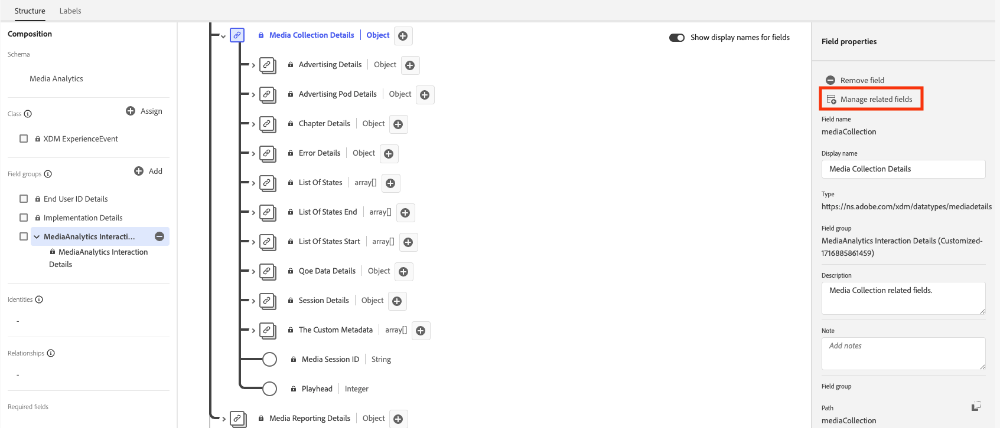
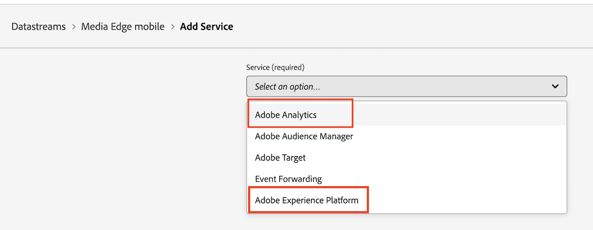

# Visão geral da implementação do Edge

O Adobe Experience Platform Edge Network permite enviar dados destinados a vários produtos para um único endpoint, que então encaminha as informações apropriadas para cada produto. Isso consolida o esforço de implementação em várias soluções de dados e é a maneira recomendada de implementar a Coleção de mídia de transmissão para Adobe Analytics e Customer Journey Analytics.

Independentemente da base de código usada, ou seja, o Web SDK, o Mobile SDK (iOS ou Android), o Roku SDK ou a API do Media Edge, primeiro você deve concluir a configuração da plataforma descrita nesta página: criar um esquema, criar um conjunto de dados e configurar um fluxo de dados.

## Pré-requisitos

1. **Conclua os pré-requisitos gerais.** Consulte os [pré-requisitos gerais](/help/getting-started/prereqs.md).

1. **Confirme uma solução Adobe compatível.** Você deve ter uma implementação funcional do Customer Journey Analytics, Adobe Analytics, Adobe Journey Optimizer ou Real-Time Customer Data Platform:
   * [Guia do Customer Journey Analytics](https://experienceleague.adobe.com/docs/analytics-platform/using/cja-landing.html?lang=pt-BR)
   * [Implementação do Adobe Analytics](https://experienceleague.adobe.com/docs/analytics/implementation/home.html?lang=pt-BR)
   * [Documentação do Adobe Journey Optimizer](https://experienceleague.adobe.com/docs/journey-optimizer.html?lang=pt-BR)
   * [Documentação do Real-Time Customer Data Platform](https://experienceleague.adobe.com/docs/real-time-customer-data-platform.html)

## Configurar o esquema no Adobe Experience Platform

Para padronizar a coleta de dados entre aplicativos que usam o Adobe Experience Platform, a Adobe criou o padrão aberto e publicamente documentado Experience Data Model (XDM).

1. No Adobe Experience Platform, comece a criar o esquema conforme descrito em [Criar e editar esquemas na interface](https://experienceleague.adobe.com/docs/experience-platform/xdm/ui/resources/schemas.html?lang=en).

1. Na página Detalhes do esquema, escolha **[!UICONTROL Evento de experiência]** como a classe base do esquema.

   

1. Selecione **[!UICONTROL Próximo]**.

1. Especifique um nome para exibição de esquema e uma descrição e selecione **[!UICONTROL Concluir]**.

1. Na área **[!UICONTROL Composição]**, na seção **[!UICONTROL Grupos de campos]**, selecione **[!UICONTROL Adicionar]**, procure e adicione os seguintes grupos de campos ao esquema:
   * `End User ID Details`
   * `Implementation Details`
   * `MediaAnalytics Interaction Details`

   Após adicionar os grupos de campos, eles são exibidos na seção **[!UICONTROL Grupos de campos]**:

   

1. Selecione **[!UICONTROL Salvar]** para salvar suas alterações.

1. (Opcional) Você pode ocultar determinados campos que não são usados pela API do Media Edge. Ocultar esses campos facilita a leitura do esquema, mas não é obrigatório. Esses campos se referem apenas àqueles no grupo de campos `MediaAnalytics Interaction Details`.

   +++ Expanda para exibir instruções nos campos que você pode ocultar.

   1. Na área **[!UICONTROL Estrutura]**, selecione o campo `Media Collection Details` e **[!UICONTROL Gerenciar campos relacionados]**.

      

   1. Habilite a opção para **[!UICONTROL Mostrar nomes para exibição para campos]** e atualize o esquema da seguinte maneira:

      * No campo `Media Collection Details` > `Advertising Details`, oculte os seguintes campos de relatório: `Ad Completed`, `Ad Started` e `Ad Time Played`.

      * No campo `Media Collection Details` > `Advertising Pod Details`, oculte o seguinte campo de relatório: `Ad Break ID`

      * No campo `Media Collection Details` > `Chapter Details`, oculte os seguintes campos de relatórios: `Chapter Completed`, `Chapter ID`, `Chapter Started` e `Chapter Time Played`.

      * No campo `Media Collection Details`, oculte o campo `List Of States`.

        

      * No campo `Media Collection Details` > `List Of States End` e `Media Collection Details` > `List Of States Start`, oculte os seguintes campos de relatório: `Player State Count`, `Player State Set` e `Player State Time`.

        

      * No campo `Media Collection Details` > `Qoe Data Details`, oculte os seguintes campos de relatórios: `Average Bitrate`, `Average Bitrate Bucket`, `Bitrate Change Impacted Streams`, `Bitrate Changes`, `Buffer Impacted Streams`, `Buffer Events`, `Dropped Frame Impacted Streams`, `Drops Before Starts`, `Errors`, `External Error IDs`, `Error Impacted Streams`, `Media SDK Error IDs`, `Player SDK Error IDs`, `Stalling Impacted Streams`, `Stalling Events`, `Total Buffer Duration` e `Total Stalling Duration`.

      * No campo `Media Collection Details` > `Session Details`, oculte os seguintes campos de relatórios: `10% Progress Marker`, `25% Progress Marker`, `50% Progress Marker`, `75% Progress Marker`, `95% Progress Marker`, `Ad Count`, `Average Minute Audience`, `Content Completes`, `Chapter Count`, `Content Starts`, `Content Time Spent`, `Estimated Streams`, `Federated Data`, `Media Segment Views`, `Media Downloaded Flag`, `Media Starts`, `Media Session ID`, `Media Session Server Timeout`, `Media Time Spent`, `Pause Events`, `Pause Impacted Streams`, `Pev3`, `Pccr`, `Total Pause Duration`, `Unique Time Played` e `Video Segment`.

   1. Selecione **[!UICONTROL Confirmar]** para salvar suas alterações.

   1. Na área **[!UICONTROL Estrutura]**, habilite a opção para **[!UICONTROL Mostrar nomes para exibição para campos]** e selecione o campo `List Of Media Collection Downloaded Content Events`.

   1. Selecione **[!UICONTROL Gerenciar campos relacionados]** e atualize o esquema da seguinte maneira:

      * No campo `List Of Media Collection Downloaded Content Events` > `Media Details` > `Advertising Details`, oculte os seguintes campos de relatório: `Ad Completed`, `Ad Started` e `Ad Time Played`.

      * No campo `List Of Media Collection Downloaded Content Events` > `Media Details` > `Advertising Pod Details`, oculte o seguinte campo de relatório: `Ad Break ID`

      * No campo `List Of Media Collection Downloaded Content Events` > `Media Details` > `Chapter Details`, oculte os seguintes campos de relatório: `Chapter Completed`, `Chapter ID`, `Chapter Started` e `Chapter Time Played`.

      * No campo `List Of Media Collection Downloaded Content Events` > `Media Details`, oculte o campo `List Of States`.

      * No campo `List Of Media Collection Downloaded Content Events` > `Media Details` > `List Of States End` e `Media Collection Details` > `List Of States Start`, oculte os seguintes campos de relatórios: `Player State Count`, `Player State Set` e `Player State Time`.

      * No campo `List Of Media Collection Downloaded Content Events` > `Media Details` > `Qoe Data Details`, oculte os seguintes campos de relatórios: `Average Bitrate`, `Average Bitrate Bucket`, `Bitrate Change Impacted Streams`, `Bitrate Changes`, `Buffer Events`, `Buffer Impacted Streams`, `Drops Before Starts`, `Dropped Frame Impacted Streams`, `Error Impacted Streams`, `Errors`, `External Error IDs`, `Media SDK Error IDs`, `Player SDK Error IDs`, `Stalling Events`, `Stalling Impacted Streams`, `Total Buffer Duration` e `Total Stalling Duration`.

      * No campo `List Of Media Collection Downloaded Content Events` > `Media Details` > `Session Details`, oculte os seguintes campos de relatórios: `10% Progress Marker`, `25% Progress Marker`, `50% Progress Marker`, `75% Progress Marker`, `95% Progress Marker`, `Ad Count`, `Average Minute Audience`, `Chapter Count`, `Content Completes`, `Content Starts`, `Content Time Spent`, `Estimated Streams`, `Federated Data`, `Media Downloaded Flag`, `Media Segment Views`, `Media Session ID`, `Media Session Server Timeout`, `Media Starts`, `Media Time Spent`, `Pause Events`, `Pause Impacted Streams`, `Pccr`, `Pev3`, `Total Pause Duration`, `Unique Time Played` e `Video Segment`.

      * No campo `List Of Media Collection Downloaded Content Events` > `Media Details`, oculte o campo `Media Session ID`.

   1. Selecione **[!UICONTROL Confirmar]** para salvar suas alterações.

   1. Na área **[!UICONTROL Estrutura]**, selecione o campo `Media Reporting Details` e **[!UICONTROL Gerenciar campos relacionados]**.

   1. Habilite a opção para **[!UICONTROL Mostrar nomes para exibição para campos]** e atualize o esquema da seguinte maneira:

      * No campo `Media Reporting Details`, oculte os seguintes campos: `Error Details`, `List Of States End`, `List of States Start` e `Media Session ID`.

   1. Selecione **[!UICONTROL Confirmar]** > **[!UICONTROL Salvar]** para salvar as alterações.

   +++

1. (Opcional) É possível adicionar metadados personalizados ao esquema. Isso permite incluir metadados adicionais definidos pelo usuário para necessidades ou contextos específicos. Para obter mais informações sobre metadados personalizados com a API do Media Edge, consulte [Suporte a metadados personalizados](custom-metadata.md).

   +++ Expanda para exibir instruções sobre como adicionar metadados personalizados ao esquema.

   1. Localize o nome do locatário da organização selecionando **[!UICONTROL Informações da conta]** > **[!UICONTROL Orgs atribuídas]** > [!UICONTROL _**nome da organização**_] > **[!UICONTROL locatário]**.

      Campos personalizados são recebidos por meio desse caminho. (Por exemplo, nome do locatário: _dcbl → caminho myCustomField: _dcbl.myCustomField.)

   1. Adicione um grupo de campos personalizado ao esquema de mídia definido.

      

   1. Adicione campos personalizados que deseja rastrear ao grupo de campos.

      

   1. [Use o caminho gerado](https://experienceleague.adobe.com/en/docs/experience-platform/xdm/ui/fields/overview#type-specific-properties) para o campo personalizado na carga da sua solicitação.

      

   +++

1. Continue com [Criar um conjunto de dados no Adobe Experience Platform](#create-a-dataset-in-adobe-experience-platform).

## Criar um conjunto de dados na Adobe Experience Platform

1. Certifique-se de configurar um esquema conforme descrito em [Configurar o esquema no Adobe Experience Platform](#set-up-the-schema-in-adobe-experience-platform).

1. No Adobe Experience Platform, comece a criar o conjunto de dados conforme descrito no [guia da interface do usuário de conjuntos de dados](https://experienceleague.adobe.com/docs/experience-platform/catalog/datasets/user-guide.html?lang=pt-BR#create).

   Ao selecionar um esquema para seu conjunto de dados, escolha o esquema criado anteriormente.

1. Continuar com [Configurar uma sequência de dados no Adobe Experience Platform](#configure-a-datastream-in-adobe-experience-platform).

## Configurar um fluxo de dados no Adobe Experience Platform

1. Certifique-se de ter criado um conjunto de dados conforme descrito em [Criar um conjunto de dados no Adobe Experience Platform](#create-a-dataset-in-adobe-experience-platform).

1. Crie uma nova sequência de dados conforme descrito em [Configurar uma sequência de dados](https://experienceleague.adobe.com/docs/experience-platform/edge/datastreams/configure.html?lang=pt-BR).

   Ao criar o fluxo de dados, faça as seguintes seleções:

   * No campo **[!UICONTROL Esquema de Evento]**, selecione o esquema criado em [Configurar o esquema no Adobe Experience Platform](#set-up-the-schema-in-adobe-experience-platform). Selecione **[!UICONTROL Salvar]**.

     >[!IMPORTANT]
     >
     >Não selecione **[!UICONTROL Salvar e Adicionar Mapeamento]**, pois isso resultará em erros de mapeamento para o campo Carimbo de data/hora.

     

   * Adicione um dos seguintes serviços ao fluxo de dados, dependendo se você usa o Adobe Analytics ou o Customer Journey Analytics:

      * **[!UICONTROL Adobe Analytics]** (se estiver usando o Adobe Analytics)

        Se você estiver usando o Adobe Analytics, defina um conjunto de relatórios conforme descrito em [Criar um conjunto de relatórios](https://experienceleague.adobe.com/en/docs/analytics/admin/admin-tools/manage-report-suites/c-new-report-suite/t-create-a-report-suite).

      * **[!UICONTROL Adobe Experience Platform]** (se estiver usando o Customer Journey Analytics)

     Para obter informações sobre como adicionar um serviço a uma sequência de dados, consulte &quot;Adicionar serviços a uma sequência de dados&quot; em [Configurar uma sequência de dados](https://experienceleague.adobe.com/docs/experience-platform/edge/datastreams/configure.html?lang=en#view-details).

     

   * Expanda **[!UICONTROL Opções Avançadas]** e habilite a opção **[!UICONTROL Media Analytics]**.

     

## Escolha seu método de implementação

Com o esquema, o conjunto de dados e o fluxo de dados em vigor, implemente uma das seguintes bases de código para começar a enviar dados de mídia de transmissão para a Edge Network. Cada página aborda a configuração específica de mídia de transmissão; o código por evento e por variável está em [Eventos](/help/implementation/events/overview.md) e [Variáveis](/help/implementation/variables/overview.md).

| Base de código | No código | Através de tags |
|---|---|---|
| Web | [Web SDK](web-sdk.md) | [Extensão de tag do Web SDK](web-sdk-tags.md) |
| iOS | [iOS](ios.md) | [iOS (Marcas)](ios-tags.md) |
| Android | [Android](android.md) | [Android (Marcas)](android-tags.md) |
| Roku | [Roku](roku.md) | — |
| API | [API do Media Edge](media-edge-api.md) | — |

## Próxima etapa

Depois de começar a coletar dados, é possível configurar os relatórios:

* [Configurar relatórios para implementações do Edge](/help/reporting/setup/edge-reporting.md) (Customer Journey Analytics)
* [Configurar relatórios para implementações somente do Analytics](/help/reporting/setup/analytics-reporting.md) (se a sua sequência de dados alimentar o Adobe Analytics)

>[!MORELIKETHIS]
>
>* [Suporte a metadados personalizados](custom-metadata.md)
>* [Esquema de relatórios XDM](reporting-schema.md)
>* [Visão geral dos eventos](/help/implementation/events/overview.md)
