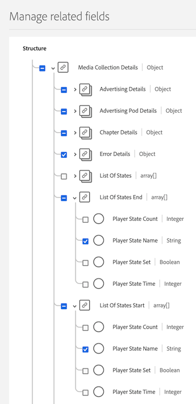

# Instale o Media Analytics com o Experience Platform Edge

A Adobe Experience Platform Edge permite enviar dados destinados a vários produtos para um local centralizado. A Experience Edge encaminha as informações apropriadas para os produtos desejados. Esse conceito permite consolidar os esforços de implementação, especialmente abrangendo várias soluções de dados.

O gráfico a seguir ilustra uma implementação do Media Analytics que usa o Experience Platform Edge:

>[!IMPORTANT]
>
>Atualmente, você pode enviar dados para o Experience Edge somente usando o Adobe Experience Platform Mobile SDK.

<!-- Replace the above sentence with this after it web releases: You can send data to Experience Edge using any of the following implementation methods:

* Adobe Experience Platform Web SDK (Coming soon)
* Adobe Experience Platform Mobile SDK
* Edge Network Server API

Regardless of which Experience Edge implementation method you use for configuring media tracking, you must first complete the following sections:

-->

Conclua as seguintes seções para implementar o Media Analytics com Experience Platform Edge:

* [Definir um conjunto de relatórios](#define-a-report-suite)
* [Configurar o esquema no Adobe Experience Platform](#set-up-the-schema-in-adobe-experience-platform)
* [Criar um conjunto de dados no Adobe Experience Platform](#create-a-dataset-in-adobe-experience-platform)
* [Configurar um armazenamento de dados no Adobe Experience Platform](#configure-a-datastream-in-adobe-experience-platform)
* [Criar uma conexão no Customer Journey Analytics](#create-a-connection-in-customer-journey-analytics)
* [Criar uma visualização de dados no Customer Journey Analytics](#create-a-data-view-in-customer-journey-analytics)
* [Criar e configurar um projeto no Customer Journey Analytics](#create-and-configure-a-project-in-customer-journey-analytics)
* [Enviar dados para o Experience Platform Edge com a Extensão do Edge](#send-data-to-experience-platform-edge-with-the-edge-extension)

## Definir um conjunto de relatórios

>[!NOTE]
>
>Um conjunto de relatórios é necessário somente se você estiver usando o Adobe Analytics. Um conjunto de relatórios não é necessário se você planeja usar o Customer Journey Analytics para os relatórios.

Se você planeja usar o Adobe Analytics para relatórios, é necessário ter um conjunto de relatórios para usar com sua implementação de Mídia de transmissão. Para obter informações sobre como definir um conjunto de relatórios, consulte [Gerenciador do Conjunto de relatórios](https://experienceleague.adobe.com/docs/analytics/admin/admin-tools/manage-report-suites/report-suites-admin.html?lang=en).

Após definir um conjunto de relatórios, continue com [Configurar o esquema no Adobe Experience Platform](#set-up-the-schema-in-adobe-experience-platform).

## Configurar o esquema no Adobe Experience Platform

Para padronizar a coleta de dados para uso em aplicativos que utilizam a Adobe Experience Platform, a Adobe criou o padrão aberto e documentado publicamente, o Experience Data Model (XDM).

Para criar e configurar um schema:

1. No Adobe Experience Platform, comece a criar o schema conforme descrito em [Criar e editar esquemas na interface do usuário](https://experienceleague.adobe.com/docs/experience-platform/xdm/ui/resources/schemas.html?lang=en).

   Ao criar o schema, escolha [!UICONTROL **ExperiênciaEvento XDM**] do [!UICONTROL **Criar esquema**] menu suspenso.

1. No [!UICONTROL **Composição**] na [!UICONTROL **Grupos de campos**] seção , selecione [!UICONTROL **Adicionar**], em seguida, procure e adicione os novos grupos de campos a seguir ao schema:
   * `Adobe Analytics ExperienceEvent Template`
   * `Implementation Details`
   * `MediaAnalytics Interaction Details`

   Após adicionar os grupos de campos, eles devem ser exibidos na variável [!UICONTROL **Grupos de campos**] , como se segue:

   

1. No [!UICONTROL **Estrutura**] selecione a `endUserIds` > `_experience` grupo de campos e selecione [!UICONTROL **Gerenciar campos relacionados**].

   

1. Atualize o schema da seguinte maneira:

   * No `Adobe Analytics ExperienceEvent Template` grupo de campos, ocultar todos os campos exceto `EndUserIDs`.

   * No `endUserIds` > `_experience` > `Adobe Advertising Cloud end user IDs` grupo de campos, ocultar todos os campos, exceto o `Identifier` campo.

   * No `endUserIds` > `_experience` > `Adobe Analytics Cloud Custom end user IDs` grupo de campos, ocultar todos os campos, exceto o `Identifier` campo.

      

1. Selecionar [!UICONTROL **Confirmar**] para salvar as alterações.

1. No [!UICONTROL **Estrutura**] selecione a `Implementation Details` grupo de campos, selecione [!UICONTROL **Gerenciar campos relacionados**], em seguida, atualize o schema da seguinte maneira:

   * No `Implementation Details` > `Implementation details` grupo de campos, ocultar todos os campos exceto por `version`.

      

1. Selecionar [!UICONTROL **Confirmar**] para salvar as alterações.

1. No [!UICONTROL **Estrutura**] selecione a `Media Collection Details` grupo de campos, selecione [!UICONTROL **Gerenciar campos relacionados**], em seguida, atualize o schema da seguinte maneira:

   * No `Media Collection Details` grupo de campos, ocultar o `List Of States` grupo de campos.

      

   * No `Media Collection Details` > `Advertising Details` ocultar os seguintes campos de relatório: `Ad Completed`, `Ad Started`e `Ad Time Played`.

   * No `Media Collection Details` > `Advertising Pod Details` ocultar o seguinte campo de relatório: `Ad Break ID`

   * No `Media Collection Details` > `Chapter Details` ocultar os seguintes campos de relatório: `Chapter ID`, `Chapter Completed`, `Chapter Started`e `Chapter Time Played`.

   * No `Media Collection Details` > `Qoe Data Details` ocultar os seguintes campos de relatório: `Average Bitrate`, `Average Bitrate Bucket`, `Bitrate Changes`, `Buffer Events`, `Total Buffer Duration`, `Errors`, `External Error IDs`, `Bitrate Change Impacted Streams`, `Buffer Impacted Streams`, `Dropped Frame Impacted Streams`, `Error Impacted Streams`, `Stalling Impacted Streams`, `Drops Before Starts`, `Media SDK Error IDs`, `Player SDK Error IDs`, `Stalling Events`e `Total Stalling Duration`.

   * No `Media Collection Details` > `Session Details` ocultar os seguintes campos de relatório: `Media Session ID`, `Ad Count`, `Average Minute Audience`, `Chapter Count`, `Estimated Streams`, `Pause Impacted Streams`, `10% Progress Marker`, `25% Progress Marker`, `50% Progress Marker`, `75% Progress Marker`, `95% Progress Marker`, `Media Segment Views`, `Content Completes`, `Media Downloaded Flag`, `Federated Data`, `Content Starts`, `Media Starts`, `Pause Events`, `Total Pause Duration`, `Media Session Server Timeout`, `Video Segment`, `Content Time Spent`, `Media Time Spent`, `Unique Time Played`, `Pev3`e `Pccr`.

   * No `Media Collection Details` > `List Of States End` e `Media Collection Details` > `List Of States Start` ocultar os seguintes campos de relatório: `Player State Count`, `Player State Set`e `Player State Time`.

      

1. Selecionar [!UICONTROL **Confirmar**] para salvar as alterações.

1. No [!UICONTROL **Estrutura**] selecione a `List Of Media Collection Downloaded Content Events` grupo de campos, selecione [!UICONTROL **Gerenciar campos relacionados**], em seguida, atualize o schema da seguinte maneira:

   * No `List Of Media Collection Downloaded Content Events` > `Media Details` grupo de campos, ocultar o `List Of States` grupo de campos.

   * No `List Of Media Collection Downloaded Content Events` > `Media Details` > `Advertising Details` ocultar os seguintes campos de relatório: `Ad Completed`, `Ad Started`e `Ad Time Played`.

   * No `List Of Media Collection Downloaded Content Events` > `Media Details` > `Advertising Pod Details` ocultar o seguinte campo de relatório: `Ad Break ID`

   * No `List Of Media Collection Downloaded Content Events` > `Media Details` > `Chapter Details` ocultar os seguintes campos de relatório: `Chapter ID`, `Chapter Completed`, `Chapter Started`e `Chapter Time Played`.

   * No `List Of Media Collection Downloaded Content Events` > `Media Details` > `Qoe Data Details` ocultar os seguintes campos de relatório: `Average Bitrate`, `Average Bitrate Bucket`, `Bitrate Changes`, `Buffer Events`, `Total Buffer Duration`, `Errors`, `External Error IDs`, `Bitrate Change Impacted Streams`, `Buffer Impacted Streams`, `Dropped Frame Impacted Streams`, `Error Impacted Streams`, `Stalling Impacted Streams`, `Drops Before Starts`, `Media SDK Error IDs`, `Player SDK Error IDs`, `Stalling Events`e `Total Stalling Duration`.

   * No `List Of Media Collection Downloaded Content Events` > `Media Details` > `Session Details` ocultar os seguintes campos de relatório: `Media Session ID`, `Ad Count`, `Average Minute Audience`, `Chapter Count`, `Estimated Streams`, `Pause Impacted Streams`, `10% Progress Marker`, `25% Progress Marker`, `50% Progress Marker`, `75% Progress Marker`, `95% Progress Marker`, `Media Segment Views`, `Content Completes`, `Media Downloaded Flag`, `Federated Data`, `Content Starts`, `Media Starts`, `Pause Events`, `Total Pause Duration`, `Media Session Server Timeout`, `Video Segment`, `Content Time Spent`, `Media Time Spent`, `Unique Time Played`, `Pev3`e `Pccr`.

   * No `List Of Media Collection Downloaded Content Events` > `Media Details` > `List Of States End` e `Media Collection Details` > `List Of States Start` ocultar os seguintes campos de relatório: `Player State Count`, `Player State Set`e `Player State Time`.

   * No `List Of Media Collection Downloaded Content Events` > `Media Details`  grupo de campos, ocultar o `Media Session ID` campo.

1. Selecionar [!UICONTROL **Confirmar**] para salvar as alterações.

1. No [!UICONTROL **Estrutura**] selecione a `Media Reporting Details` grupo de campos, selecione [!UICONTROL **Gerenciar campos relacionados**], em seguida, atualize o schema da seguinte maneira:

   * No `Media Reporting Details` grupo de campos, oculte os seguintes grupos de campos: `Error Details`, `List Of States End`, `List of States Start`, `Playhead`e `Media Session ID`.

1. Selecionar [!UICONTROL **Confirmar**] > [!UICONTROL **Salvar**]  para salvar as alterações.

1. Continue com [Criar um conjunto de dados no Adobe Experience Platform](#create-a-dataset-in-adobe-experience-platform).

## Criar um conjunto de dados no Adobe Experience Platform

1. Certifique-se de configurar um esquema como descrito em [Configurar o esquema no Adobe Experience Platform](#set-up-the-schema-in-adobe-experience-platform).

1. No Adobe Experience Platform, comece a criar o conjunto de dados conforme descrito em [Guia da interface do usuário de conjuntos de dados](https://experienceleague.adobe.com/docs/experience-platform/catalog/datasets/user-guide.html?lang=pt-BR#create).

   Ao selecionar um esquema para seu conjunto de dados, escolha o esquema criado anteriormente, conforme descrito em [Configurar o esquema no Adobe Experience Platform](#set-up-the-schema-in-adobe-experience-platform).

1. Continue com [Configurar um armazenamento de dados no Customer Journey Analytics](#configure-a-datastream-in-adobe-experience-platform).

## Configurar um armazenamento de dados no Adobe Experience Platform

1. Certifique-se de ter criado um conjunto de dados conforme descrito em [Criar um conjunto de dados no Adobe Experience Platform](#create-a-dataset-in-adobe-experience-platform).

1. Crie um novo armazenamento de dados conforme descrito em [Configurar um conjunto de dados](https://experienceleague.adobe.com/docs/experience-platform/edge/datastreams/configure.html?lang=pt-BR).

   Ao criar o armazenamento de dados, certifique-se de fazer as seguintes seleções de configuração:

   * No [!UICONTROL **Esquema do evento**] ao criar o armazenamento de dados, selecione o esquema criado em [Configurar o esquema no Adobe Experience Platform](#set-up-the-schema-in-adobe-experience-platform). Selecione [!UICONTROL **Salvar**].

      >[!IMPORTANT]
          >
      > Não selecionar [!UICONTROL **Salvar e adicionar mapeamento**] porque isso resultará em erros de mapeamento para o campo Carimbo de data e hora .
      

      

   * Adicione um dos seguintes serviços ao armazenamento de dados, dependendo se você está usando o Adobe Analytics ou o Customer Journey Analytics:

      * [!UICONTROL **Adobe Analytics**] (se estiver usando o Adobe Analytics)

         Se estiver usando o Adobe Analytics, defina um conjunto de relatórios, conforme descrito na seção [Definir um conjunto de relatórios](#define-a-report-suite) neste artigo.

      * [!UICONTROL **Adobe Experience Platform**] (se estiver usando Customer Journey Analytics)
      Para obter informações sobre como adicionar um serviço a um armazenamento de dados, consulte a seção &quot;Adicionar serviços a um armazenamento de dados&quot; em [Configurar um conjunto de dados](https://experienceleague.adobe.com/docs/experience-platform/edge/datastreams/configure.html?lang=en#view-details).

      

   * Expandir [!UICONTROL **Opções avançadas**], em seguida, ative a [!UICONTROL **Media Analytics**] opção.

      

1. Continue com [Criar uma conexão no Customer Journey Analytics](#create-a-connection-in-customer-journey-analytics).

## Criar uma conexão no Customer Journey Analytics

>[!NOTE]
>
>O procedimento a seguir é necessário somente se você estiver usando o Customer Journey Analytics.

1. Certifique-se de ter criado um conjunto de dados conforme descrito em [Configurar um armazenamento de dados no Customer Journey Analytics](#configure-a-datastream-in-adobe-experience-platform).

1. No Customer Journey Analytics, crie uma conexão conforme descrito em [Criar uma conexão](https://experienceleague.adobe.com/docs/analytics-platform/using/cja-connections/create-connection.html?lang=pt-BR).

   Ao criar a conexão, as seguintes seleções de configuração são necessárias para implementar a Mídia de transmissão:

   1. Selecione o conjunto de dados criado anteriormente, conforme descrito em [Criar um conjunto de dados no Adobe Experience Platform](#create-a-dataset-in-adobe-experience-platform).

   1. Certifique-se de que [!UICONTROL **Importar todos os novos dados**] está ativada.

1. Continue com [Criar uma visualização de dados no Customer Journey Analytics](#create-a-new-data-view-in-customer-journey-analytics).

## Criar uma visualização de dados no Customer Journey Analytics

>[!NOTE]
>
>O procedimento a seguir é necessário somente se você estiver usando o Customer Journey Analytics.

1. Certifique-se de ter criado uma conexão no Customer Journey Analytics conforme descrito em [Criar uma conexão no Customer Journey Analytics](#create-a-connection-in-customer-journey-analytics).

1. No Customer Jornada Analytics, crie uma visualização de dados conforme descrito em [Criar ou editar uma visualização de dados](https://experienceleague.adobe.com/docs/analytics-platform/using/cja-dataviews/create-dataview.html?lang=pt-BR).

   Ao criar a visualização de dados, as seguintes seleções de configuração são necessárias para implementar o Streaming Media:

   1. No [!UICONTROL **Conexão**] selecione a conexão criada anteriormente, conforme descrito em [Criar uma conexão no Customer Journey Analytics](#create-a-connection-in-customer-journey-analytics).

      Pode levar até 15 minutos antes que a conexão criada esteja disponível para seleção.

   1. No [!UICONTROL **Componentes**] na guia , no [!UICONTROL **Campos de esquema**] , procure cada componente listado nas tabelas abaixo e arraste-o para a seção [!UICONTROL **Métricas**] painel. Se houver vários campos com o mesmo nome, use o caminho XDM para garantir que seja o campo correto.

      **Conteúdo principal - Métricas de conteúdo**

      | Nome do componente | Caminho XDM |
      |----------|---------|
      | Inícios da mídia | mediaReporting.sessionDetails.isViewed |
      | Visualizações do segmento de mídia | mediaReporting.sessionDetails.hasSegmentView |
      | Início do conteúdo | mediaReporting.sessionDetails.isPlayed |
      | Conclusões de conteúdo | mediaReporting.sessionDetails.isCompleted |
      | Tempo gasto no conteúdo | mediaReporting.sessionDetails.timePlayed |
      | Tempo gasto com a mídia | mediaReporting.sessionDetails.totalTimePlayed |
      | Tempo de reprodução exclusivo | mediaReporting.sessionDetails.uniqueTimePlayed |
      | Marcador de progresso de 10% | mediaReporting.sessionDetails.hasProgress10 |
      | Público-alvo médio por minuto | mediaReporting.sessionDetails.averageMinuteAudience |

      **Capítulo e anúncios - Métricas de capítulo e anúncios**

      | Nome do componente | Caminho XDM |
      |----------|---------|
      | Capítulo iniciado | mediaReporting.chapterDetails.isStarted |
      | Capítulo concluído | mediaReporting.chapterDetails.isCompleted |
      | Tempo de reprodução do capítulo | mediaReporting.chapterDetails.timePlayed |
      | Anúncio iniciado | mediaReporting.advertisingDetails.isStarted |
      | Anúncio concluído | mediaReporting.advertisingDetails.isCompleted |
      | Hora de reprodução do anúncio | mediaReporting.advertisingDetails.timePlayed |

      **QoE - Métricas de QoE**

      | Nome do componente | Caminho XDM |
      |----------|---------|
      | Hora de início | mediaReporting.qoeDataDetails.timeToStart |
      | Quedas antes do início | mediaReporting.qoeDataDetails.isDroppedBeforeStart |
      | Fluxos afetados pelo buffer | mediaReporting.qoeDataDetails.hasBufferImpactedStreams |
      | Fluxos afetados pela mudança na taxa de bits | mediaReporting.qoeDataDetails.hasBitrateChangeImpactedStreams |
      | Alterações da taxa de bits | mediaReporting.qoeDataDetails.bitrateChangeCount |
      | Taxa média de bits | mediaReporting.qoeDataDetails.bitrateAverage |
      | Queda de quadros | mediaReporting.qoeDataDetails.droppedFrames |
      | Erros | mediaReporting.qoeDataDetails.errorCount |
      | Fluxos afetados por erros | mediaReporting.qoeDataDetails.hasErrorImpactedStreams |
      | Fluxos afetados pela queda de quadros | mediaReporting.qoeDataDetails.hasDroppedFrameImpactedStreams |

      **Estado do player - Métricas de estado do player**

      | Nome do componente | Caminho XDM |
      |----------|---------|
      | Conjunto de estado do player | mediaReporting.states.isSet |
      | Contagem de estado do player | mediaReporting.states.count |
      | Hora do estado do player | mediaReporting.states.time |

   1. Atualize os rótulos (no [!UICONTROL **Rótulos de contexto**] menu suspenso) para os componentes na tabela a seguir. Procure e arraste qualquer componente que ainda não esteja no painel Métricas para o painel.

      | Nome do componente | Rótulo do contexto |
      |---------|----------|
      | Tempo limite do servidor da sessão de mídia | Mídia: Segundos desde a última chamada |
      | Tempo gasto com a mídia | Mídia: Tempo gasto com a mídia |
      | Duração total do buffer | Mídia: Duração total do buffer |
      | Hora de início | Mídia: Hora de início |
      | Duração total da pausa | Mídia: Duração total da pausa |

   1. Para adicionar detalhamentos ao seu projeto do Customer Journey Analytics, adicione as seguintes dimensões ao [!UICONTROL **Dimension**] painel:

      | Caminho XDM | Nome do componente |
      |---------|----------|
      | mediaReporting.states.name | Nome do estado do player |
      | mediaReporting.sessionDetails.ID | ID da sessão de mídia |

      Além das dimensões nesta tabela, você pode adicionar outras dimensões que deseja disponibilizar para filtrar dados por em projetos do Customer Journey Analytics.

1. Selecionar [!UICONTROL **Salvar e continuar**] > [!UICONTROL **Salvar e concluir**] para salvar as alterações.

1. Continue com [Criar e configurar um projeto no Customer Journey Analytics](#create-and-configure-a-project-in-customer-journey-analytics).

## Criar e configurar um projeto no Customer Journey Analytics

1. Certifique-se de ter criado uma visualização de dados no Customer Journey Analytics conforme descrito em [Criar uma visualização de dados no Customer Journey Analytics](#create-a-new-data-view-in-customer-journey-analytics).

1. Na Customer Journey Analytics, no [!UICONTROL **Workspace**] na guia , no [!UICONTROL **Projetos**] , selecione [!UICONTROL **Criar projeto**].

1. Selecionar [!UICONTROL **Projeto em branco**] > [!UICONTROL **Criar**].

1. No novo projeto, selecione a visualização de dados criada anteriormente.

   Ao criar painéis no seu projeto, você pode usar qualquer componente adicionado à sua visualização de dados, conforme descrito em [Criar uma visualização de dados no Customer Journey Analytics](#create-a-new-data-view-in-customer-journey-analytics).

   Os 4 painéis a seguir são exemplos de painéis que você pode criar:

   

   

   

   

1. Selecione o **Painéis** no painel à esquerda, em seguida, arraste o [!UICONTROL **Visualizadores simultâneos de mídia**] e o [!UICONTROL **Tempo gasto na reprodução da mídia**] painel.

   Os 2 painéis devem ter esta aparência:

   

   

1. Compartilhe o projeto conforme descrito em [Compartilhar projetos](https://experienceleague.adobe.com/docs/analytics-platform/using/cja-workspace/curate-share/share-projects.html?lang=en).

   >[!NOTE]
   >
   >   Se os usuários com os quais você deseja compartilhar não estiverem disponíveis, verifique se os usuários têm acesso de usuário e administrador ao Customer Journey Analytics na Adobe Admin Console.

1. Continue com [Enviar dados para o Experience Platform Edge](#send-data-to-experience-platform-edge).

## Enviar dados para o Experience Platform Edge usando o AEP Mobile SDK

Você pode usar o SDK móvel do Adobe Experience Platform para enviar dados móveis para o Experience Platform Edge. (Como alternativa, você pode usar uma implementação personalizada das APIs de borda.<!-- I guess we don't need/want to document this? -->)

Use os seguintes recursos de documentação para concluir a implementação:

| Sistema operacional móvel | Recursos  |
|---------|----------|
| **iOS** | Os seguintes recursos estão disponíveis para enviar dados móveis do iOS: <ul><li>[Configuração do SDK móvel usando a interface da coleta de dados](https://github.com/adobe/aepsdk-edgemedia-ios/blob/dev/Documentation/getting-started.md)</li><li>[Migração do SDK do Media para o SDK do Edge Media](https://github.com/adobe/aepsdk-edgemedia-ios/blob/dev/Documentation/migration-guide.md)</li><li>[Referência da API do Edge Media](https://github.com/adobe/aepsdk-edgemedia-ios/blob/dev/Documentation/api-reference.md)</li></ul> |
| **Android** | Os seguintes recursos estão disponíveis para enviar dados móveis do Android: <ul><li>[Configuração do SDK móvel usando a interface da coleta de dados](https://github.com/adobe/aepsdk-edgemedia-android/blob/dev/Documentation/getting-started.md)</li><li>[Migração do SDK do Media para o SDK do Edge Media](https://github.com/adobe/aepsdk-edgemedia-android/blob/dev/Documentation/migration-guide.md)</li><li>[Referência da API do Edge Media](https://github.com/adobe/aepsdk-edgemedia-android/blob/dev/Documentation/api-reference.md)</li></ul> |

<!--

+++Adobe Experience Platform Mobile SDK

If you plan to use the Mobile SDK extension in Adobe Experience Platform Data Collection to send data to Edge, complete the following sections:

### Create a mobile property

Create a mobile property, as described in [Set up a mobile property](https://developer.adobe.com/client-sdks/documentation/getting-started/create-a-mobile-property/). 

Content initially copied from here: https://experienceleague.adobe.com/docs/analytics/implementation/aep-edge/mobile-sdk/overview.html?lang=en 

The Adobe Experience Platform Mobile SDK helps power Adobe's Experience Cloud solutions and services in your mobile apps. It is available for Android, iOS, and various cross-platform development frameworks. Configuration is handled through Adobe Experience Platform Data Collection.
>[!IMPORTANT]
>
>An Adobe Analytics extension is also available in Adobe Experience Platform Data Collection. If you install this extension, you do not take advantage of XDM or the Edge Network.

### Register the extensions and load your tag configuration

Use code in your app to register the necessary extensions and load your tag configuration. For more information, see [Set up the configuration](https://developer.adobe.com/client-sdks/documentation/user-guides/getting-started-with-platform/overview/#set-up-the-configuration) in [Getting started with Adobe Experience Platform](https://developer.adobe.com/client-sdks/documentation/user-guides/getting-started-with-platform/overview/#set-up-the-configuration).

### Implement and test fuctionality

Implement and test app functionality using a combination of tags data elements, rules, additional extensions, and SDK API calls. Inspect, validate, and debug data collection and experiences for your mobile application.

For more information, see [Use the sample application](https://developer.adobe.com/client-sdks/documentation/user-guides/getting-started-with-platform/overview/#use-the-sample-application) in [Getting started with Adobe Experience Platform](https://developer.adobe.com/client-sdks/documentation/user-guides/getting-started-with-platform/overview/#set-up-the-configuration).

### Extend and validate your mobile app implementation

Before pushing the mobile app extension to your production environment, first validate that it works.

(What are the steps to do this?)

-->

<!--

+++Adobe Experience Platform Web SDK (Coming soon)

>[!NOTE]
>
>The Adobe Experience Platform Web SDK is not yet available. This page will be updated when it becomes available.

<!-- Content initially copied from here: https://experienceleague.adobe.com/docs/analytics/implementation/aep-edge/web-sdk/overview.html?lang=en -->

<!-- Use the Web SDK extension in Adobe Experience Platform Data Collection to send data to Edge.

You can use the [Adobe Experience Platform Web SDK](https://experienceleague.adobe.com/docs/experience-platform/tags/extensions/client/sdk/overview.html) to send data to Adobe Analytics. This implementation method works by translating the [Experience Data Model (XDM)](https://experienceleague.adobe.com/docs/experience-platform/xdm/home.html) into a format used by Analytics.

You can send data to Experience Edge directly using the Web SDK, or through the Web SDK extension in Tags. -->

<!-- ### Web SDK

A high-level overview of the implementation tasks:

<table style="width:100%">

<tr>
<th style="width:5%"></th><th style="width:60%"><b>Task</b></th><th style="width:35%"><b>More Information</b></th>
</tr>

<tr>
<td>1</td>
<td>Ensure you have <b>defined a report suite</b>.</td>
<td><a href="../../../admin/admin/c-manage-report-suites/report-suites-admin.md">Report Suite Manager</a></td>
</tr>

<tr>
<td>2</td>
<td><b>Setup schemas and datasets</b>. To standardize data collection for use across applications that leverage Adobe Experience Platform, Adobe has created the open and publicly documented standard, Experience Data Model (XDM).</td>
<td><a href="https://experienceleague.adobe.com/docs/experience-platform/xdm/ui/overview.html?lang=en">Schemas UI overview</a> and <a href="https://experienceleague.adobe.com/docs/experience-platform/catalog/datasets/user-guide.html?lang=en">Datasets UI overview</a></td>
</tr>

<tr>
<td>3</td>
<td><b>Create a data layer</b> to manage the tracking of the data on your website.</td>
<td><a href="../../prepare/data-layer.md">Create a data layer</a></td>
</tr>

<tr>
<td> 4</td>
<td><b>Install the prebuilt standalone version</b>. You can reference the library (<code>alloy.js</code>) on the CDN directly on your page or download and host it on your own infrastructure. Alternatively, you can use the NPM package.</td>
<td><a href="https://experienceleague.adobe.com/docs/experience-platform/edge/fundamentals/installing-the-sdk.html?lang=en#option-2%3A-installing-the-prebuilt-standalone-version">Installing the prebuilt standalone version</a> and <a href="https://experienceleague.adobe.com/docs/experience-platform/edge/fundamentals/installing-the-sdk.html?lang=en#option-3%3A-using-the-npm-package">Using the NPM package</a></td>
</tr>

<tr>
<td>5</td>
<td><b>Configure a datastream</b>. A datastream represents the server-side configuration when implementing the Adobe Experience Platform Web SDK.</td>
<td><a href="https://experienceleague.adobe.com/docs/experience-platform/edge/datastreams/configure.html?lang=en">Configure a datastream<a></td> 
</tr>

<td>6</td>
<td><b>Add an Adobe Analytics service</b> to your datastream. That service controls whether and how data is sent to Adobe Analytics.</td>
<td><a href="https://experienceleague.adobe.com/docs/experience-platform/edge/datastreams/configure.html?lang=en#analytics">Add Adobe Analytics service to a datastream</a></td>
</tr>

<tr>
<td>7</td>
<td><b>Configure the Web SDK</b>. Ensure the library that you installed in step 4 is properly configured with the datastream ID (formerly known as edge configuration id (<code>edgeConfigId</code>)), organization id (<code>orgId</code>), and other available options.</td>
<td><a href="https://experienceleague.adobe.com/docs/experience-platform/edge/fundamentals/configuring-the-sdk.html?lang=en">Configure the Web SDK</a></td>
</tr>

<tr>
<td>8</td>
<td><b>Execute commands</b> and/or <b>track events</b>. After the base code has been implemented on your webpage, you can begin executing commands and tracking events with the SDK.
</td>
<td><a href="https://experienceleague.adobe.com/docs/experience-platform/edge/fundamentals/executing-commands.html?lang=en">Execute commands</a> and <a href="https://experienceleague.adobe.com/docs/experience-platform/edge/fundamentals/tracking-events.html?lang=en">Track events</a></td>
</tr>

<tr>
<td>9</td><td><b>Extend and validate your implementation</b> before pushing it out to production.</td><td></td> 
</tr>
</table>

### Web SDK extension

A high-level overview of the implementation tasks:

<table style="width:100%">

<tr>
<th style="width:5%"></th><th style="width:60%"><b>Task</b></th><th style="width:35%"><b>More Information</b></th>
</tr>

<tr>
<td>1</td>
<td>Ensure you have <b>defined a report suite</b>.</td>
<td><a href="../../../admin/admin/c-manage-report-suites/report-suites-admin.md">Report Suite Manager</a></td>
</tr>

<tr>
<td>2</td>
<td><b>Setup schemas and datasets</b>. To standardize data collection for use across applications that leverage Adobe Experience Platform, Adobe has created the open and publicly documented standard, Experience Data Model (XDM).</td>
<td><a href="https://experienceleague.adobe.com/docs/experience-platform/xdm/ui/overview.html?lang=en">Schemas UI overview</a> and <a href="https://experienceleague.adobe.com/docs/experience-platform/catalog/datasets/user-guide.html?lang=en">Datasets UI overview</a></td>
</tr>

<tr>
<td>3</td>
<td><b>Create a data layer</b> to manage the tracking of the data on your website.</td>
<td><a href="../../prepare/data-layer.md">Create a data layer</a></td>
</tr>

<tr>
<td>4</td>
<td><b>Configure a datastream</b>. A datastream represents the server-side configuration when implementing the Adobe Experience Platform Web SDK.</td>
<td><a href="https://experienceleague.adobe.com/docs/experience-platform/edge/datastreams/configure.html?lang=en">Configure a datastream<a></td> 
</tr>

<tr>
<td>5</td> 
<td><b>Add an Adobe Analytics service</b> to your datastream. That service controls whether and how data is sent to Adobe Analytics.</td>
<td><a href="https://experienceleague.adobe.com/docs/experience-platform/edge/datastreams/configure.html?lang=en#analytics">Add Adobe Analytics service to a datastream</a></td>
</tr>

<tr>
<td>6</td>
<td><b>Create a tag property</b>. Properties are overarching containers used to reference tag management data.</td>
<td><a href="https://experienceleague.adobe.com/docs/experience-platform/tags/admin/companies-and-properties.html?lang=en#for-web">Create or configure a tag property for web</a></td>
</tr>

<tr>
<td>7</td> 
<td><b>Install and configure the Web SDK extension</b> in your tag property. Configure the Web SDK extension to send data to the datastream configured in step 4.</td>
<td><a href="https://experienceleague.adobe.com/docs/experience-platform/tags/extensions/client/sdk/overview.html?lang=en">Adobe Experience Platform Web SDK extension overview</a></td>
</tr>

<tr>
<td>8</td>
<td><b>Iterate, validate, and publish</b> to production. Add the tag property to your web site. Then use data elements, rules, and so on, to customize your implementation.</td>
<td><a href="https://experienceleague.adobe.com/docs/experience-platform/tags/publish/overview.html?lang=en">Publishing overview</a></td>
</tr>

</table>

### Additional resources

Tags can be highly customized. Learn more about how you can get the most out of Adobe Analytics by including the right data in your implementation.

-   [Tags documentation](https://experienceleague.adobe.com/docs/experience-platform/tags/home.html#): Learn how the interface works and what extensions are available.

-   [Adobe Experience Platform Web SDK documentation](https://experienceleague.adobe.com/docs/web-sdk.html?lang=en)

+++

-->

<!--

### Adobe Experience Platform SDK

A high-level overview of the implementation tasks:

<table style="width:100%">

<tr>
<th style="width:5%"></th><th style="width:60%"><b>Task</b></th><th style="width:35%"><b>More Information</b></th>
</tr>

<tr>
<td>1</td>
<td>Ensure you have <b>defined a report suite</b>.</td>
<td><a href="../../../admin/admin/c-manage-report-suites/report-suites-admin.md">Report Suite Manager</a></td>
</tr>

<tr>
<td>2</td>
<td><b>Setup schemas and datasets</b>. To standardize data collection for use across applications that leverage Adobe Experience Platform, Adobe has created the open and publicly documented standard, Experience Data Model (XDM).</td>
<td><a href="https://experienceleague.adobe.com/docs/experience-platform/xdm/ui/overview.html?lang=en">Schemas UI overview</a> and <a href="https://experienceleague.adobe.com/docs/experience-platform/catalog/datasets/user-guide.html?lang=en">Datasets UI overview</a></td>
</tr>

<tr>
<td>3</td>
<td><b>Configure a datastream</b>. A datastream represents the server-side configuration when implementing the Adobe Experience Platform Web SDK.</td>
<td><a href="https://experienceleague.adobe.com/docs/experience-platform/edge/datastreams/configure.html?lang=en">Configure a datastream<a></td> 
</tr>

<td>4</td>
<td><b>Add an Adobe Analytics service</b> to your datastream. That service controls whether and how data is sent to Adobe Analytics.</td>
<td><a href="https://experienceleague.adobe.com/docs/experience-platform/edge/datastreams/configure.html?lang=en#analytics">Add Adobe Analytics service to a datastream</a></td>
</tr>

<tr>
<td>5</td>
<td><b>Create a mobile property</b>. A property is a container that you fill with extensions, rules, data elements, and libraries.</td>
<td><a href="https://developer.adobe.com/client-sdks/documentation/getting-started/create-a-mobile-property/">Set up a mobile property</a></tr>

<tr>
<td>6</td>
<td><b>Install the Adobe Experience Platform Edge Network extension</b> in the mobile tag property and configure the datastream in the extension.</td>
<td><a href="https://developer.adobe.com/client-sdks/documentation/edge-network/">Adobe Experience Platform Edge Network</a>
</tr>

<tr>
<td>7</td>
<td><b>Use code in your app</b> to register the necessary extensions and load your tag configuration.</td>
<td><a href="https://developer.adobe.com/client-sdks/documentation/user-guides/getting-started-with-platform/overview/#set-up-the-configuration">Set up the configuration</a></td>
</tr>

<tr>
<td>8</td>
<td><b>Implement and test functionality</b> using combination of tag's data elements, rules, additional extensions, and SDK API calls in your app. Inspect, validate, and debug data collection and experiences for your mobile application.</td>
<td><a href="https://developer.adobe.com/client-sdks/documentation/user-guides/getting-started-with-platform/overview/#use-the-sample-application">Use the sample application</a>
</tr>

<tr>
<td>9</td>
<td><b>Extend and validate your mobile app implementation</b> before pushing it out to production.</td>
<td></td> 
</tr>

</table>

### Adobe Analytics extension.

A high-level overview of the implementation tasks:

<table style="width:100%">

<tr>
<th style="width:5%"></th><th style="width:60%"><b>Task</b></th><th style="width:35%"><b>More Information</b></th>
</tr>

<tr>
<td>1</td>
<td>Ensure you have <b>defined a report suite</b>.</td>
<td><a href="../../../admin/admin/c-manage-report-suites/report-suites-admin.md">Report Suite Manager</a></td>
</tr>

<tr>
<td>2</td>
<td><b>Setup schemas and datasets</b>. To standardize data collection for use across applications that leverage Adobe Experience Platform, Adobe has created the open and publicly documented standard, Experience Data Model (XDM).</td>
<td><a href="https://experienceleague.adobe.com/docs/experience-platform/xdm/ui/overview.html?lang=en">Schemas UI overview</a> and <a href="https://experienceleague.adobe.com/docs/experience-platform/catalog/datasets/user-guide.html?lang=en">Datasets UI overview</a></td>
</tr>

<tr>
<td>3</td>
<td><b>Install the Adobe Analytics extension</b> in the mobile tag property and configure the extension to point to your report suite.</td>
<td><a href="https://developer.adobe.com/client-sdks/documentation/adobe-analytics/">Adobe Analytics extension for mobile property</a>
</tr>

<tr>
<td>4</td>
<td><b>Use code in your app</b> to register the necessary extensions and load your tag configuration.</td>
<td><a href="https://developer.adobe.com/client-sdks/documentation/user-guides/getting-started-with-platform/overview/#set-up-the-configuration">Set up the configuration</a></td>
</tr>

<tr>
<td>5</td>
<td><b>Implement and test functionality</b> using combination of tag's data elements, rules, additional extensions, and SDK API calls in your app. Inspect, validate, and debug data collection and experiences for your mobile application.</td>
<td><a href="https://developer.adobe.com/client-sdks/documentation/user-guides/getting-started-with-platform/overview/#use-the-sample-application">Use the sample application</a>
</tr>

<tr>
<td>6</td>
<td><b>Extend and validate your mobile app implementation</b> before pushing it out to production.</td>
<td></td> 
</tr>

</table>

### Additional resources

-   [Tags documentation](https://experienceleague.adobe.com/docs/experience-platform/tags/home.html#)

-   [Mobile SDK documentation](https://developer.adobe.com/client-sdks/documentation/)

-->

<!--

+++

+++Edge Network Server API

Send data directly to Edge using an API.

Content initially copied from here: https://experienceleague.adobe.com/docs/analytics/implementation/aep-edge/edge-api/overview.html?lang=en 

If you are unable to use the Adobe Experience Platform [Web SDK](../web-sdk/overview.md) or [Mobile SDK](../mobile-sdk/overview.md), you can send data to the Edge Network directly through an API.

See [Edge Network Server API documentation](https://experienceleague.adobe.com/docs/experience-platform/edge-network-server-api/overview.html), and an example [integrating with Adobe Analytics](https://experienceleague.adobe.com/docs/experience-platform/edge-network-server-api/interacting-other-adobe-solutions/interacting-adobe-analytics.html).

+++ 

-->

