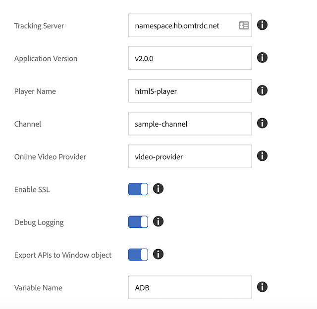

# Migração do Media SDK independente para o Adobe Launch - Web (JS)

>[!NOTE]
>A Adobe Experience Platform Launch está sendo reformulada como um conjunto de tecnologias de coleção de dados na Experience Platform. Como resultado, várias alterações de terminologia foram implementadas na documentação do produto. Consulte o seguinte [documento](https://experienceleague.adobe.com/docs/experience-platform/tags/term-updates.html?lang=pt-BR) para obter uma referência consolidada das alterações de terminologia.

## Diferenças nos recursos

* *Launch* - o Launch fornece uma interface do usuário que orienta você na instalação, configuração e implantação de suas soluções de rastreamento de mídia baseadas na Web. O Launch melhora com o Dynamic Tag Management (DTM).
* *SDK do Media* - o SDK do Media fornece bibliotecas de rastreamento de mídia criadas para plataformas específicas (por exemplo: Android, iOS, etc.). A Adobe recomenda o SDK do Media para rastrear o uso de mídia em aplicativos móveis.

## Configuração

### SDK do Media independente

No SDK do Media independente, é possível configurar o rastreamento no aplicativo
e transmiti-lo para o SDK ao criar o rastreador.

```javascript
//Media Heartbeat initialization
var mediaConfig = new MediaHeartbeatConfig();
mediaConfig.trackingServer = "namespace.hb.omtrdc.net";
mediaConfig.playerName = "html5-player";
mediaConfig.channel = "sample-channel";
mediaConfig.ovp = "video-provider";
mediaConfig.appVersion = "v2.0.0"
mediaConfig.ssl = true;
mediaConfig.debugLogging = true;
```

Além da configuração do `MediaHeartbeat`, a página deve configurar e transmitir
a instância `AppMeasurement` e a instância `VisitorAPI` para que o rastreamento de mídia funcione corretamente.

### Extensão do Launch

1. No Experience Platform Launch, clique na guia [!UICONTROL Extensões] para sua
propriedade da Web.
1. Na guia [!UICONTROL Catálogo], localize a extensão Adobe Media Analytics para áudio e
vídeo e clique em [!UICONTROL Instalar].
1. Na página de configurações da extensão, defina os parâmetros de rastreamento. A extensão do Media usa os parâmetros configurados para rastreamento.

   

[Guia do usuário do Launch - Instalar e configurar a extensão de mídia](https://experienceleague.adobe.com/docs/experience-platform/tags/extensions/adobe/media-analytics/overview.html?lang=pt-BR#install-and-configure-the-ma-extension)

## Diferenças na criação do rastreador

### SDK do Media

1. Adicione a biblioteca do Media Analytics ao projeto de desenvolvimento.
1. Criar um objeto de configuração (`MediaHeartbeatConfig`).
1. Implemente o protocolo delegado, expondo as funções `getQoSObject()` e `getCurrentPlaybackTime()`.
1. Crie uma instância do Media Heartbeat (`MediaHeartbeat`).

```
// Media Heartbeat initialization
var mediaConfig = new MediaHeartbeatConfig();
...
// Configuration settings
mediaConfig.trackingServer = Configuration.HEARTBEAT.TRACKING_SERVER;
...
// Implement Media Delegate (Quality of Service and Playhead)
var mediaDelegate = new MediaHeartbeatDelegate();
...
mediaDelegate.getQoSObject = function() {
    return MediaHeartbeat.createQoSObject(<bitrate>, <startuptime>, <fps>, <droppedFrames>);
    ...
}
...
// Create your tracker
this.mediaHeartbeat = new MediaHeartbeat(mediaDelegate, mediaConfig, appMeasurement);
```

### Launch

O Launch oferece duas abordagens para a criação da infraestrutura de rastreamento. Ambas as abordagens usam o Media Analytics Launch Extension:

1. Use as APIs de rastreamento de mídia em uma página da Web.

   Nesse cenário, o Media Analytics Launch Extension exporta as APIs de rastreamento de mídia para uma variável configurada no objeto de janela global:

   ```
   window["CONFIGURED_VARIABLE_NAME"].MediaHeartbeat.getInstance
   ```

1. Use as APIs de rastreamento de mídia de outra extensão do Launch.

   Nesse cenário, é possível usar as APIs de rastreamento de mídia expostas pelos Módulos compartilhados `get-instance` e `media-heartbeat`.

   >[!NOTE]
   >
   >Os Módulos compartilhados não estão disponíveis para uso nas páginas da Web. É possível usar os Módulos compartilhados somente em outra extensão.

   Crie uma instância `MediaHeartbeat` usando o Módulo compartilhado `get-instance`.
Transmita um objeto delegado para `get-instance` que exponha as funções `getQoSObject()` e `getCurrentPlaybackTime()`.

   ```
   var getMediaHeartbeatInstance =
   turbine.getSharedModule('adobe-video-analytics', 'get-instance');
   ```

   Acesse as constantes `MediaHeartbeat` pelo Módulo compartilhado `media-heartbeat`.

## Documentação relacionada

### SDK do Media

* [Configurar o JavaScript 2.x](/help/legacy/media-sdk/setup/setup-javascript/set-up-js-2.md)
* [API JS do SDK do Media](https://adobe-marketing-cloud.github.io/media-sdks/reference/javascript/MediaHeartbeat.html)

### Launch

* [Resumo do Launch](https://experienceleague.adobe.com/docs/experience-platform/tags/home.html?lang=pt-BR)
* [Extensão do Media Analytics](https://experienceleague.adobe.com/docs/experience-platform/tags/extensions/adobe/media-analytics/overview.html?lang=pt-BR)
