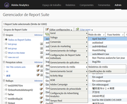
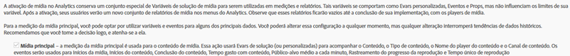
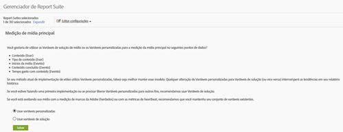
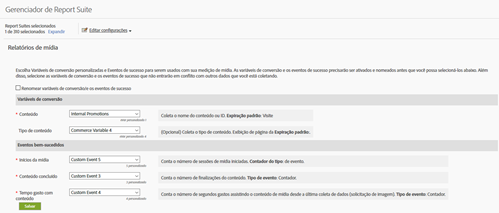

# Visão geral do marco {#milestone-overview}

>[!CAUTION]
>
>Esta opção de medição foi descontinuada.

[Documentação do marco herdada](milestone_analytics_video.pdf)

## Configuração {#configuration}

### Configuração de marco do vídeo

Para rastrear vídeos, atribua um conjunto de *Variáveis de conversão personalizadas* (eVars) e *Eventos personalizados* que serão utilizados no rastreamento e nos relatórios. Uma variável de *Insight personalizado* () também é usada para a definição de caminho.`s.prop`

As variáveis selecionadas para cada métrica são adicionadas à página de configuração do vídeo. Isso permite que o sistema gere e formate relatórios de vídeo padrão de modo automático. A eVar do *nome do vídeo* e o contador de *exibições de vídeo* são obrigatórios. As outras variáveis são opcionais, mas são recomendadas para a avaliação completa. Depois de ativar o rastreamento de vídeo, é possível usar o rastreamento de vídeo para exibir relatórios gerados a partir dos dados do vídeo relatados.

Também é possível rastrear quantidades adicionais de métricas para o vídeo. Por exemplo, se você utiliza diversos reprodutores de vídeo no site, é possível preencher um eVar com o nome do reprodutor. Algumas das variáveis selecionadas também podem ser utilizadas em outras áreas do site. Por exemplo, se for utilizada no site, a variável de *tipo de conteúdo* pode permitir que você avalie o percentual de exibições de página do vídeo, além de relacionar eventos de conversão com o vídeo.

### Configuração de relatórios de marco

Para configurar o relatórios de vídeo para uma implementação de etapa, acesse **[!UICONTROL Admin > Report Suite Manager].**Selecione o conjunto de relatórios e escolha**[!UICONTROL Video Management > Video Reporting]:**

<!--
{width="248"}
-->


Na primeira tela, somente o Vídeo principal funcionará com os dados do Marco. Selecione **[!UICONTROL Video Core]** e clique em **[!UICONTROL Save].**



Na tela seguinte, selecione **[!UICONTROL Use Custom Variables].**

<!--
{width="470"}
-->


Na tela final, selecione os dois eVars e os três eventos a serem usados com a sua medição de vídeo:

<!--

-->


## Referência da variável de vídeo {#video-variable-reference}

A tabela a seguir contém mais detalhes sobre as variáveis de comércio e os eventos personalizados de vídeo:

| Métrica de vídeo | Tipo de variável | Descrição |
| --- | --- | --- |
| Conteúdo | Expiração <br/>padrão do eVar: Visita | (Obrigatório) Coleta o nome do vídeo, conforme especificado na implementação. |
| Tipo de conteúdo | Expiração <br/>padrão do eVar: Visualização de página | Coleta dados sobre o tipo de conteúdo exibido por um visitante. Ocorrências enviadas por avaliação de vídeo recebem um tipo de conteúdo de `video.` <br/>Essa variável não precisa ser reservada exclusivamente para rastreamento de vídeo. Quando outros conteúdos relatam os tipos de conteúdo por meio da mesma variável, é possível analisar a distribuição de visitantes nesses tipos diferentes. Por exemplo, seria possível marcar outros tipos de conteúdo por meio de valores como `article` ou `product page` com essa variável. <br/>Da perspectiva de avaliação do vídeo, o *Tipo de conteúdo* permite que você identifique visitantes de vídeo e, portanto, calcule as taxas de conversão do vídeo. |
| Tempo gasto no conteúdo | Tipo <br/>de evento: Contador | Contabiliza o tempo, em segundos, que é gasto com a exibição de um vídeo desde o último processo de coleta de dados (solicitação da imagem). |
| Inicialização de vídeo | Tipo <br/>de evento: Contador | Indica que um visitante visualizou uma parte de um vídeo. No entanto, não fornece informações algumas sobre quanto ou a que parte de um vídeo o visitante assistiu. |
| Término do vídeo | Tipo <br/>de evento: Contador | Indica se o usuário exibiu um vídeo completo. Por padrão, o evento completo é avaliado um segundo antes do fim do vídeo.  <br/>Durante a implementação, é possível especificar quantos segundos a partir do fim do vídeo são necessários para considerar a visualização como concluída. Para o vídeo ao vivo e outros fluxos sem um fim definido, é possível especificar um ponto personalizado para avaliar conclusões. Por exemplo, após um tempo de exibição específico. |

## Variáveis do módulo de mídia {#media-module-variables}

As variáveis a seguir permitem a configuração da medição de vídeo. Você deve definir os valores para as variáveis presentes na tabela Variáveis exigidas. Além disso, para rastrear eventos no reprodutor de vídeo, você deve habilitar autoTrack (para reprodutores suportados) ou implementar o monitoramento personalizado do evento do reprodutor utilizando os métodos abrir, reproduzir, parar e fechar.

| Variável    | Descrição |
| --- | --- |
| `Media.trackUsingContextData` | **Sintaxe:** <br/><br/> `s.Media.trackUsingContextData = true;` <br/>Essa opção habilita o monitoramento integrado de vídeos. Quando definido como Verdadeiro, o módulo de mídia gera dados de contexto para o rastreamento de mídia, em vez do herdado `pev3`. <br/>Use `Media.contextDataMapping` para mapear os dados de contexto de acordo com as eVars e os Eventos selecionados.<br/>Valor padrão: `false` |
| `Media.contextDataMapping` | **Sintaxe:** <br/><br/> `s.Media.contextDataMapping = {`<br/>      `"a.media.name":"eVar2, prop2",` <br/>     `"a.media.segment":"eVar3",` <br/>     `"a.contentType":"eVar1",` <br/>     `"a.media.timePlayed":"event3",` <br/>     `"a.media.view":"event1",` <br/>     `"a.media.segmentView":"event2",` <br/>     `"a.media.complete":"event7",` <br/>     `"a.media.milestones":{` <br/>         `25:"event4",` <br/>         `50:"event5",` <br/>         `75:"event6"` <br/>     ` }` <br/> `};` <br/><br/>Um objeto que define o mapeamento de variáveis para eVars e Eventos que você deseja usar na avaliação do vídeo. O objeto deve mapear os seguintes campos: <br/><br/> **a.media.name:** (obrigatório) preenche variáveis com o nome do vídeo. Forneça a eVar selecionada para armazenar o nome do vídeo e a variável Custom Insight Video (`s.prop`) que deseja utilizar para o caminho do vídeo. Os valores serão exibidos em uma lista separada por vírgulas. <br/><br/> **a.media.segment:** (opcional) a eVar na qual você deseja armazenar o nome do segmento de mídia. a.contentType: (opcional) a eVar na qual você deseja armazenar o valor do vídeo, que inclui os recursos de monitoramento de visitas e visitantes habilitados com o objetivo de gerar relatórios de visitas e visitantes do vídeo. A variável selecionada provavelmente já é usada para armazenar dados, como apresentações de slides ou uma página de produto <br/><br/> **a.media.view:** (obrigatório) o Evento no qual você deseja contabilizar as exibições de mídia. <br/><br/> **a.media.segmentView:** (opcional) o Evento no qual você deseja contabilizar exibições de segmentos. <br/><br/> **a.media.complete:** (opcional) o Evento no qual você deseja contabilizar as exibições concluídas. <br/><br/> **a.media.timePlayed:** (opcional, altamente recomendado) o Evento numérico no qual você deseja armazenar a quantidade de segundos reproduzidos dos vídeos. <br/><br/> **a.media.milestones:** (opcional) um objeto que mapeia marcos de s.Media.trackMilestones para contabilizar Eventos. Media.segmentByMilestones deve estar definido como verdadeiro (true) se você definir marcos. <br/><br/> **Rastreamento de anúncios** As variáveis de dados de contexto listadas abaixo estão disponíveis para o rastreamento de anúncios: <br/> **a.media.ad.name:** (obrigatório) preenche variáveis com o nome do anúncio. Forneça a eVar selecionada para armazenar o nome do anúncio, e a variável Custom Insight Video (`s.prop`) que deseja utilizar para o caminho. Os valores serão exibidos em uma lista separada por vírgulas. <br/><br/> **a.media.ad.pod:** a posição no conteúdo principal em que o anúncio foi reproduzido. <br/><br/> **a.media.ad.podPosition:** a posição no pod para a reprodução do anúncio. <br/><br/> **a.media.ad.CPM:** o CPM ou CPM criptografado (com prefixo “~”) que se aplica a essa reprodução. <br/><br/> **a.media.ad.view:** funciona como `a.media.view` <br/><br/> **a.media.ad.clicked:** contabiliza a quantidade de cliques do anúncio (chamadas de `Media.click`) <br/><br/> **a.media.ad.timePlayed:** funciona como `a.media.timePlayed` <br/><br/> **a.media.ad.complete:** funciona como `a.media.complete` a.media.ad.segment: funciona como `a.media.segment` <br/><br/> **a.media.ad.segmentView:** funciona como `a.media.segmentView` <br/><br/> **a.media.ad.milestones:** funciona como `a.media.milestones` <br/><br/> **a.media.ad.offsetMilestones:** funciona como `a.media.offsetMilestones` |
| `Media.trackVars` | **Sintaxe:** <br/><br/> `s.Media.trackVars =` <br/>    `"events,` `prop2,` `eVar1,` `eVar2,` `eVar3";` <br/><br/>Uma lista separada por vírgulas com todas as variáveis definidas no código de rastreamento do vídeo. |
| `Media.trackEvents` | **Sintaxe:** <br/><br/> `s.Media.trackEvents =` <br/>    `"event1,` `event2,` `event3,` `event4,` `event5,` `event6,` `event7"` <br/><br/>Uma lista separada por vírgulas com todos os eventos definidos no código de rastreamento do vídeo. |

## Variáveis opcionais {#optional-variables}

|  Variável    | Descrição |
| --- | --- |
| `Media.autoTrack` | **Sintaxe:** <br/><br/> `s.Media.autoTrack = true` <br/><br/>Habilita o rastreamento automático para os reprodutores suportados. Reprodutores suportados: <ul> <li> Open Source Media Framework (OSMF) </li> <li> FLVPlayback (players de vídeo criados pelo assistente de importação de vídeo no Flash Professional) </li> <li> Silverlight </li> <li> MediaDisplay </li> <li> MediaPlayback </li> <li> API Brightcove versões 2 e 3 (consulte [Brightcove](https://marketing.adobe.com/resources/help/pt_BR/sc/appmeasurement/video/video_other_players.html)) </li> <li> Windows Media Player, Quicktime ou Real Player com JavaScript </li> </ul> <br/><br/>Se você não estiver utilizando um dos reprodutores acima, é possível usar `Media.open` `Media.play` `Media.stop` `Media.close` para rastrear os eventos do reprodutor. |
| `Media.autoTrackNetStreams` | **Sintaxe:** <br/><br/> `s.Media.autoTrackNetStreams = true` <br/><br/>O Flash 10.3 apresentou uma nova funcionalidade ao componente NetStream, que permite o rastreamento aprimorado de vídeos. Se você estiver utilizando um player Flash NetStream personalizado, é possível habilitar a variável para ativar uma funcionalidade semelhante ao autoTrack. Esse método exige que os vídeos sejam exibidos no Flash 10.3 ou posterior. |
| `Media.completeByCloseOffset` | **Sintaxe:** <br/><br/> <br/><br/>`s.Media.completeByCloseOffset = true` <br/><br/>Essa configuração permite que você contabilize um vídeo que foi concluído alguns segundos antes do fim do vídeo.  <br/><br/>O evento é enviado com base na quantidade de segundos especificada em `completeCloseOffsetThreshold`. Permite que você faça a avaliação das conclusões em players de vídeo que nunca relatam um deslocamento igual ao tamanho do vídeo.<br/><br/>Por padrão, esse valor está definido como verdadeiro e o limite está definido como 1 segundo. Com esses padrões, o evento de conclusão é enviado 1 segundo antes do fim do vídeo. |
| `Media.completeCloseOffsetThreshold` | **Sintaxe:** <br/><br/> `s.Media.completeCloseOffsetThreshold = 1` <br/><br/>Esse limite permite que você contabilize uma visualização de vídeo concluída alguns segundos antes do fim do vídeo.  `Media.completeByCloseOffset` deve estar definido como verdadeiro para a utilização desse limite.<br/><br/>O valor inteiro que foi fornecido determina o deslocamento em segundos da duração do vídeo no momento do seu encerramento e ainda é considerado como concluído. Permite que você faça a avaliação das conclusões em players de vídeo que nunca relatam um deslocamento igual ao tamanho do vídeo.  <br/><br/>O limite padrão é de 1 segundo. |
| `Media.playerName` | **Sintaxe:** <br/><br/> `s.Media.playerName = "Custom Player Name"` <br/><br/>Especifica um nome de player de vídeo personalizado. |
| `Media.trackSeconds` | **Sintaxe:** <br/><br/> `s.Media.trackSeconds = 15` <br/><br/>Define o intervalo, em segundos, para enviar dados de rastreamento de vídeo aos servidores de coleta de dados da Adobe durante a reprodução do vídeo. O valor deve ser definido em incrementos de 5 segundos. <br/><br/> Habilitar `Media.trackSeconds` aciona apenas os eventos definidos em `Media.contextDataMapping`. Para enviar variáveis além daquelas especificadas para a avaliação do vídeo, você deve usar o Media.Monitor. |
| `Media.trackMilestones` | Monitora marcos como o percentual da duração do vídeo.  <br/><br/> **Sintaxe:** <br/><br/> `s.Media.trackMilestones = "25, 50, 75";` <br/><br/>Define o intervalo como um percentual da duração do vídeo, para enviar dados de rastreamento de vídeo aos servidores de coleta de dados da Adobe. Especifique os marcos como uma lista de números inteiros separada por vírgulas. Por exemplo: 10 = 10%, 23 = 23%.  <br/><br/>Como esses marcos são pontos fixos no vídeo, se um visitante ultrapassar o marco de 10%, retornar e passar pelo marco de 10% novamente, o módulo de mídia enviará os dados de monitoramento diversas vezes. Da mesma maneira, se o visitante ultrapassar um marco, o módulo de mídia não enviará os dados de monitoramento para o marco.  <br/><br/>Habilitar `Media.trackMilestones` aciona apenas os eventos definidos em `Media.contextDataMapping`. Para enviar variáveis além daquelas especificadas para a avaliação do vídeo, você deve usar o Media.Monitor. |
| `Media.trackOffsetMilestones` | Rastreia marcos como segundos passados desde o início do vídeo.  <br/><br/> **Sintaxe:** <br/><br/> `s.Media.trackOffsetMilestones = "20, 40, 60";` <br/><br/>Define o intervalo, como segundos decorridos desde o início do anúncio, para o envio dos dados de monitoramento de vídeo para os servidores de coleta de dados da Adobe. Especifique os marcos como uma lista de números inteiros separada por vírgulas. Por exemplo: 20 = 20 segundos, 40 = 40 segundos).  <br/><br/>Como esses marcos são pontos fixos no vídeo, se um visitante ultrapassar o marco de 20 segundos, retornar e passar pelo marco de 20 segundos novamente, o módulo de mídia enviará os dados de monitoramento diversas vezes. Da mesma maneira, se o visitante ultrapassar um marco, o módulo de mídia não enviará os dados de monitoramento para o marco.  <br/><br/> Habilitar `Media.trackOffsetMilestones` aciona apenas os eventos definidos em `Media.contextDataMapping`. Para enviar variáveis além daquelas especificadas para a avaliação do vídeo, você deve usar o Media.Monitor. |
| `Media.segmentByMilestones` | **Sintaxe:** <br/><br/> `s.Media.segmentByMilestones = true;` <br/><br/>Gera automaticamente o nome do segmento, o número e os dados de duração do segmento, com base na duração da mídia e nos marcos especificados em `Media.trackMilestones` <br/><br/> A segmentação por marcos é a única maneira de definir segmentos ao usar `autoTrack`. <br/><br/>Valor padrão: `false` |
| `Media.segmentByOffsetMilestones` | **Sintaxe:** <br/><br/> `s.Media.segmentByOffsetMilestones = true;` <br/><br/>Gera automaticamente o nome do segmento, o número e os dados de duração do segmento, com base na duração da mídia e nos marcos especificados em `Media.trackOffsetMilestones` <br/><br/> A segmentação por marcos é a única maneira de definir segmentos ao usar `autoTrack`.  <br/><br/>Valor padrão: `false` |

## Variáveis de rastreamento de anúncios {#ad-tracking-variables}

Essas variáveis são utilizadas para enviar informações de publicidade com o método openAd. Consulte [Rastreamento do anúncio de vídeo VAST.](https://marketing.adobe.com/resources/help/pt_BR/sc/appmeasurement/video/video_ads.html)

| Variável    | Descrição |
| --- | --- |
| `Media.adTrackSeconds` | **Sintaxe:** <br/><br/> `s.Media.adTrackSeconds = 15;` <br/><br/>Define o intervalo, em segundos, para enviar dados de rastreamento de vídeos publicitários aos servidores de coleta de dados da Adobe durante a reprodução do vídeo. O valor deve ser definido em incrementos de 5 segundos.  <br/><br/> Habilitar `Media.adTrackSeconds` aciona apenas os eventos definidos em `Media.contextDataMapping`. Para enviar variáveis adicionais além daquelas especificadas para a avaliação do vídeo, você deve usar o `Media.monitor`. |
| `Media.adTrackMilestones` | Rastreia marcos de publicidade como o percentual da sua duração.  <br/><br/> **Sintaxe:** <br/><br/> `s.Media.adTrackMilestones = "25, 50, 75";` <br/><br/>Define o intervalo como um percentual da duração do anúncio, para enviar dados de rastreamento de vídeo publicitário aos servidores de coleta de dados da Adobe. Especifique os marcos como uma lista de números inteiros separada por vírgulas. Por exemplo: 10 = 10%, 23 = 23%).  <br/><br/>Como esses marcos são pontos fixos no anúncio, se um visitante ultrapassar o marco de 10%, retornar e passar pelo marco de 10% novamente, o módulo de mídia enviará os dados de monitoramento diversas vezes. Da mesma maneira, se o visitante ultrapassar um marco, o módulo de mídia não enviará os dados de monitoramento para o marco.  <br/><br/> Habilitar `Media.adTrackMilestones` aciona apenas os eventos definidos em `Media.contextDataMapping`. Para enviar variáveis adicionais além daquelas especificadas para a avaliação do vídeo, você deve usar o `Media.monitor`. |
| `Media.adTrackOffsetMilestones` | Rastreia marcos de publicidade como segundos passados desde o início do anúncio.  <br/><br/> **Sintaxe:** <br/><br/> `s.Media.adTrackOffsetMilestones = "20, 40, 60";` <br/><br/>Define o intervalo como segundos decorridos desde o início do anúncio, para enviar os dados de rastreamento do anúncio aos servidores de coleta de dados da Adobe. Especifique os marcos como uma lista de números inteiros separada por vírgulas. Por exemplo: 20 = 20 segundos, 40 = 40 segundos).  <br/><br/>Como esses marcos são pontos fixos no anúncio, se um visitante ultrapassar o marco de 20 segundos, retornar e passar pelo marco de 20 segundos novamente, o módulo de mídia enviará os dados de monitoramento diversas vezes. Da mesma maneira, se o visitante ultrapassar um marco, o módulo de mídia não enviará os dados de monitoramento para o marco.  <br/><br/> Habilitar `Media.adTrackOffsetMilestones` aciona apenas os eventos definidos em `Media.contextDataMapping`. Para enviar variáveis adicionais além daquelas especificadas para a avaliação do vídeo, você deve usar o `Media.monitor`. |
| `Media.adSegmentByMilestones` | **Sintaxe:** <br/><br/> `s.Media.adSegmentByMilestones = true;` <br/><br/>Gera automaticamente o nome do segmento, o número e os dados de duração do segmento, com base na duração da mídia e nos marcos especificados em `Media.adTrackMilestones` <br/><br/> A segmentação por marcos é a única maneira de definir segmentos ao usar `autoTrack`.  <br/><br/>Valor padrão: `false` |
| `Media.adSegmentByOffsetMilestones` | **Sintaxe:** <br/><br/> `s.Media.adSegmentByOffsetMilestones = true;` <br/><br/>Gera automaticamente o nome do segmento, o número e os dados de duração do segmento, com base na duração da mídia e nos marcos especificados em `Media.adTrackOffsetMilestones` <br/><br/> A segmentação por marcos é a única maneira de definir segmentos ao usar `autoTrack`. <br/><br/>Valor padrão: `false` |

## Métodos do módulo de mídia {#media-module-methods}

Os métodos do módulo de mídia são utilizados para rastrear de forma manual os eventos, bem como para rastrear métricas adicionais que não fazem parte dos relatórios de vídeo padrão.

Se você estiver utilizando `Media.autoTrack` e não for rastrear métricas adicionais, não é necessário chamar todos esses métodos diretamente. Todos os argumentos são necessários, exceto quando especificado como opcional.

| Método    | Descrição |
| --- | --- |
| `Media.open` | **Sintaxe:** <br/><br/> `s.Media.open(mediaName, mediaLength, mediaPlayerName)` <br/><br/>Prepara o módulo de mídia para coletar dados de rastreamento do vídeo. Este método usa os seguintes parâmetros: <ul><li> **mediaName:** (obrigatório) o nome do vídeo conforme você quer que ele seja exibido nos relatórios de vídeo. </li><li>  **mediaLength:** (obrigatório) a duração do vídeo, em segundos.  </li><li> **mediaPlayerName:** (obrigatório) o nome do reprodutor de mídia utilizado para exibir o vídeo, conforme você quer que ele seja exibido nos relatórios de vídeo. </li></ul> |
| `Media.openAd` | **Sintaxe:** <br/><br/> `s.Media.openAd(name, length, playerName, parentName,`<br/>   `parentPod, parentPodPosition, CPM)` <br/><br/>Prepara o módulo de mídia para coletar dados de rastreamento dos anúncios. Este método usa os seguintes parâmetros: <ul> <li> **name:** (obrigatório) o nome ou ID do anúncio.  </li> <li> **Length:** (obrigatório) a duração do anúncio.  </li> <li> **playerName:** (obrigatório) o nome do reprodutor de mídia utilizado para exibir o anúncio.  </li> <li> **parentName:** o nome ou a ID do conteúdo principal no qual o anúncio está incorporado.  </li> <li> **parentPod:** a posição, no conteúdo principal, de reprodução do anúncio.  </li> <li> **parentPodPosition:** a posição, no pod, de reprodução do anúncio.  </li> <li> **CPM:** o CPM ou o CPM criptografado (com prefixo &quot;~&quot;) que se aplica a essa reprodução.  </li> </ul> |
| `Media.click` | **Sintaxe:** <br/><br/> `s.Media.click(name, offset)` <br/><br/>Rastreie situações nas quais um anúncio é clicado em um vídeo. Este método usa os seguintes parâmetros: <ul> <li> **name:** o nome do anúncio. Deve corresponder ao nome utilizado em Media.openAd.  </li> <li> **offset:** o deslocamento para o anúncio no momento do clique.  </li> </ul> |
| `Media.close` | **Sintaxe:** <br/><br/> `s.Media.close(mediaName)` <br/><br/>Encerra a coleta de dados do vídeo e envia informações para os servidores de coleta de dados da Adobe. Chame o método ao fim do vídeo. Esse método utiliza o seguinte parâmetro: <br/><br/> **mediaName:** o nome do vídeo. Deve corresponder ao nome utilizado em `Media.open`. |
| `Media.complete` | **Sintaxe:** <br/><br/> `s.Media.complete(name, offset)` <br/><br/>Este método rastreia manualmente um método de evento concluído. Ele é utilizado quando é necessário acionar eventos com uma lógica especial, que não pode ser manuseada com `Media.completeByCloseOffset`. <br/><br/>Por exemplo, se você estiver medindo um stream ao vivo que não tem hora para acabar, é possível acionar uma conclusão depois que o usuário exibir um stream ao vivo por X segundos. Você pode avaliar uma conclusão utilizando um cálculo de percentual com base na duração e no tipo de conteúdo. Este método usa os seguintes parâmetros: <ul> <li> **mediaName:** o nome do vídeo. Deve corresponder ao nome utilizado em Media.open.  </li> <li> **mediaOffset:** os segundos do vídeo quando o evento concluído deve ser enviado. Especifique o deslocamento com base no vídeo, iniciando no ponto zero. <br/><br/>Se o player de mídia rastrear utilizando milissegundos, verifique se o valor é convertido em segundos antes de chamar Media.complete.  </li> </ul> Se planeja chamar a conclusão manual, defina <br/><br/> `s.Media.completeByCloseOffset = false`. |
| `Media.play` | **Sintaxe:** <br/><br/> `s.Media.play(name, offset, segmentNum, segment, segmentLength)` <br/><br/>Chame esse método sempre que um vídeo começar a ser reproduzido. Ao utilizar a avaliação manual do vídeo, você pode fornecer os dados de segmento atuais no envio de dados.  <br/><br/>Se o reprodutor mudar de um segmento para outro, por qualquer motivo, você deve chamar `Media.stop` `Media.play`. <br/><br/>Este método usa os seguintes parâmetros: <br/><br/> **mediaName:** o nome do vídeo. Deve corresponder ao nome utilizado em Media.open.  <br/><br/> **mediaOffset:** os segundos do vídeo em que a reprodução é iniciada. Especifique o deslocamento com base no vídeo, iniciando no ponto zero. Se o player de mídia rastrear utilizando milissegundos, verifique se o valor é convertido em segundos antes de chamar Media.play.  <br/><br/> **segmentNum:** (opcional) o número do segmento atual, utilizado pelos relatórios de marketing para ordenar a exibição dos segmentos nos relatórios. O parâmetro segmentNum deve ser superior a zero.  <br/><br/> **segment:** (opcional) o nome atual do segmento.  <br/><br/> **segmentLength:** (opcional) <br/><br/>A duração do segmento atual, em segundos.  <br/><br/>Por exemplo: <br/><br/> `s.Media.play("My Video", 1800, 2,"Second Quarter", 1800)` <br/><br/> `s.Media.play("My Video", 0, 1,"Preroll", 30)` |
| `Media.stop` | **Sintaxe:** <br/><br/> `s.Media.stop(mediaName, mediaOffset)` <br/><br/>Rastreia um evento de parada (parada, pausa etc.) do vídeo especificado. Este método usa os seguintes parâmetros: <ul> <li> **mediaName:** o nome do vídeo. Deve corresponder ao nome utilizado em `Media.open`.  </li> <li> **mediaOffset:** os segundos do vídeo em que ocorre o evento de parada ou pausa. Especifique o deslocamento com base no vídeo, iniciando no ponto zero.  </li> </ul> |
| `Media.monitor` | **Sintaxe:** <br/><br/> `s.Media.monitor(s, media)` <br/><br/> **Sintaxe do Silverlight:** <br/><br/> `s.Media.monitor =` <br/>   `new AppMeasurement_Media_Monitor(myMediaMonitor);` <br/><br/>O monitor do aplicativo Silverlight implementa o padrão de design delegado Objective-C. O método de classe `myMediaMonitor` utiliza os parâmetros `s` e `media`. <br/><br/>Utilize esse método para enviar métricas adicionais de vídeo. Você pode configurar outras variáveis (Props, eVars, Eventos) e enviá-las utilizando o `Media.track` e levando em conta o estado atual do vídeo durante a sua reprodução. <br/><br/>Consulte [Avaliação de métricas adicionais com Media.monitor.](https://marketing.adobe.com/resources/help/pt_BR/sc/appmeasurement/video/video_mediamonitor.html) <br/><br/>Este método usa os seguintes parâmetros: <br/><br/>  **s:** A instância `AppMeasurement` (ou objeto `s` do JavaScript).<br/><br/> **media:** um objeto com membros, responsável por fornecer o estado do vídeo. Esses membros incluem:  <ul><li> `media.name:` O nome do vídeo. Deve corresponder ao nome utilizado em `Media.open`; </li><li> `media.length:` a duração do vídeo em segundos, fornecida na chamada para `Media.open`; </li><li> `media.playerName:` o nome do reprodutor de mídia fornecido na chamada para `Media.open`; </li><li> `media.openTime:``Media.open` um objeto NSDate contendo dados sobre quando foi chamado; </li><li> `media.offset:` o deslocamento atual, em segundos, (ponto no vídeo) do vídeo. O deslocamento começa em zero (o primeiro segundo do vídeo é 0); </li><li> `media.percent:` o percentual atual do vídeo reproduzido, com base na duração do vídeo e do deslocamento atual.;  </li><li> `media.timePlayed:` o número total de segundos reproduzidos até o momento;  </li><li> `media.eventFirstTime:` indica se foi a primeira vez que o evento de mídia foi chamado para o vídeo; </li><li> `media.mediaEvent:` uma string contendo o nome do evento que provocou a chamada do monitor. </li></ul> |
|  | `media.mediaEvent` events: <ul><li> `OPEN:` quando a reprodução ocorre por `Media.autoTrack` ou com uma chamada para `Media.play`; </li><li> `CLOSE:` quando a reprodução termina ao concluir o vídeo por `Media.autoTrack` ou ao chamar `Media.close`;</li><li> `PLAY:` quando a reprodução continua após uma pausa ou ao depurar `Media.autoTrack`, ou efetuar uma segunda chamada para `Media.play`;</li><li> `STOP:``Media.autoTrack` quando a reprodução é interrompida devido a uma pausa no início da depuração por ou uma chamada para `Media.stop`;</li><li> `MONITOR:` quando a monitoração automática verifica o estado do vídeo durante a reprodução (a cada segundo);</li><li> `SECONDS:` No segundo intervalo definido pela variável `Media.trackSeconds`;</li><li> `MILESTONE:` Nos marcos definidos pela variável `Media.trackMilestones`; </li></ul> |
| `Media.track` | **Sintaxe:** <br/><br/> `s.Media.track(mediaName)` <br/><br/>Envia imediatamente o estado atual do vídeo, juntamente com qualquer `Media.trackVars` e Media.trackEvents que já tenha sido definido. Esse método é utilizado em `Media.monitor`. <br/><br/>Consulte [Avaliação de métricas adicionais com Media.monitor.](https://marketing.adobe.com/resources/help/pt_BR/sc/appmeasurement/video/video_mediamonitor.html) <br/><br/>Chame `Media.open` e `Media.play` no vídeo antes de chamar esse método. Esse método utiliza o seguinte parâmetro: <ul> <li> **mediaName**: o nome do vídeo. Deve corresponder ao nome utilizado em `Media.open`.</li> </ul> Este método é a única maneira de enviar mais variáveis durante a reprodução do vídeo. Isso redefine o intervalo de segundos e a porcentagem dos contadores de marcos para zero, de modo a impedir múltiplas ocorrências de rastreamento. |


## Monitoramento de eventos do reprodutor de vídeo {#track-video-player-events}

Você pode criar funções anexadas aos manipuladores do evento do reprodutor de vídeo para monitorar os reprodutores de mídia. Isso permite que você chame `Media.open`, `Media.play`, `Media.stop` e `Media.close` nos momentos apropriados. Por exemplo:

* **Carregar:** Chame `Media.open` e `Media.play`
* **Pausar:** Chame `Media.stop`. Por exemplo, se um usuário pausar um vídeo depois de 15 segundos, chama `s.Media.stop("Video1", 15)`
* **Buffer:** chama a instância `Media.stop` durante o buffering do vídeo. Chama `Media.play` quando a reprodução é retomada.
* **Retomar:** Chame `Media.play`. Por exemplo, quando um usuário retoma um vídeo após 15 segundos, chama `s.Media.play("Video1", 15)`.
* **Scrub (controle deslizante):** quando o usuário arrasta o controle deslizante do vídeo, chamada de `Media.stop`. Quando um usuário solta a barra deslizante do vídeo, chama `Media.play`.
* **Finalizar:** Chame `Media.stop`, depois `Media.close`. Por exemplo, ao fim de um vídeo de 100 segundos, chama `s.Media.stop("Video1", 100)`, em seguida `s.Media.close("Video1")`.

Para chegar a este resultado é possível definir quatro funções personalizadas que você pode chamar pelos manipuladores de evento do reprodutor de mídia. Os diferentes parâmetros passados para `Media.open`, `Media.play`, `Media.stop` e `Media.close` são originados pelo reprodutor. Os pseudo códigos demonstram como isto deve ser feito:

```javascript
/* Call on video load */ 
function startMovie() { 
    s.Media.open(mediaName, mediaLength, mediaPlayerName); 
    playMovie(); 
} 
 
/* Call on video resume from pause and slider release */ 
function playMovie() { 
    s.Media.play(mediaName, 
                 mediaOffset,  
                 segmentNum,  
                 segment,  
                 segmentLength); 
} 
/* Call on video pause and slider grab */ 
function stopMovie() { 
    s.Media.stop(mediaName, mediaOffset); 
} 
 
/* Call on video end */ 
/* Measuring Video for Developers 43 */ 
function endMovie() { 
    stopMovie(); 
    s.Media.close(mediaName); 
} 
```

## JavaScript autotrack {#javascript-autotrack}

O módulo de mídia do JavaScript identifica todas as tags `<embed>` ou `<object>` no HTML da página. Em seguida, ele pesquisa os dados em cada tag para determinar o reprodutor de mídia, caso ele esteja em uso. Se o reprodutor for o Windows Media Player, o Quicktime ou o Real Player, a função `autoTrack` poderá ser usada, embora o `autoTrack` para o Windows Media Player funcione somente no Internet Explorer. O rastreamento manual para o Windows Media Player é necessário para oferecer suporte a todos os outros navegadores.

É necessário ter o atributo `classid` definido no objeto que você deseja rastrear. O `classid` é necessário para expor os manipuladores de evento utilizados pelo Módulo de mídia no monitoramento automático de vídeos.

```javascript
s.Media.autoTrack = true
```

## Código de amostra do JavaScript {#javascript-sample-code}

```javascript
// Sample implementation 
s.usePlugins=true 
function s_doPlugins(s) { 
    /* Add manual calls to modules and plugins here */ 
} 
 
s.doPlugins=s_doPlugins 
 
/*********Media Module Calls**************/ 
s.loadModule("Media") 
 
/*Configure Media Module Functions */ 
s.Media.autoTrack= true; 
s.Media.trackVars="events, prop2, eVar1, eVar2, eVar3"; 
s.Media.trackEvents="event1, event2, event3, event4, event5, event6, event7" 
s.Media.trackMilestones="25, 50, 75"; 
s.Media.playerName="My Media Player"; 
s.Media.segmentByMilestones = true; 
s.Media.trackUsingContextData = true; 
s.Media.contextDataMapping = { 
    "a.media.name":"eVar2, prop2", 
    "a.media.segment":"eVar3", 
    "a.contentType":"eVar1", 
    "a.media.timePlayed":"event3", 
    "a.media.view":"event1", 
    "a.media.segmentView":"event2", 
    "a.media.complete":"event7", 
    "a.media.milestones":{ 
        25:"event4", 
        50:"event5", 
        75:"event6" 
    } 
} 
 
s.Media.monitor = function (s, media) { } //If Needed

/* Turn on and configure debugging here */ 
s.debugTracking = true; 
s.trackLocal = true; 
 
/* WARNING: Changing any of the below variables will cause drastic changes to how your visitor 
data is collected. Changes should only be made when instructed to do so by your account 
manager.*/ 
s.visitorNamespace = "yourNamespace"; 
s.trackingServer="metrics.mysite.com" //Use only if using first party cookies 
s.trackingServerSecure="smetrics.mysite.com" // Use only if using first party cookies in  
                                             // conjunction with SSL 
s.dc = '122'; 
 
/************************** PLUGINS SECTION *************************/ 
/* Insert any plugins code you want to use here. */ 
 
/****************************** MODULES *****************************/ 
/* Insert the media module tracking code here. */ 
```

