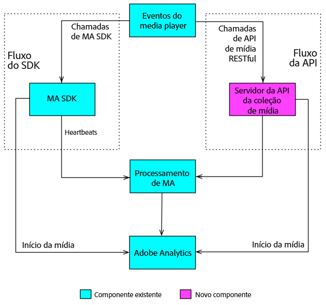

# Visão geral{#overview}

A API da coleção de mídia é a alternativa RESTful da Adobe para o SDK do Media no lado do cliente. Com a API da coleção de mídia, o reprodutor pode rastrear eventos de áudio e vídeo usando chamadas RESTful HTTP. A API de coleta de mídia oferece o mesmo rastreamento em tempo real do Media SDK, mais um recurso adicional:

* **Rastreamento de conteúdo baixado**

   Esse recurso oferece a capacidade de rastrear mídia enquanto um usuário está offline por meio do armazenamento local de dados do evento até que o dispositivo do usuário retorne online. (Consulte [Rastrear o conteúdo baixado](track-downloaded-content.md) para obter detalhes.)

A API da coleção de mídia é essencialmente um adaptador e atua como uma versão no lado do servidor do SDK do Media. Isso significa que alguns aspectos da documentação do SDK de mídia também são relevantes para a API de coleta de mídia. For example, both solutions use the same [Audio and Video Parameters](../metrics-and-metadata/audio-video-parameters.md), and the collected Audio and Video tracking data leads to the same [Reporting and Analysis.](../media-reports/media-reports-enable.md)

## Fluxos de dados de rastreamento de mídia {#section_pwq_n34_qbb}

Um player de mídia que implementa a API de coleta de mídia faz chamadas de rastreamento de API resttly diretamente ao servidor de back-end de rastreamento de mídia, enquanto um player que implementa o Media SDK faz chamadas de rastreamento para as apis do SDK dentro do aplicativo do player. Um resultado de fazer chamadas pela Web é que o reprodutor que implementa a API da coleção de mídia precisa lidar com parte do processamento que o SDK do Media realiza automaticamente. (Details in [Media Collection Implementation.](mc-api-impl/mc-api-quick-start.md))

Os dados de rastreamento capturados com a API da coleção de mídia são enviados e processados inicialmente de forma diferente dos dados de rastreamento capturados em um player de SDK Media, mas o mesmo mecanismo de processamento no back-end é usado para ambas as soluções.



## API Overview {#section_y4n_mcl_kcb}

**URI:** obtenha essa informação do seu representante da Adobe.

**Método HTTP:** POST, com corpo de solicitação JSON.

### Chamadas à APIs {#mc-api-calls}

* **`sessions`-** Estabelece uma sessão com o servidor e retorna uma ID de sessão que será usada nas chamadas de `events` subsequentes. Seu aplicativo realiza essa chamada uma vez no início de uma sessão de rastreamento.

   ```
   {uri}/api/v1/sessions
   ```

* **`events`-** Envia dados de rastreamento de mídia.

   ```
   {uri}/api/v1/sessions/{session-id}/events
   ```

### Corpo da solicitação {#mc-api-request-body}

```
{ 
    "playerTime": { 
        "playhead": {playhead position in seconds}, 
        "ts": {timestamp in milliseconds} 
    }, 
    "eventType": {event-type}, 
    "params": { 
        {parameter-name}: {parameter-value}, 
        ... 
        {parameter-name}: {parameter-value} 
    }, 
    "qoeData" : { 
        {parameter-name}: {parameter-value}, 
        ... 
        {parameter-name}: {parameter-value} 
    }, 
    "customMetadata": { 
        {parameter-name}: {parameter-value}, 
        ... 
        {parameter-name}: {parameter-value} 
    } 
} 
```

* `playerTime` - Obrigatório para todas as solicitações.
* `eventType` - Obrigatório para todas as solicitações.
* `params` - Obrigatório para determinados `eventTypes`; verifique o [esquema de validação JSON](mc-api-ref/mc-api-json-validation.md) para determinar quais eventTypes são obrigatórios e quais são opcionais.

* `qoeData` - Opcional para todas as solicitações.
* `customMetadata` - Opcional para todas as solicitações, mas apenas para tipos `sessionStart`de `adStart``chapterStart` evento e evento.

Para cada `eventType`, há um [esquema de validação JSON](mc-api-ref/mc-api-json-validation.md) disponível publicamente que você deve usar para verificar os tipos de parâmetros e se um parâmetro é opcional ou obrigatório para um evento específico.

### Tipos de evento {#mc-api-event-types}

* `sessionStart`
* `play`
* `ping`
* `pauseStart`
* `bufferStart`
* `adStart`
* `adComplete`
* `adSkip`
* `adBreakStart`
* `adBreakComplete`
* `chapterStart`
* `chapterSkip`
* `chapterComplete`
* `sessionEnd`
* `sessionComplete`

