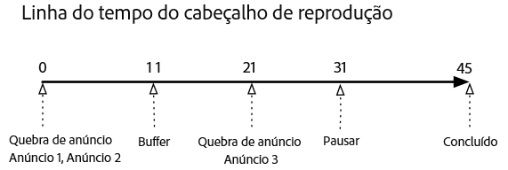
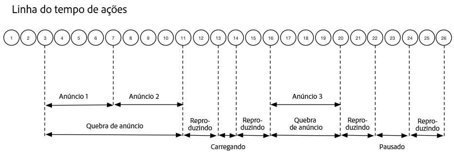

# Linha do tempo 1 - Visualização do conteúdo até o fim{#timeline-view-to-end-of-content}

## VOD, anúncios precedentes, pausa, buffer, visualização até o fim do conteúdo

Os diagramas a seguir ilustram a linha do tempo do indicador de reprodução e a linha do tempo de pontuação das ações de um usuário. Os detalhes de cada ação e suas solicitações relacionadas são apresentados abaixo.








## Detalhes da ação

### Action 1 - Start session {#Action-1}

| Ação | Linha do tempo da ação (segundos) | Posição do indicador de reprodução (Segundos) | Solicitação do cliente |
| --- | :---: | :---: | --- |
| Botão Reprodução automática ou Reprodução pressionado, o vídeo começa a ser carregado. | 0 | 0 | `/api/v1/sessions` |

**Detalhe da implementação**

Essa chamada sinaliza _a intenção do usuário de reproduzir_ um vídeo. <br/><br/>Retorna uma ID de sessão ( `{sid}`) ao cliente que é usada para identificar todas as chamadas de rastreamento subsequentes na sessão. O estado do reprodutor ainda não é "reproduzindo", mas "iniciando". <br/><br/>[Os parâmetros obrigatórios da sessão](/help/media-collection-api/mc-api-ref/mc-api-sessions-req.md) devem ser incluídos no mapa `params` no corpo da solicitação. <br/><br/>No back-end, essa chamada gera uma chamada de inicialização do Adobe Analytics.

**Exemplo de corpo da solicitação**

```
{
    playerTime: {
        playhead: 0, ts: <timestamp>
    },
    eventType:sessionStart, params: {
        "media.playerName": "sample-html5-api-player",
        "analytics.trackingServer": "[ _YOUR_TS_ ]",
        "analytics.reportSuite": "[ _YOUR_RSID_ ]",
        "analytics.visitorId": "[ _YOUR_VISITOR_ID_ ]",
        "media.contentType": "VOD",
        "media.length": 60.3333333333333,
        "media.id": "VA API Sample Player",
        "visitor.marketingCloudOrgId": "[YOUR_MCID]",
        "media.name": "ClickMe",
        "media.channel": "sample-channel",
        "media.sdkVersion": "va-api-0.0.0",
        "analytics.enableSSL": false
    }
}
```

### Action 2 - Ping timer start {#Action-2}

| Ação | Linha do tempo da ação (segundos) | Posição do indicador de reprodução (Segundos) | Solicitação do cliente |
| --- | :---: | :---: | --- |
| O aplicativo inicia o temporizador de evento de ping | 0 | 0 | `/api/v1/sessions/{sid}/events` |  |

**Detalhes da implementação**

Inicie o timer de ping do aplicativo. O primeiro evento de ping deve ser lançado em 1 segundo se houver anúncios precedentes, caso contrário, 10 segundos.

### Action 3 - Ad break start {#Action-3}

| Ação | Linha do tempo da ação (segundos) | Posição do indicador de reprodução (Segundos) | Solicitação do cliente |
| --- | :---: | :---: | --- |
| Rastrear o início do ad break precedente | 0 | 0 | `/api/v1/sessions/{sid}/events` |

**Detalhe da implementação**

Os anúncios somente podem ser rastreados em um ad break.

**Exemplo de corpo da solicitação**

```
{
    playerTime: {
        playhead: 0,
        ts: <timestamp>
    },
    eventType:adBreakStart, params: {
        "media.ad.podFriendlyName": "ad_pod1",
        "media.ad.podIndex": 0,
        "media.ad.podSecond": 0
    }
}
```

### Action 4 - Ad start {#Action-4}

| Ação | Linha do tempo da ação (segundos) | Posição do indicador de reprodução (Segundos) | Solicitação do cliente |
| --- | :---: | :---: | --- |
| Rastrear o início do anúncio nº 1 precedente | 0 | 0 | `/api/v1/sessions/{sid}/events` |

**Detalhe da implementação**

Comece a rastrear o primeiro anúncio precedente, que tem 15 segundos de duração. Incluindo metadados personalizados com este `adStart` .

**Exemplo de corpo da solicitação**

```
{
    playerTime: {
        playhead: 0,
        ts: &lt;timestamp&gt;
    },
    eventType:adStart,
    params: {
        "media.ad.podFriendlyName": "ad_pod1",
        "media.ad.name": "Ad 1",
        "media.ad.id": "001",
        "media.ad.length": 15,
        "media.ad.podPosition": 1,
        "media.ad.playerName": "Sample Player",
        "media.ad.advertiser": "Ad Guys",
        "media.ad.campaignId": "1",
        "media.ad.creativeId": "42",
        "media.ad.siteId": "XYZ",
        "media.ad.creativeURL": "https://xyz_creative.com",
        "media.ad.placementId": "sample_placement"
    },
    customMetadata: {
        "myCustomData1": "CustomData1",
        "myCustomData2": "CustomData2"
    }
}
```

### Action 5 - Ad pings {#Action-5}

#### Action 5.1 - Ad ping 1 {#Action-5-1}

| Ação | Linha do tempo da ação (segundos) | Posição do indicador de reprodução (Segundos) | Solicitação do cliente |
| --- | :---: | :---: | --- |
| O aplicativo envia o evento de ping | 1 | 0 | `/api/v1/sessions/{sid}/events` |

**Detalhe da implementação**

Faça o ping a cada 1 segundo enquanto dentro de um anúncio.

**Exemplo de corpo da solicitação**

```
{
    playerTime: {
        playhead: 0,
        ts: <timestamp>
    },
    eventType:ping
}
```

#### Action 5.2 - Ad ping 2 {#Action-5-2}

| Ação | Linha do tempo da ação (segundos) | Posição do indicador de reprodução (Segundos) | Solicitação do cliente |
| --- | :---: | :---: | --- |
| O aplicativo envia o evento de ping | 2 | 0 | `/api/v1/sessions/{sid}/events` |

**Detalhe da implementação**

Faça o ping a cada 1 segundo enquanto dentro de um anúncio.

**Exemplo de corpo da solicitação**

```
{
    playerTime: {
        playhead: 0,
        ts: <timestamp>
    },
    eventType:ping
}
```

#### Action 5.3 - Ad ping 3 {#Action-5-3}


| Ação | Linha do tempo da ação (segundos) | Posição do indicador de reprodução (Segundos) | Solicitação do cliente |
| --- | :---: | :---: | --- |
| O aplicativo envia o evento de ping | 3 | 0 | `/api/v1/sessions/{sid}/events` |

**Detalhe da implementação**

Faça o ping a cada 1 segundo enquanto dentro de um anúncio.

>[!NOTE]
>
>Anúncios subsequentes na linha do tempo ignorarão a série de segundos de um segundo
>como interesse da seriity…

**Exemplo de corpo da solicitação**

```
{
    playerTime: {
        playhead: 0,
        ts: <timestamp>
    },
    eventType:ping
}
```

### Action 6 - Ad complete {#Action-6}

| Ação | Linha do tempo da ação (segundos) | Posição do indicador de reprodução (Segundos) | Solicitação do cliente |
| --- | :---: | :---: | --- |
| Rastrear o anúncio nº 1 precedente concluído | 15 | 0 | `/api/v1/sessions/{sid}/events` |

**Detalhe da implementação**

Rastreie o final do primeiro anúncio precedente.

**Exemplo de corpo da solicitação**

```
{
    playerTime: {
        playhead: 0,
        ts: <timestamp>
    },
    eventType:adComplete
}
```

### Action 7 - Ad start {#Action-7}

| Ação | Linha do tempo da ação (segundos) | Posição do indicador de reprodução (Segundos) | Solicitação do cliente |
| --- | :---: | :---: | --- |
| Rastrear o início do anúncio nº 2 precedente | 15 | 0 | `/api/v1/sessions/{sid}/events` |

**Detalhe da implementação**

Rastreie o início do segundo anúncio precedente, que tem 7 segundos de duração.

**Exemplo de corpo da solicitação**

```
{
    playerTime: {
        playhead: 0,
        ts: <timestamp>
    },
    eventType:adStart, params: {
        "media.ad.podFriendlyName": "ad_pod1",
        "media.ad.name": "Ad 2",
        "media.ad.id": "002",
        "media.ad.length": 7,
        "media.ad.podPosition": 1,
        "media.ad.playerName": "Sample Player",
        "media.ad.advertiser": "Ad Guys",
        "media.ad.campaignId": "2",
        "media.ad.creativeId": "44",
        "media.ad.siteId": "XYZ",
        "media.ad.creativeURL": "https://xyz_creative.com",
        "media.ad.placementId": "sample_placement2"
    },
}
```

### Action 8 - Ad pings {#Action-8}

| Ação | Linha do tempo da ação (segundos) | Posição do indicador de reprodução (Segundos) | Solicitação do cliente |
| --- | :---: | :---: | --- |
| O aplicativo envia o evento de ping | 20 | 0 | `/api/v1/sessions/{sid}/events` |

**Detalhe da implementação**

Faça o ping a cada 1 segundo.

**Exemplo de corpo da solicitação**

```
{
    playerTime: {
        playhead: 0,
        ts: <timestamp>
    },
    eventType:ping
}
```

### Action 9 - Ad complete {#Action-9}

| Ação | Linha do tempo da ação (segundos) | Posição do indicador de reprodução (Segundos) | Solicitação do cliente |
| --- | :---: | :---: | --- |
| Rastrear o anúncio nº 2 precedente concluído | 22 | 0 | `/api/v1/sessions/{sid}/events` |

**Detalhe da implementação**

Rastreie o final do segundo anúncio precedente.

**Exemplo de corpo da solicitação**

```
{
    playerTime: {
        playhead: 0,
        ts: <timestamp>
    },
    eventType:adComplete
}
```

### Action 10 - Ad break complete {#Action-10}

| Ação | Linha do tempo da ação (segundos) | Posição do indicador de reprodução (Segundos) | Solicitação do cliente |
| --- | :---: | :---: | --- |
| Rastrear o ad break precedente concluído | 22 | 0 | `/api/v1/sessions/{sid}/events` |

**Detalhe da implementação**

O ad break terminou. Durante o ad break, o reprodutor permaneceu no estado "reproduzindo".

**Exemplo de corpo da solicitação**

```
{
    playerTime: {
        playhead: 0,
        ts: <timestamp>
    },
    eventType:adBreakComplete
}
```

### Action 11 - Play content {#Action-11}

| Ação | Linha do tempo da ação (segundos) | Posição do indicador de reprodução (Segundos) | Solicitação do cliente |
| --- | :---: | :---: | --- |
| Rastrear evento de reprodução | 22 | 0 | `/api/v1/sessions/{sid}/events` |

**Detalhe da implementação**

Depois do evento `adBreakComplete`, coloque o reprodutor no estado "reproduzindo" usando o evento `play`.

**Exemplo de corpo da solicitação**

```
{
    playerTime: {
        playhead: 0,
        ts: <timestamp>
    },
    eventType:play
}
```

### Action 12 - Ping {#Action-12}

| Ação | Linha do tempo da ação (segundos) | Posição do indicador de reprodução (Segundos) | Solicitação do cliente |
| --- | :---: | :---: | --- |
| O aplicativo envia o evento de ping | 30 | 8 | `/api/v1/sessions/{sid}/events` |

**Detalhe da implementação**

Envie um ping ao back-end a cada 10 segundos.

**Exemplo de corpo da solicitação**

```
{
    playerTime: {
        playhead: 8,
        ts: <timestamp>
    },
    eventType:ping
}
```

### Action 13 - Buffer start {#Action-13}

| Ação | Linha do tempo da ação (segundos) | Posição do indicador de reprodução (Segundos) | Solicitação do cliente |
| --- | :---: | :---: | --- |
| Evento de início de buffer ocorrido | 33 | 11 | `/api/v1/sessions/{sid}/events` |

**Detalhe da implementação**

Rastreie o movimento do reprodutor para o estado de "buffering".

**Exemplo de corpo da solicitação**

```
{
    playerTime: {
        playhead: 11,
        ts: <timestamp>
    }, eventType:bufferStart
}
```

### Action 14 - Buffer end {#Action-14}

| Ação | Linha do tempo da ação (segundos) | Posição do indicador de reprodução (Segundos) | Solicitação do cliente |
| --- | :---: | :---: | --- |
| O buffering terminou, o aplicativo rastreia a retomada do conteúdo | 36 | 11 | `/api/v1/sessions/{sid}/events` |

**Detalhe da implementação**

O buffering termina após 3 segundos; coloque o reprodutor no estado "reproduzindo". Você deve enviar outro evento de rastreamento de reprodução a partir do buffering.  **`play`A chamada depois de um`bufferStart`inferir uma chamada de "bufferend" para o back end,** então não há necessidade de `bufferEnd` um evento.

**Exemplo de corpo da solicitação**

```
{
    playerTime: {
        playhead: 11,
        ts: <timestamp>
    },
    eventType:play
}
```

### Action 15 - Ping {#Action-15}

| Ação | Linha do tempo da ação (segundos) | Posição do indicador de reprodução (Segundos) | Solicitação do cliente |
| --- | :---: | :---: | --- |
| O aplicativo envia o evento de ping | 40 | 15 | `/api/v1/sessions/{sid}/events` |

**Detalhe da implementação**

Envie um ping ao back-end a cada 10 segundos.

**Exemplo de corpo da solicitação**

```
{
    playerTime: {
        playhead: 15,
        ts: <timestamp>
    }, eventType:ping
}
```

### Action 16 - Ad break start {#Action-16}

| Ação | Linha do tempo da ação (segundos) | Posição do indicador de reprodução (Segundos) | Solicitação do cliente |
| --- | :---: | :---: | --- |
| Rastrear o início do ad break intermediário | 46 | 21 | `/api/v1/sessions/{sid}/events` |

**Detalhe da implementação**

Anúncio intermediário de 8 segundos: envie `adBreakStart` .

**Exemplo de corpo da solicitação**

```
{
    playerTime: {
        playhead: 21,
        ts: <timestamp>
    },
    eventType:adBreakStart,
    params: {
        "media.ad.podFriendlyName": "ad_pod2",
        "media.ad.podIndex": 1,
        "media.ad.podSecond": 21
    }
}
```

### Action 17 - Ad start {#Action-17}

| Ação | Linha do tempo da ação (segundos) | Posição do indicador de reprodução (Segundos) | Solicitação do cliente |
| --- | :---: | :---: | --- |
| Rastrear o início do anúncio nº 3 intermediário | 46 | 21 | `/api/v1/sessions/{sid}/events` |

**Detalhe da implementação**

Rastreie o anúncio intermediário.

**Exemplo de corpo da solicitação**

```
{
    playerTime: {
        playhead: 21,
        ts: <timestamp>
    },
    eventType:adStart, params: {
        "media.ad.podFriendlyName": "ad_pod2",
        "media.ad.name": "Ad 3",
        "media.ad.id": "003",
        "media.ad.length": 8,
        "media.ad.podPosition": 2,
        "media.ad.playerName": "Sample Player",
        "media.ad.advertiser": "Ad Guys",
        "media.ad.campaignId": "7",
        "media.ad.creativeId": "40",
        "media.ad.siteId": "XYZ",
        "media.ad.creativeURL": "https://xyz_creative.com",
        "media.ad.placementId": "sample_placement2"
    },
}
```

### Action 18 - Ad ping {#Action-18}

| Ação | Linha do tempo da ação (segundos) | Posição do indicador de reprodução (Segundos) | Solicitação do cliente |
| --- | :---: | :---: | --- |
| O aplicativo envia o evento de ping | 50 | 21 | `/api/v1/sessions/{sid}/events` |

**Detalhe da implementação**

Envie um ping ao back-end a cada 10 segundos.

**Exemplo de corpo da solicitação**

```
{
    playerTime: {
        playhead: 21,
        ts: <timestamp>
    }, eventType:ping
}
```

### Action 19 - Ad complete {#Action-19}

| Ação | Linha do tempo da ação (segundos) | Posição do indicador de reprodução (Segundos) | Solicitação do cliente |
| --- | :---: | :---: | --- |
| Rastrear a conclusão do anúncio nº 1 intermediário | 54 | 21 | `/api/v1/sessions/{sid}/events` |

**Detalhe da implementação**

O anúncio intermediário está concluído.

**Exemplo de corpo da solicitação**

```
{
    playerTime: {
        playhead: 21,
        ts: <timestamp>
    },
    eventType:adComplete
}
```

### Action 20 - Ad break complete {#Action-20}

| Ação | Linha do tempo da ação (segundos) | Posição do indicador de reprodução (Segundos) | Solicitação do cliente |
| --- | :---: | :---: | --- |
| Rastrear o ad break intermediário concluído | 54 | 21 | `/api/v1/sessions/{sid}/events` |

**Detalhe da implementação**

O ad break está concluído.

**Exemplo de corpo da solicitação**

```
{
    playerTime: {
        playhead: 21,
        ts: <timestamp>
    },
    eventType:adBreakComplete
}
```

### Action 21 - Ping {#Action-21}

| Ação | Linha do tempo da ação (segundos) | Posição do indicador de reprodução (Segundos) | Solicitação do cliente |
| --- | :---: | :---: | --- |
| O aplicativo envia o evento de ping | 60 | 27 | `/api/v1/sessions/{sid}/events` |

**Detalhe da implementação**

Envie um ping ao back-end a cada 10 segundos.

**Exemplo de corpo da solicitação**

```
{
    playerTime: {
        playhead: 27,
        ts: <timestamp>
    },
    eventType:ping
}
```

### Action 22 - Pause {#Action-22}

| Ação | Linha do tempo da ação (segundos) | Posição do indicador de reprodução (Segundos) | Solicitação do cliente |
| --- | :---: | :---: | --- |
| O usuário pressionou Pausar | 64 | 31 | `/api/v1/sessions/{sid}/events` |

**Detalhe da implementação**

A ação do usuário move o estado de reprodução para "pausado".

**Exemplo de corpo da solicitação**

```
{
    playerTime: {
        playhead: 31,
        ts: <timestamp>
    },
    eventType:pauseStart
}
```

### Action 23 - Ping {#Action-23}

| Ação | Linha do tempo da ação (segundos) | Posição do indicador de reprodução (Segundos) | Solicitação do cliente |
| --- | :---: | :---: | --- |
| O aplicativo envia o evento de ping | 70 | 31 | `/api/v1/sessions/{sid}/events` |

**Detalhe da implementação**

Envie um ping ao back-end a cada 10 segundos. O reprodutor ainda está no estado "buffering"; o usuário está parado em 20 segundos do conteúdo. Irritado...

**Exemplo de corpo da solicitação**

```
{
    playerTime: {
        playhead: 31,
        ts: <timestamp>
    }, eventType:ping
}
```

### Action 24 - Play {#Action-24}

| Ação | Linha do tempo da ação (segundos) | Posição do indicador de reprodução (Segundos) | Solicitação do cliente |
| --- | :---: | :---: | --- |
| O usuário pressionou Reproduzir para retomar o conteúdo principal | 74 | 31 | `/api/v1/sessions/{sid}/events` |

**Detalhe da implementação**

Mova o estado de reprodução para "reproduzindo".  **`play`A chamada depois de um`pauseStart`inferir uma chamada de "retomada" para o back end,** então não há necessidade de `resume` um evento.

**Exemplo de corpo da solicitação**

```
{
    playerTime: {
        playhead: 31,
        ts: <timestamp>
    }, eventType:play
}
```

### Action 25 - Ping {#Action-25}

| Ação | Linha do tempo da ação (segundos) | Posição do indicador de reprodução (Segundos) | Solicitação do cliente |
| --- | :---: | :---: | --- |
| O aplicativo envia o evento de ping | 80 | 37 | `/api/v1/sessions/{sid}/events` |

**Detalhe da implementação**

Envie um ping ao back-end a cada 10 segundos.

**Exemplo de corpo da solicitação**

```
{
    playerTime: {
        playhead: 37,
        ts: <timestamp>
    }, eventType:ping
}
```

### Action 26 - Session complete {#Action-26}

| Ação | Linha do tempo da ação (segundos) | Posição do indicador de reprodução (Segundos) | Solicitação do cliente |
| --- | :---: | :---: | --- |
| O usuário termina de assistir ao conteúdo até o final. | 88 | 45 | `/api/v1/sessions/{sid}/events` |

**Detalhe da implementação**

Envie `sessionComplete` ao back-end para indicar que o usuário terminou de assistir todo o conteúdo.

**Exemplo de corpo da solicitação**

```
{
    playerTime: {
        playhead: 45,
        ts: <timestamp>
    }, eventType:sessionComplete
}
```

>[!NOTE]
>
>**Sem eventos de busca? -** Não há suporte explícito na API da coleção de mídia para eventos `seekStart` ou `seekComplete`. Isso ocorre porque determinados reprodutores geram um grande número desses eventos quando o usuário final movimenta o indicador de reprodução e várias centenas de usuários podem congestionar facilmente a largura de banda da rede de um serviço de back-end. A Adobe resolve o suporte explícito a eventos de busca computando a duração do heartbeat com base no carimbo de data e hora do dispositivo, em vez de na posição do indicador de reprodução.

