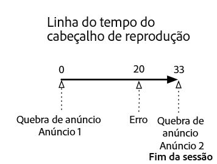
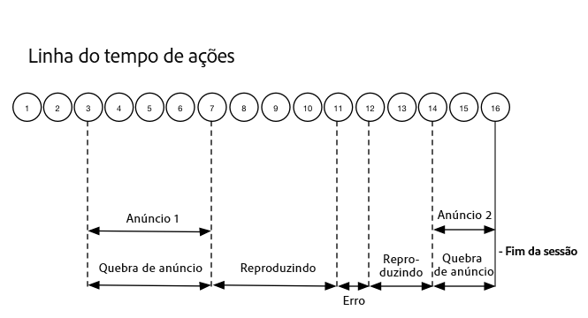

# Linha do tempo 2 - Usuário abandona a sessão {#timeline--2-user-abandons-session}

## VOD, anúncios precedentes, anúncios intermediários, usuário abandona o conteúdo antecipadamente

Os diagramas a seguir ilustram a linha do tempo do indicador de reprodução e a linha do tempo correspondente das ações de um usuário. Os detalhes de cada ação e suas solicitações relacionadas são apresentados abaixo.








## Detalhes da ação

### Action 1 - Start session {#Action-1}

| Ação | Linha do tempo da ação (segundos) | Posição do indicador de reprodução (Segundos) | Solicitação do cliente |
| --- | :---: | :---: | --- |
| Botão de Reprodução automática ou Reprodução pressionado | 0 | 0 | `/api/v1/sessions` |

**Detalhes da implementação**

Essa chamada sinaliza _a intenção do usuário de reproduzir_ um vídeo. It returns a Session ID ( `{sid}` ) to the client that is used to identify all subsequent tracking calls within the session. O estado do reprodutor ainda não é "reproduzindo", mas "iniciando".  [Os parâmetros obrigatórios da sessão](../../media-collection-api/mc-api-ref/mc-api-sessions-req.md) devem ser incluídos no mapa `params` no corpo da solicitação.  No back-end, essa chamada gera uma chamada de inicialização do Adobe Analytics.

**Exemplo de corpo da solicitação**

```
{
    playerTime: {
        playhead: 0,
        ts: <timestamp>
    },
    eventType:sessionStart, params: {
        "media.playerName": "sample-html5-api-player",
        "analytics.trackingServer": "[ _YOUR-TS_ ]",
        "analytics.reportSuite": "[ _YOUR-RSID_ ]",
        "analytics.visitorId": "[ _YOUR-VISITOR-ID_ ]",
        "media.contentType": "VOD",
        "media.length": 60.3333333333333,
        "media.id": "VA API Sample Player",
        "visitor.marketingCloudOrgId": "[YOUR-MCID]",
        "media.name": "ClickMe",
        "media.channel": "sample-channel",
        "media.sdkVersion": "va-api-0.0.0",
        "analytics.enableSSL": false
    }
}
```

### Action 2 - Ping timer start {#Action-2}

| Ação | Linha do tempo da ação (segundos) | Posição do indicador de reprodução (Segundos) | Solicitação do cliente |
| --- | :---: | :---: | --- |
| O aplicativo inicia o temporizador de evento de ping | 0 | 0 |  |

**Detalhes da implementação**

Inicie o timer de ping do aplicativo. O primeiro evento de ping deve ser lançado em 1 segundo se houver anúncios precedentes, caso contrário, 10 segundos.

### Action 3 - Ad break start {#Action-3}

| Ação | Linha do tempo da ação (segundos) | Posição do indicador de reprodução (Segundos) | Solicitação do cliente |
| --- | :---: | :---: | --- |
| Rastrear o início do ad break precedente | 0 | 0 | `/api/v1/sessions/{sid}/events` |

**Detalhes da implementação**

Os anúncios precedentes devem ser rastreados. Os anúncios somente podem ser rastreados em um ad break.

**Exemplo de corpo da solicitação**

```
{
    playerTime: {
        playhead: 0,
        ts: <timestamp>
    },
    eventType:adBreakStart, params: {
        "media.ad.podFriendlyName": "ad_pod1",
        "media.ad.podIndex": 0,
        "media.ad.podSecond": 0
    }
}
```

### Action 4 - Ad start {#Action-4}

| Ação | Linha do tempo da ação (segundos) | Posição do indicador de reprodução (Segundos) | Solicitação do cliente |
| --- | :---: | :---: | --- |
| Rastrear o início do anúncio nº 1 precedente | 0 | 0 | `/api/v1/sessions/{sid}/events` |

**Detalhes da implementação**

Um anúncio de 12 segundos é iniciado.

**Exemplo de corpo da solicitação**

```
{
    playerTime: {
        playhead: 0,
        ts: <timestamp>
    },
    eventType:adStart, params: {
        "media.ad.podFriendlyName": "ad_pod1",
        "media.ad.name": "Ad 1",
        "media.ad.id": "002",
        "media.ad.length": 7,
        "media.ad.podPosition": 1,
        "media.ad.playerName": "Sample Player",
        "media.ad.advertiser": "Ad Guys",
        "media.ad.campaignId": "1",
        "media.ad.creativeId": "42",
        "media.ad.siteId": "XYZ",
        "media.ad.creativeURL": "https://xyz-creative.com",
        "media.ad.placementId": "sample-placement2"
    },
}
```

### Action 5 - Ad pings {#Action-5}

| Ação | Linha do tempo da ação (segundos) | Posição do indicador de reprodução (Segundos) | Solicitação do cliente |
| --- | :---: | :---: | --- |
| O aplicativo envia o evento de ping | 1 | 0 | `/api/v1/sessions/{sid}/events` |

**Detalhes da implementação**

Faça o ping a cada 1 segundo. (Os painéis subsequentes não são exibidos, com o objetivo de facilitar a serialização.)

**Exemplo de corpo da solicitação**

```
{
    playerTime: {
        playhead: 0,
        ts: <timestamp>
    },
    eventType:ping
}
```

### Action 6 - Ad complete {#Action-6}

| Ação | Linha do tempo da ação (segundos) | Posição do indicador de reprodução (Segundos) | Solicitação do cliente |
| --- | :---: | :---: | --- |
| Rastrear o anúncio nº 1 precedente concluído | 12 | 0 | `/api/v1/sessions/{sid}/events` |

**Detalhes da implementação**

O primeiro anúncio precedente terminou.

**Exemplo de corpo da solicitação**

```
{
    playerTime: {
        playhead: 0,
        ts: <timestamp>
    },
    eventType:adComplete
}
```

### Action 7 - Ad break complete {#Action-7}

| Ação | Linha do tempo da ação (segundos) | Posição do indicador de reprodução (Segundos) | Solicitação do cliente |
| --- | :---: | :---: | --- |
| Rastrear o ad break precedente concluído | 12 | 0 | `/api/v1/sessions/{sid}/events` |

**Detalhes da implementação**

O ad break terminou. Durante o ad break, o reprodutor permaneceu no estado "reproduzindo".

**Exemplo de corpo da solicitação**

```
{
    playerTime: {
        playhead: 0,
        ts: <timestamp>
    },
    eventType:adBreakComplete
}
```

### Action 8 - Play content {#Action-8}

| Ação | Linha do tempo da ação (segundos) | Posição do indicador de reprodução (Segundos) | Solicitação do cliente |
| --- | :---: | :---: | --- |
| Rastrear evento de reprodução | 12 | 0 | `/api/v1/sessions/{sid}/events` |

**Detalhes da implementação**

Mova o reprodutor para o estado "reproduzindo"; comece a rastrear o início da reprodução do conteúdo.

**Exemplo de corpo da solicitação**

```
{
    playerTime: {
        playhead: 0,
        ts: <timestamp>
    },
    eventType:play,
    qoeData: { bitrate: 10000 }
}
```

### Action 9 - Ping {#Action-9}

| Ação | Linha do tempo da ação (segundos) | Posição do indicador de reprodução (Segundos) | Solicitação do cliente |
| --- | :---: | :---: | --- |
| O aplicativo envia o evento de ping | 20 | 8 | `/api/v1/sessions/{sid}/events` |

**Detalhes da implementação**

Envie um ping ao back-end a cada 10 segundos.

**Exemplo de corpo da solicitação**

```
{
    playerTime: {
        playhead: 8ß,
        ts: <timestamp>
    },
    eventType:ping
}
```

### Action 10 - Ping {#Action-10}

| Ação | Linha do tempo da ação (segundos) | Posição do indicador de reprodução (Segundos) | Solicitação do cliente |
| --- | :---: | :---: | --- |
| O aplicativo envia o evento de ping | 30 | 18 | `/api/v1/sessions/{sid}/events` |

**Detalhes da implementação**

Envie um ping ao back-end a cada 10 segundos.

**Exemplo de corpo da solicitação**

```
{
    playerTime: {
        playhead: 18,
        ts: <timestamp>
    },
    eventType:ping
}
```

### Action 11 - Error {#Action-11}

| Ação | Linha do tempo da ação (segundos) | Posição do indicador de reprodução (Segundos) | Solicitação do cliente |
| --- | :---: | :---: | --- |
| Ocorre um erro, o aplicativo envia as informações do erro. | 32 | 20 | `/api/v1/sessions/{sid}/events` |

**Detalhes da implementação**


**Exemplo de corpo da solicitação**

```
{
    playerTime: {
        playhead: 20,
        ts: <timestamp>
    },
    eventType:error
}
```

### Action 12 - Play content {#Action-12}

| Ação | Linha do tempo da ação (segundos) | Posição do indicador de reprodução (Segundos) | Solicitação do cliente |
| --- | :---: | :---: | --- |
| O aplicativo se recupera do erro, o usuário pressiona Reproduzir | 37 | 20 | `/api/v1/sessions/{sid}/events` |

**Detalhes da implementação**


**Exemplo de corpo da solicitação**

```
{
    playerTime: {
        playhead: 18,
        ts: <timestamp>
    },
    eventType:play, qoeData: { bitrate: 10000 }
}
```

### Action 13 - Ping {#Action-13}

| Ação | Linha do tempo da ação (segundos) | Posição do indicador de reprodução (Segundos) | Solicitação do cliente |
| --- | :---: | :---: | --- |
| O aplicativo envia o evento de ping | 40 | 28 | `/api/v1/sessions/{sid}/events` |

**Detalhes da implementação**

Envie um ping ao back-end a cada 10 segundos.

**Exemplo de corpo da solicitação**

```
{
    playerTime: {
        playhead: 28,
        ts: <timestamp>
    },
    eventType:ping
}
```

### Action 14 - Ad break start {#Action-14}

| Ação | Linha do tempo da ação (segundos) | Posição do indicador de reprodução (Segundos) | Solicitação do cliente |
| --- | :---: | :---: | --- |
| Rastrear o início do ad break intermediário | 45 | 33 | `/api/v1/sessions/{sid}/events` |

**Detalhes da implementação**

Anúncio intermediário de 8 segundos: envie `adBreakStart` .

**Exemplo de corpo da solicitação**

```
{
    playerTime: {
        playhead: 33,
        ts: <timestamp>
    },
    eventType:adBreakStart, params: {
        "media.ad.podFriendlyName": "ad_pod2",
        "media.ad.podIndex": 1,
        "media.ad.podSecond": 33
    }
}
```

### Action 15 - Ad start {#Action-15}

| Ação | Linha do tempo da ação (segundos) | Posição do indicador de reprodução (Segundos) | Solicitação do cliente |
| --- | :---: | :---: | --- |
| Rastrear o início do anúncio nº 1 intermediário | 45 | 33 | `/api/v1/sessions/{sid}/events` |

**Detalhes da implementação**

Rastreie o anúncio intermediário.

**Exemplo de corpo da solicitação**

```
{
    playerTime: { playhead: 33, ts: <timestamp>
    },
    eventType:adStart, params: {
        "media.ad.podFriendlyName": "ad_pod1",
        "media.ad.name": "Ad 1",
        "media.ad.id": "002",
        "media.ad.length": 8,
        "media.ad.podPosition": 1,
        "media.ad.playerName": "Sample Player",
        "media.ad.advertiser": "Ad Guys",
        "media.ad.campaignId": "7",
        "media.ad.creativeId": "40",
        "media.ad.siteId": "XYZ",
        "media.ad.creativeURL": "https://xyz_creative.com",
        "media.ad.placementId": "sample_placement2"
    },
}
```

### Action 16 - Close app {#Action-16}

| Ação | Linha do tempo da ação (segundos) | Posição do indicador de reprodução (Segundos) | Solicitação do cliente |
| --- | :---: | :---: | --- |
| O usuário fecha o aplicativo. O aplicativo determina que o usuário abandonou a visualização e não está retornando a esta sessão. | 48 | 33 | `/api/v1/sessions/{sid}/events` |

**Detalhes da implementação**

Envie `sessionEnd` para o back-end do VA para indicar que a sessão deve ser encerrada imediatamente, sem processamento adicional.

**Exemplo de corpo da solicitação**

```
{
    playerTime: {
        playhead: 33,
        ts: <timestamp>
    },
    eventType:sessionEnd
}
```


