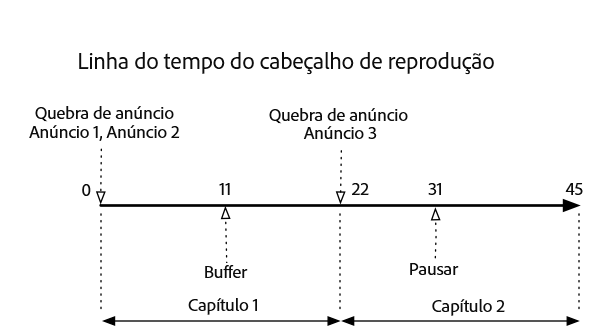
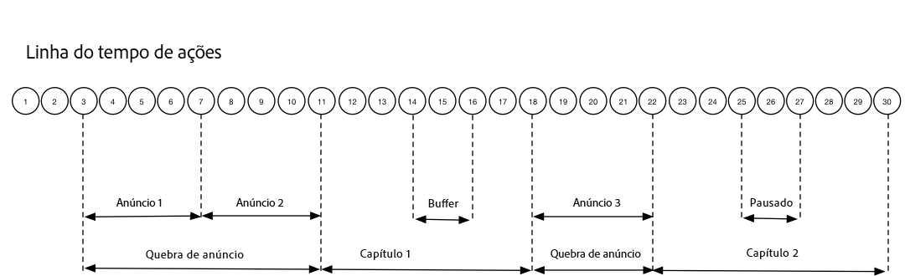

# Linha do tempo 3 - Capítulos {#timeline-3-chapters}

## VOD, anúncios precedentes, pausa, buffer, visualização até o fim do conteúdo


Os diagramas a seguir ilustram a linha do tempo do indicador de reprodução e a linha do tempo correspondente das ações de um usuário. Os pormenores de cada ação e os pedidos que a acompanham são apresentados a seguir.








## Detalhes da ação


### Ação 1 - Iniciar sessão {#Action-1}

| Ação | Linha do tempo de ação (segundos) | Posição do indicador de reprodução (segundos) | Solicitação de cliente |
| --- | :---: | :---: | --- |
| Botão Reproduzir automaticamente ou Reproduzir pressionado, o vídeo começa a carregar. | 0 | 0 | `/api/v1/sessions` |

**Detalhes da implementação**

Esta chamada indica _a intenção do usuário de reproduzir_ um vídeo. Retorna uma ID de sessão (`{sid}`) ao cliente usada para identificar todas as chamadas de rastreamento subsequentes na sessão. O estado do reprodutor ainda não é &quot;reproduzindo&quot;, mas &quot;iniciando&quot;.  [Os parâmetros obrigatórios da sessão](/help/media-collection-api/mc-api-ref/mc-api-sessions-req.md) devem ser incluídos no mapa `params` no corpo da solicitação.  No back-end, essa chamada gera uma chamada de inicialização do Adobe Analytics.

**Exemplo de corpo da solicitação**

```
{
    playerTime: {
        playhead: 0,
        ts: <timestamp>
    },
    eventType:sessionStart, params: {
        "media.playerName": "sample-html5-api-player",
        "analytics.trackingServer": "[ _YOUR-TS_ ]",
        "analytics.reportSuite": "[ _YOUR_RSID_ ]",
        "analytics.visitorId": "[ _YOUR_VISITOR_ID_ ]",
        "media.contentType": "VOD",
        "media.length": 60.3333333333333,
        "media.id": "VA API Sample Player",
        "visitor.marketingCloudOrgId": "[YOUR_MCID]",
        "media.name": "ClickMe",
        "media.channel": "sample-channel",
        "media.sdkVersion": "va-api-0.0.0",
        "analytics.enableSSL": false
    }
}
```

### Ação 2 — Início do temporizador de ping {#Action-2}

| Ação | Linha do tempo de ação (segundos) | Posição do indicador de reprodução (segundos) | Solicitação de cliente |
| --- | :---: | :---: | --- |
| Temporizador do evento ping de início do aplicativo | 0 | 0 |  |

**Detalhes da implementação**

Inicie seu temporizador de ping. O primeiro evento de ping deve disparar 1 segundo se houver anúncios precedentes, 10 segundos se não houver.

### Ação 3 - Início de quebra de anúncio {#Action-3}

| Ação | Linha do tempo de ação (segundos) | Posição do indicador de reprodução (segundos) | Solicitação de cliente |
| --- | :---: | :---: | --- |
| Rastrear início de ad break antes da exibição | 0 | 0 | `/api/v1/sessions/{sid}/events` |

**Detalhes da implementação**

Os anúncios somente podem ser rastreados em um ad break.

**Exemplo de corpo da solicitação**

```
{
    playerTime: {
        playhead: 0,
        ts: <timestamp>
    },
    eventType:adBreakStart, params: {
        "media.ad.podFriendlyName": "ad_pod1",
        "media.ad.podIndex": 0, "media.ad.podSecond": 0
    }
}
```

### Ação 4 - Início do anúncio {#Action-4}

| Ação | Linha do tempo de ação (segundos) | Posição do indicador de reprodução (segundos) | Solicitação de cliente |
| --- | :---: | :---: | --- |
| Rastrear início do anúncio nº 1 antes da exibição | 0 | 0 | `/api/v1/sessions/{sid}/events` |

**Detalhes da implementação**

Comece a rastrear o primeiro anúncio precedente, que tem 15 segundos de duração. Incluindo metadados personalizados com este `adStart` .

**Exemplo de corpo da solicitação**

```
{
    playerTime: {
        playhead: 0,
        ts: <timestamp>
    },
    eventType:adStart, params: {
        "media.ad.podFriendlyName": "ad_pod1",
        "media.ad.name": "Ad 1",
        "media.ad.id": "001",
        "media.ad.length": 15,
        "media.ad.podPosition": 1,
        "media.ad.playerName": "Sample Player",
        "media.ad.advertiser": "Ad Guys",
        "media.ad.campaignId": "1",
        "media.ad.creativeId": "42",
        "media.ad.siteId": "XYZ",
        "media.ad.creativeURL": "https://xyz_creative.com",
        "media.ad.placementId": "sample_placement"
    },
    customMetadata: {
        "myCustomData1": "CustomData1",
        "myCustomData2": "CustomData2"
    }
}
```

### Ação 5 - Pings de anúncios {#Action-5}

| Ação | Linha do tempo de ação (segundos) | Posição do indicador de reprodução (segundos) | Solicitação de cliente |
| --- | :---: | :---: | --- |
| O aplicativo envia o evento de ping | 10 | 0 | `/api/v1/sessions/{sid}/events` |

**Detalhes da implementação**

Envie um ping ao back-end a cada 1 segundo. (Os pings de anúncios subsequentes não são mostrados, por motivos de brevidade.)

**Exemplo de corpo da solicitação**

```
{
    playerTime: {
        playhead: 0,
        ts: <timestamp>
    },
    eventType:ping
}
```

### Ação 6 - Anúncio concluído {#Action-6}

| Ação | Linha do tempo de ação (segundos) | Posição do indicador de reprodução (segundos) | Solicitação de cliente |
| --- | :---: | :---: | --- |
| Rastrear conclusão do anúncio nº 1 antes da exibição | 15 | 0 | `/api/v1/sessions/{sid}/events` |

**Detalhes da implementação**

Rastreie o final do primeiro anúncio precedente.

**Exemplo de corpo da solicitação**

```
{
    playerTime: {
        playhead: 0,
        ts: <timestamp>
    },
    eventType:adComplete
}
```

### Ação 7 - Início do anúncio {#Action-7}

| Ação | Linha do tempo de ação (segundos) | Posição do indicador de reprodução (segundos) | Solicitação de cliente |
| --- | :---: | :---: | --- |
| Rastrear início do anúncio nº 2 antes da exibição | 15. | 0 | `/api/v1/sessions/{sid}/events` |

**Detalhes da implementação**

Rastreie o início do segundo anúncio precedente, que tem 7 segundos de duração.

**Exemplo de corpo da solicitação**

```
{
    playerTime: {
        playhead: 0,
        ts: <timestamp>
    },
    eventType:adStart, params: {
        "media.ad.podFriendlyName": "ad_pod1",
        "media.ad.name": "Ad 2",
        "media.ad.id": "002",
        "media.ad.length": 7,
        "media.ad.podPosition": 1,
        "media.ad.playerName": "Sample Player",
        "media.ad.advertiser": "Ad Guys",
        "media.ad.campaignId": "2",
        "media.ad.creativeId": "44",
        "media.ad.siteId": "XYZ",
        "media.ad.creativeURL": "https://xyz_creative.com",
        "media.ad.placementId": "sample_placement2"
    },
}
```

### Ação 8 - Pings de anúncios {#Action-8}

| Ação | Linha do tempo de ação (segundos) | Posição do indicador de reprodução (segundos) | Solicitação de cliente |
| --- | :---: | :---: | --- |
| O aplicativo envia o evento de ping | 16 | 0 | `/api/v1/sessions/{sid}/events` |

**Detalhes da implementação**

Envie um ping ao back-end a cada 1 segundo. (Os pings de anúncios subsequentes não são mostrados, por motivos de brevidade.)

**Exemplo de corpo da solicitação**

```
{
    playerTime: {
        playhead: 0,
        ts: <timestamp>
    },
    eventType:ping
}
```

### Ação 9 - Anúncio concluído {#Action-9}

| Ação | Linha do tempo de ação (segundos) | Posição do indicador de reprodução (segundos) | Solicitação de cliente |
| --- | :---: | :---: | --- |
| Rastrear conclusão do anúncio nº 2 antes da exibição | 22 | 0 | `/api/v1/sessions/{sid}/events` |

**Detalhes da implementação**

Rastreie o final do segundo anúncio precedente.

**Exemplo de corpo da solicitação**

```
{
    playerTime: {
        playhead: 0,
        ts: <timestamp>
    },
    eventType:adComplete
}
```

### Ação 10 - Quebra de anúncio concluída {#Action-10}

| Ação | Linha do tempo de ação (segundos) | Posição do indicador de reprodução (segundos) | Solicitação de cliente |
| --- | :---: | :---: | --- |
| Rastrear conclusão de ad break antes da exibição | 22º | 0 | `/api/v1/sessions/{sid}/events` |

**Detalhes da implementação**

O ad break está concluído. Ao longo do ad break, o estado da reprodução permaneceu &quot;reproduzindo&quot;.

**Exemplo de corpo da solicitação**

```
{
    playerTime: {
        playhead: 0,
        ts: <timestamp>
    },
    eventType:adBreakComplete
}
```

### Ação 11 - Reproduzir conteúdo {#Action-11}

| Ação | Linha do tempo de ação (segundos) | Posição do indicador de reprodução (segundos) | Solicitação de cliente |
| --- | :---: | :---: | --- |
| Rastrear evento de reprodução | 22º | 0 | `/api/v1/sessions/{sid}/events` |

**Detalhes da implementação**

Depois do evento `adBreakComplete`, coloque o reprodutor no estado &quot;reproduzindo&quot; usando o evento `play`.

**Exemplo de corpo da solicitação**

```
{
    playerTime: {
        playhead: 0,
        ts: <timestamp>
    },
    eventType:play
}
```

### Ação 12 — Início do capítulo {#Action-12}

| Ação | Linha do tempo de ação (segundos) | Posição do indicador de reprodução (segundos) | Solicitação de cliente |
| --- | :---: | :---: | --- |
| Rastrear evento de início de capítulo | 23 | 1 | `/api/v1/sessions/{sid}/events` |

**Detalhes da implementação**

Após o evento de reprodução, rastreie o início do primeiro capítulo.

**Exemplo de corpo da solicitação**

```
{
    playerTime: {
        playhead: 0,
        ts: <timestamp>
    },
    eventType:chapterStart, params: {
        "media.chapter.index": 1,
        "media.chapter.offset": 0, "media.chapter.length": 20, "media.chapter.friendlyName": "Chapter Uno"
    },
}
```

### Ação 13 - Ping {#Action-13}

| Ação | Linha do tempo de ação (segundos) | Posição do indicador de reprodução (segundos) | Solicitação de cliente |
| --- | :---: | :---: | --- |
| O aplicativo envia o evento de ping | 30 | 8 | `/api/v1/sessions/{sid}/events` |

**Detalhes da implementação**

Envie um ping ao back-end a cada 10 segundos.

**Exemplo de corpo da solicitação**

```
{
    playerTime: {
        playhead: 8,
        ts: <timestamp>
    },
    eventType:ping
}
```

### Ação 14 - Início do buffer {#Action-14}

| Ação | Linha do tempo de ação (segundos) | Posição do indicador de reprodução (segundos) | Solicitação de cliente |
| --- | :---: | :---: | --- |
| Ocorreu um evento de início de buffer | 33 | 11 | `/api/v1/sessions/{sid}/events` |

**Detalhes da implementação**

Rastreie o movimento para o estado de &quot;buffering&quot;.

**Exemplo de corpo da solicitação**

```
{
    playerTime: {
        playhead: 11,
        ts: <timestamp>
    },
    eventType:bufferStart
}
```

### Ação 15 — Fim do buffer (reproduzir) {#Action-15}

| Ação | Linha do tempo de ação (segundos) | Posição do indicador de reprodução (segundos) | Solicitação de cliente |
| --- | :---: | :---: | --- |
| Buffering encerrado, o aplicativo rastreia a retomada do conteúdo | 36 | 11º | `/api/v1/sessions/{sid}/events` |

**Detalhes da implementação**

O buffering termina após 3 segundos; coloque o reprodutor no estado &quot;reproduzindo&quot;. Você deve enviar outro evento de rastreamento de reprodução a partir do buffering.  **A chamada `play` depois de um `bufferStart` infere uma chamada de &quot;bufferEnd&quot; ao back-end,** assim, um evento `bufferEnd` não é necessário.

**Exemplo de corpo da solicitação**

```
{
    playerTime: {
        playhead: 11,
        ts: <timestamp>
    },
    eventType:play
}
```

### Ação 16 - Ping {#Action-16}

| Ação | Linha do tempo de ação (segundos) | Posição do indicador de reprodução (segundos) | Solicitação de cliente |
| --- | :---: | :---: | --- |
| O aplicativo envia o evento de ping | 40 | 15. | `/api/v1/sessions/{sid}/events` |

**Detalhes da implementação**

Envie um ping ao back-end a cada 10 segundos.

**Exemplo de corpo da solicitação**

```
{
    playerTime: {
        playhead: 15,
        ts: <timestamp>
    },
    eventType:ping
}
```

### Ação 17 — Fim do capítulo {#Action-17}

| Ação | Linha do tempo de ação (segundos) | Posição do indicador de reprodução (segundos) | Solicitação de cliente |
| --- | :---: | :---: | --- |
| O aplicativo rastreia o final do capítulo | 45 | 20 | `/api/v1/sessions/{sid}/events` |

**Detalhes da implementação**

O primeiro capítulo termina, antes do segundo ad break.

**Exemplo de corpo da solicitação**

```
{
    playerTime: {
        playhead: 20,
        ts: <timestamp>
    },
    eventType:chapterComplete
}
```

### Ação 18 - Início de quebra de anúncio {#Action-18}

| Ação | Linha do tempo de ação (segundos) | Posição do indicador de reprodução (segundos) | Solicitação de cliente |
| --- | :---: | :---: | --- |
| Rastrear início de ad break durante a exibição | 46 | 21 | `/api/v1/sessions/{sid}/events` |

**Detalhes da implementação**

Anúncio intermediário de 8 segundos: envie `adBreakStart` .

**Exemplo de corpo da solicitação**

```
{
    playerTime: {
        playhead: 21,
        ts: <timestamp>
    },
    eventType:adBreakStart, params: {
        "media.ad.podFriendlyName": "ad_pod2",
        "media.ad.podIndex": 1, "media.ad.podSecond": 21
    }
}
```

### Ação 19 - Início do anúncio {#Action-19}

| Ação | Linha do tempo de ação (segundos) | Posição do indicador de reprodução (segundos) | Solicitação de cliente |
| --- | :---: | :---: | --- |
| Rastrear início do anúncio nº 3 durante a exibição | 46º | 21º | `/api/v1/sessions/{sid}/events` |

**Detalhes da implementação**

Rastreie o anúncio intermediário.

**Exemplo de corpo da solicitação**

```
{
    playerTime: {
        playhead: 21,
        ts: <timestamp>
    },
    eventType:adStart, params: {
        "media.ad.podFriendlyName": "ad_pod2",
        "media.ad.name": "Ad 3",
        "media.ad.id": "003",
        "media.ad.length": 8,
        "media.ad.podPosition": 2,
        "media.ad.playerName": "Sample Player",
        "media.ad.advertiser": "Ad Guys",
        "media.ad.campaignId": "7",
        "media.ad.creativeId": "40",
        "media.ad.siteId": "XYZ",
        "media.ad.creativeURL": "https://xyz_creative.com",
        "media.ad.placementId": "sample_placement2"
    },
}
```

### Ação 20 — Pings de anúncios {#Action-20}

| Ação | Linha do tempo de ação (segundos) | Posição do indicador de reprodução (segundos) | Solicitação de cliente |
| --- | :---: | :---: | --- |
| O aplicativo envia o evento de ping | 47 | 21º | `/api/v1/sessions/{sid}/events` |

**Detalhes da implementação**

Envie um ping ao back-end a cada 1 segundo. (Os pings de anúncios subsequentes não são mostrados, por motivos de brevidade.)

**Exemplo de corpo da solicitação**

```
{
    playerTime: {
        playhead: 21,
        ts: <timestamp>
    },
    eventType:ping
}
```

### Ação 21 - Anúncio concluído {#Action-21}

| Ação | Linha do tempo de ação (segundos) | Posição do indicador de reprodução (segundos) | Solicitação de cliente |
| --- | :---: | :---: | --- |
| Rastrear conclusão do anúncio nº 1 durante a exibição | 54 | 21º | `/api/v1/sessions/{sid}/events` |

**Detalhes da implementação**

O anúncio intermediário está concluído.

**Exemplo de corpo da solicitação**

```
{
    playerTime: {
        playhead: 21,
        ts: <timestamp>
    },
    eventType:adComplete
}
```

### Ação 22 - Quebra de anúncio concluída {#Action-22}

| Ação | Linha do tempo de ação (segundos) | Posição do indicador de reprodução (segundos) | Solicitação de cliente |
| --- | :---: | :---: | --- |
| Rastrear conclusão de ad break durante a exibição | 54 | 21º | `/api/v1/sessions/{sid}/events` |

**Detalhes da implementação**

O ad break está concluído.

**Exemplo de corpo da solicitação**

```
{
    playerTime: {
        playhead: 21,
        ts: <timestamp>
    },
    eventType:adBreakComplete
}
```

### Ação 23 — Início do capítulo {#Action-23}

| Ação | Linha do tempo de ação (segundos) | Posição do indicador de reprodução (segundos) | Solicitação de cliente |
| --- | :---: | :---: | --- |
| Rastrear o início do Capítulo 2 | 55 | 22º | `/api/v1/sessions/{sid}/events` |

**Detalhes da implementação**


**Exemplo de corpo da solicitação**

```
{
    playerTime: {
        playhead: 22,
        ts: <timestamp>
    },
    eventType:chapterStart, params: {
        "media.chapter.index": 2,
        "media.chapter.offset": 22, "media.chapter.length": 22, "media.chapter.friendlyName": "Chapter Dos"
    },
}
```

### Ação 24 - Ping {#Action-24}

| Ação | Linha do tempo de ação (segundos) | Posição do indicador de reprodução (segundos) | Solicitação de cliente |
| --- | :---: | :---: | --- |
| O aplicativo envia o evento de ping | 60 | 27 | `/api/v1/sessions/{sid}/events` |

**Detalhes da implementação**

Envie um ping ao back-end a cada 10 segundos.

**Exemplo de corpo da solicitação**

```
{
    playerTime: {
        playhead: 27,
        ts: <timestamp>
    },
    eventType:ping
}
```

### Ação 25 - Pausar {#Action-25}

| Ação | Linha do tempo de ação (segundos) | Posição do indicador de reprodução (segundos) | Solicitação de cliente |
| --- | :---: | :---: | --- |
| O usuário pressionou Pause | 64 | 31 | `/api/v1/sessions/{sid}/events` |

**Detalhes da implementação**

A ação do usuário move o estado de reprodução para &quot;pausado&quot;.

**Exemplo de corpo da solicitação**

```
{
    playerTime: {
        playhead: 31,
        ts: <timestamp>
    },
    eventType:pauseStart
}
```

### Ação 26 - Ping {#Action-26}

| Ação | Linha do tempo de ação (segundos) | Posição do indicador de reprodução (segundos) | Solicitação de cliente |
| --- | :---: | :---: | --- |
| O aplicativo envia o evento de ping | 70 | 31º | `/api/v1/sessions/{sid}/events` |

**Detalhes da implementação**

Envie um ping ao back-end a cada 10 segundos. O player ainda está no estado &quot;buffering&quot;; o usuário fica preso nos 20 segundos de conteúdo. Procurando...

**Exemplo de corpo da solicitação**

```
{
    playerTime: {
        playhead: 31,
        ts: <timestamp>
    },
    eventType:ping
}
```

### Ação 27 - Reproduzir conteúdo {#Action-27}

| Ação | Linha do tempo de ação (segundos) | Posição do indicador de reprodução (segundos) | Solicitação de cliente |
| --- | :---: | :---: | --- |
| O usuário pressionou Play para retomar o conteúdo principal | 74 | 31º | `/api/v1/sessions/{sid}/events` |

**Detalhes da implementação**

Mova o estado de reprodução para &quot;reproduzindo&quot;.  **A chamada `play` depois de um `pauseStart` infere uma chamada de &quot;retomada&quot; ao back-end**; assim, um evento `resume` não é necessário.

**Exemplo de corpo da solicitação**

```
{
    playerTime: {
        playhead: 31,
        ts: <timestamp>
    },
    eventType:play
}
```

### Ação 28 - Ping {#Action-28}

| Ação | Linha do tempo de ação (segundos) | Posição do indicador de reprodução (segundos) | Solicitação de cliente |
| --- | :---: | :---: | --- |
| O aplicativo envia o evento de ping | 80 | 37 | `/api/v1/sessions/{sid}/events` |

**Detalhes da implementação**

Envie um ping ao back-end a cada 10 segundos.

**Exemplo de corpo da solicitação**

```
{
    playerTime: {
        playhead: 37,
        ts: <timestamp>
    },
    eventType:ping
}
```

### Ação 29 — Fim do capítulo {#Action-29}

| Ação | Linha do tempo de ação (segundos) | Posição do indicador de reprodução (segundos) | Solicitação de cliente |
| --- | :---: | :---: | --- |
| O Capítulo 2 termina | 87 | 44 | `/api/v1/sessions/{sid}/events` |

**Detalhes da implementação**

Rastreie o final do segundo e do último capítulo.

**Exemplo de corpo da solicitação**

```
{
    playerTime: {
        playhead: 0,
        ts: <timestamp>
    },
    eventType:chapterComplete
}
```

### Ação 30 - Sessão concluída {#Action-30}

| Ação | Linha do tempo de ação (segundos) | Posição do indicador de reprodução (segundos) | Solicitação de cliente |
| --- | :---: | :---: | --- |
| O usuário termina de assistir ao conteúdo até o fim. | 88 | 45º | `/api/v1/sessions/{sid}/events` |

**Detalhes da implementação**

Envie `sessionComplete` ao back-end para indicar que o usuário terminou de assistir todo o conteúdo.

**Exemplo de corpo da solicitação**

```
{
    playerTime: {
        playhead: 45,
        ts: <timestamp>
    },
    eventType:sessionComplete
}
```


>[!NOTE]
>
>**Nenhum evento de busca? -** Não há suporte explícito na API Media Collection para eventos `seekStart` ou `seekComplete`. Isso ocorre porque certos players geram um número muito grande desses eventos quando o usuário final está depurando, e várias centenas de usuários podem facilmente afunilar a largura de banda da rede de um serviço de backend. A Adobe oferece suporte explícito para eventos de busca, calculando a duração da pulsação com base no carimbo de data e hora do dispositivo, em vez da posição do indicador de reprodução.
