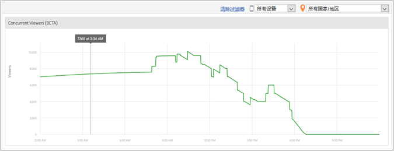

# Visualizadores simultâneos de mídia{#media-concurrent-viewers}

O painel Visualizadores simultâneos de mídia exibe os visualizadores simultâneos durante um dia. Os dados podem ser filtrados por conteúdo, tipo de dispositivo ou país.

>[!TIP]
>
>Nenhum dado será exibido se o intervalo selecionado não for um dia inteiro.

## Recursos do relatório {#report-features}

Alguns recursos deste relatório:

* Isso não ocorre em tempo real. Ele tem a latência do Adobe Analytics.
* O relatório abrange um período de 24 horas. O eixo x representa a hora do dia com base no fuso horário do conjunto de relatórios.
* Isso mostra os visualizadores simultâneos com granularidade de minutos.
* Há um *Relatório de visualizadores simultâneos de mídia* que mostra quantos visualizadores estão assistindo ou ouvindo em todo o conteúdo.
* Há um relatório de Visualizadores simultâneos no relatório *Detalhes da mídia* que mostra quantos visualizadores estão assistindo ou ouvindo a um item de mídia específico.
* O relatório funcionará somente por um dia.
* O cliente pode visualizar histórico de relatórios de visualizadores simultâneos (limitado a um único dia).

## Limitações {#limitations}

Aqui estão algumas limitações deste relatório:

* Não é possível exportar os dados, como ReportBuilder.
* Não é possível apresentar os dados em formato de tabela.
* Não é possível enviar um relatório por email.
* Mesmo que você não rastreie os anúncios, é preciso ativar novamente o rastreamento de mídia e selecionar o módulo de Anúncio de mídia.
* Essa funcionalidade fornecerá dados precisos ao usar uma Biblioteca do Heartbeats que tenha recursos de rastreamento de Pausas.

