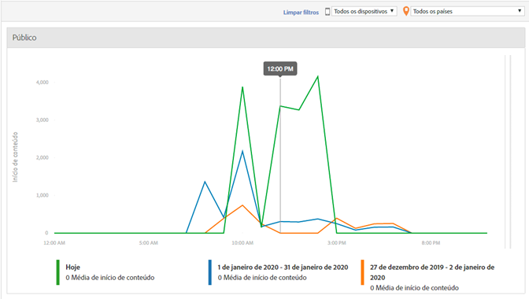

# Faixa de horário da mídia {#media-daypart}

O painel Faixa de horário da mídia exibe os inícios do conteúdo por hora do dia para que você visualize rapidamente quando o público-alvo está envolvido. 
