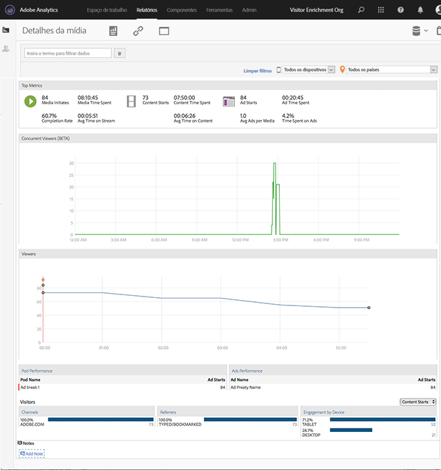

# Detalhes da mídia{#media-detail}

O painel Detalhes da mídia exibe as métricas detalhadas para todo o conteúdo, incluindo visualizadores simultâneos, inícios de conteúdo, taxa de conclusão, tempo gasto e início do anúncio.

