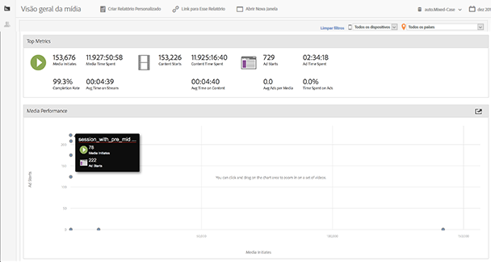
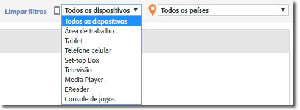
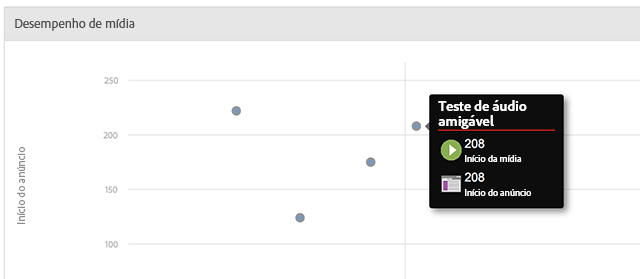

# Visão geral da mídia {#media-overview}

O painel Visão geral da mídia foi projetado para permitir que você monitore a mídia no seu site. A Visão geral da mídia apresenta diversas medidas agregadas para monitorar rapidamente se a mídia está funcionando como previsto. Um gráfico exibe o início do conteúdo ao lado do início do anúncio, para que você possa ter uma exibição rápida das métricas referentes a cada item de mídia.

<!--
{width="672px"} 
-->

## Filtros rápidos {#quick-filters}

Exibe rapidamente as métricas de mídia por dispositivo ou país:

<!--
{width="400px"}
-->

## Desempenho da mídia {#media-performance}

Clique e arraste para ampliar, e depois passe o mouse para ver as métricas granulares da mídia específica. Clique em  

para redefinir a visualização depois da ação de zoom.

<!--
{width="400px"}
-->
