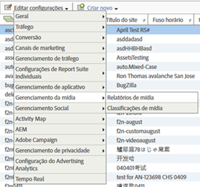

# Ativação de relatórios de mídia {#media-reports-enablement}

Cada conjunto de relatórios que coleta métricas de mídia deve ser configurado antes do envio dos dados de mídia.

>[!TIP]
>
>Para aproveitar os novos recursos, os clientes do Media Analytics devem ativar novamente o rastreamento de mídia para RSIDs.

1. Em [Reports &amp; Analytics](https://my.omniture.com/login/), clique em **[!UICONTROL Admin > Conjuntos de relatórios].**
1. Selecione o(s) conjunto(s) de relatórios no(s) qual(is) você está coletando dados de mídia e clique em **[!UICONTROL Editar configurações > Gerenciamento de mídia > Relatórios de mídia].**

   {width=&quot;400px&quot;}

1. Na página **[!UICONTROL Relatórios de mídia]**, ative **[!UICONTROL Mídia principal]**e, como opção,**[!UICONTROL Anúncios de mídia],** **[!UICONTROL Capítulos de mídia],**e**[!UICONTROL Qualidade de mídia].**

   A avaliação de mídia inclui os seguintes módulos:

   * **Mídia principal**

      A medição de mídia principal é usada para conteúdo de mídia. Isso usará eVars de solução (ou personalizadas) para acompanhar Conteúdo, Tipo de conteúdo, Nome do reprodutor de conteúdo e Canal de conteúdo. Os eventos de solução (ou personalizados) serão utilizados para Inícios de mídia, Inícios de conteúdo, Conclusões de conteúdo e Tempo gasto no conteúdo.

   * **Anúncios da mídia**

      As avaliações dos anúncios de mídia são utilizadas para avaliar os anúncios no conteúdo de mídia. Essa avaliação usará eVars de solução para medir Anúncio, Nome do player do anúncio, Pod de anúncio e Anúncio na posição do pod. Os eventos de solução serão usados para Inícios de anúncio, Conclusões de anúncio, Tempo gasto no anúncio e Tempo gasto no vídeo.

   * **Capítulos da mídia**

      A medição de capítulos de vídeo é utilizada para medir os capítulos. Um capítulo é uma subdivisão do conteúdo em uma única mídia. O capítulo usará uma eVar de solução para armazenar a ID do capítulo. Os eventos de solução serão usados para Inícios de capítulo, Conclusões de capítulo e Tempo gasto no capítulo. Metadados de capítulo adicionais de Nome do capítulo e Posição do capítulo serão fornecidos como classificações da ID do capítulo.

   * **Qualidade da mídia**

      A avaliação da qualidade do vídeo é utilizada para avaliar a qualidade da reprodução do conteúdo. Essa avaliação usará eVars de solução para armazenar Hora de início, Eventos de buffer, Duração total do buffer, Switches de taxa de bits, Taxa média de bits, Erros e Quadros descartados. Eventos de solução serão usados para Hora de início, Solta antes de iniciar, Fluxos impactados pelo buffer, Eventos do buffer, Duração total do buffer, A alteração na taxa de bits impactou os fluxos, Alterações na taxa de bits, Média da taxa de bits, Fluxos impactados por erros, Eventos de erro, O quadro solto impactou os fluxos e Quadros soltos.

   * **Metadados de vídeo e anúncio de vídeo**

      Os metadados podem ser inseridos em uma mídia e/ou em um anúncio para descrever e classificar ainda mais a mídia ou anúncio. Os metadados de mídia e anúncios padrão serão coletados pelas variáveis e classificações da solução. Os valores para incluir: Programa, Temporada, Episódio, ID do ativo, Gênero, Data da primeira exibição, Data da primeira versão digital, Classificação do conteúdo, Originador, Rede, Tipo de programa, Carregamentos de anúncios, MVPD, Autorizado, Parte do dia, ID de sessão de mídia, Anunciante, ID da campanha e ID de criação.

   * **Metadados de áudio e de anúncio de áudio**

      Os metadados podem ser anexados a um áudio e/ou anúncio para descreverem e categorizar o áudio e/ou anúncio. Os metadados padrão são coletados por meio das variáveis e classificações da solução. Os valores incluem: Artista, Álbum, Gravadora, Autor, Publicador, Estação de rádio, Programa, Temporada, Episódio, ID do ativo, Gênero, Data da primeira exibição, Data da primeira exibição virtual, Classificação do conteúdo, Originador, Tipo de programa, Parte do dia, ID da sessão de mídia, Anunciante, ID da campanha e ID Creative.
   A habilitação de cada módulo reserva um conjunto de variáveis e cria um novo conjunto de relatórios. Com exceção da Qualidade, não haverá dados nos relatórios, a menos que a implementação correspondente tenha sido concluída. A implementação do módulo Principal também implementa o módulo Qualidade se você ativá-lo.

   Se você ainda não estiver rastreando anúncios, capítulos ou qualidade de reprodução, será possível ativar opções adicionais a qualquer momento.

1. Clique em **[!UICONTROL Salvar].**

   Se esse conjunto de relatórios já estiver configurado para coletar dados de mídia, uma página de configuração adicional será exibida depois de clicar em **[!UICONTROL Salvar]**. Se você visualizar a página **[!UICONTROL Avaliação da mídia principal]**, continue para a próxima etapa.

1. (Condicional) Na página **[!UICONTROL Avaliação de mídia principal]**, selecione a opção para continuar a utilizar as variáveis personalizadas ou use variáveis da solução.

   | Opção | Notas |
   | --- | --- |
   | Continue a utilizar as variáveis personalizadas | Vantagens e desvantagens:<ul> <li> **Vantagens:** as tendências de conteúdo continuam a funcionar após a migração. </li> <li> **Desvantagens:** exige que você mantenha duas eVars personalizadas e três eventos personalizados alocados para mídia. Você pode usar novamente uma eVar personalizada e um evento personalizado. </li> </ul> Para continuar usando variáveis personalizadas: <ol> <li>Selecione **[!UICONTROL Usar variáveis personalizadas,]** e clique em **[!UICONTROL Salvar.]** </li> <li>Quando solicitado, mapeie as eVars e os eventos personalizados atuais e, em seguida, clique em **[!UICONTROL Salvar:]** </li> </ol> |
   | Migre para variáveis de solução | Vantagens e desvantagens:<ul> <li> **Vantagens:** você pode usar novamente três eVars personalizadas e quatro eventos personalizados. </li> <li> **Desvantagens:** você perde **todas** as tendências e comparações de histórico dos relatórios de mídia. Isso significa que não é possível direcionar visualizações de conteúdo ou o tempo de reprodução de conteúdo para qualquer data antes de migrar para as pulsações. </li> </ul> **Restrição:** não migre para as variáveis da solução, a menos que tenha certeza de que não deseja manter essas tendências. Todos os clientes devem utilizar as variáveis da solução e as regras de processamento para inserir os dados de mídia nas props e eVars existentes, somente se for necessário preservar a continuidade do histórico. Para migrar para variáveis de solução: Selecione **[!UICONTROL Usar variáveis de solução]** e clique em **[!UICONTROL Salvar].**  IMPORTANTE: a migração para variáveis de solução provoca a perda de **todas ** as tendências e comparações de histórico dos relatórios de mídia. |

>[!IMPORTANT]
>
>Não altere os nomes de classificação de nenhuma variável listada nas tabelas de métricas e metadados (por exemplo, [Parâmetros de áudio e vídeo](/help/metrics-and-metadata/audio-video-parameters.md)) que estão descritos em Relatório/variável reservada como &quot;classificação&quot;. As classificações de mídia são definidas quando um conjunto de relatórios é ativado para rastreamento de mídia. Periodicamente, a Adobe adiciona novas propriedades e, quando isso ocorre, os clientes devem reativar seus conjuntos de relatórios para obter acesso às novas propriedades de mídia. Durante o processo de atualização, a Adobe determina se as classificações são ativadas verificando os nomes das variáveis. Se algum deles estiver faltando, a Adobe os adicionará novamente.
