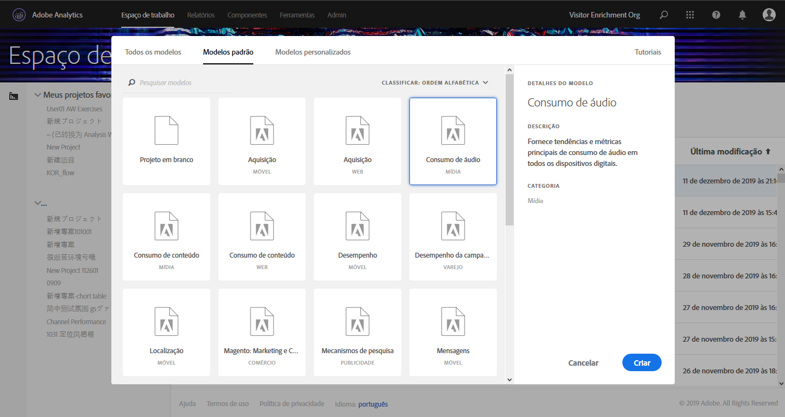
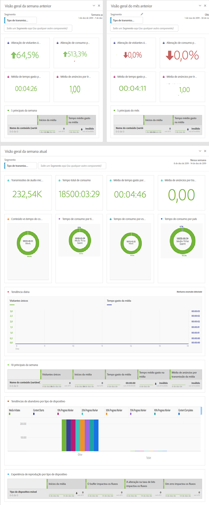

# Modelos do Workspace de mídia {#media-workspace-templates}

O Workspace do Adobe Analytics oferece a capacidade de configurar rapidamente os painéis para analisar seus dados de rastreamento. Ao criar um novo projeto, ou ao entrar no Workspace para gerenciar um projeto existente, você pode escolher entre modelos padrão que abrangem cenários comuns de rastreamento geral, como Aquisição, consumo de mídia de transmissão e muito mais. Você também pode criar, modificar e salvar seus próprios modelos personalizados.

Você trabalha com modelos na guia Workspace no Adobe Analytics ao criar ou gerenciar um projeto. Ao entrar pela primeira vez no Workspace, você verá as opções de criação de um novo projeto ou de abertura de um projeto existente:

* **Criar um novo projeto -** ao clicar no botão **[!UICONTROL Criar novo projeto]** no Workspace, uma caixa de diálogo é exibida na qual é possível selecionar a partir da sua coleção de modelos (incluindo Padrão e Personalizado):

   

   Por exemplo, se você escolher o modelo de **[!UICONTROL Consumo de áudio]**, será apresentado um projeto com o seguinte painel orientado para áudio:

   

* **Gerenciar projetos -** Em um projeto existente, você pode modificar a apresentação de dados e Salvar como para criar sua própria coleção de modelos personalizados.
