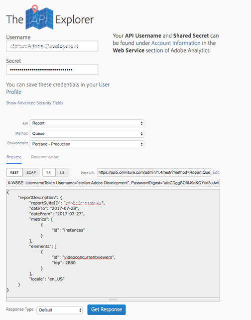
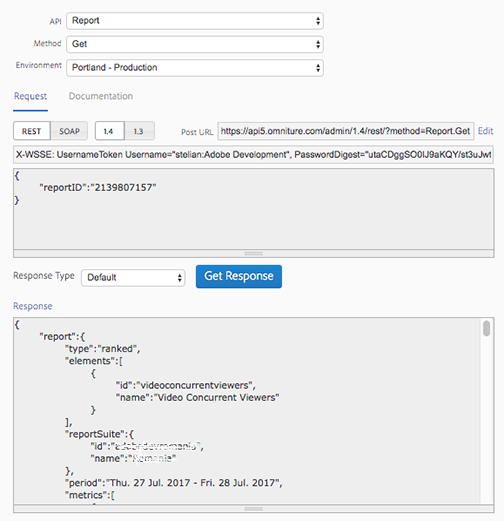

# Obter dados de relatório JSON de visualizadores simultâneos{#get-concurrent-viewers-json-report-data}

Você pode obter dados de relatório de visualizadores simultâneos usando a _*versão 1.4*_ das APIs do Analytics:
* [APIs do Analytics](https://github.com/AdobeDocs/analytics-1.4-apis)
* [Swagger](https://adobedocs.github.io/analytics-1.4-apis/swagger-docs.html#/Report/Report.Get)

1. Filtre os dados usando qualquer segmento criado na interface. Para filtrar por uma ID de conteúdo específica, crie um novo segmento.
1. Defina `elements` -> `id` no corpo da solicitação para `videoconcurrentviewers`.
1. Solicite uma quantidade suficiente de dados. A Adobe recomenda 3.200 pontos de dados para garantir que não haja lacunas nos dados.

   * O intervalo de dados especificado no relatório reúne todos os dados do visualizador simultâneo _no momento em que a sessão de vídeo terminar._
Portanto, você deve considerar as sessões que iniciam um dia e terminam após a meia-noite (ou seja, o dia seguinte).

   * Solicite mais de um dia de dados, mas em sua análise _*use apenas o primeiro dia dos dados.*_

Uma carga de solicitação de amostra para esse cenário seria semelhante a:

```
{
  "reportDescription":{
    "reportSuiteID":"[YOUR_RSID]",
    "dateFrom":"2018-07-01",
    "dateTo":"2018-07-02",
    "metrics":[
      {
        "id":"instances"
      }
    ],
    "elements":[
      {
        "id":"videoconcurrentviewers",
        "top":"3200"
      }
    ],
    "segments":[
      {
        "id":"s1234_58ca4fc7e4b0abc238707bb9"                                         
      }
    ],
    "sortBy":"instances",
    "locale":"en_US"
  }
}
```

<!--
You can extract the concurrent viewers report data using the API Explorer as follows. 

1. Navigate to: [https://www.adobe.io.](https://www.adobe.io)
1. Select and enter the following information in the API Explorer form:

    * **API -** Select "Report".
    * **Method -** Select "Queue".
    * **Environment -** Select your data center.
    * Request JSON - Specify the following:

        * `reportSuiteID` - For info on reports suites: [Report Suites](https://experienceleague.adobe.com/docs/analytics/admin/manage-report-suites/report-suites-admin.html?lang=pt-BR)
        
        * `dateTo` - End date of the report.         
        
          >[!NOTE]
          >
          >The maximum time period supported is two days.

        * `dateFrom` - Start date of the report.
        * `elements : id` - Set to `"videoconcurrentviewers"`
        
        * `elements : top` - Specify the number of entries to be returned.

      Sample request body:

      ```    
      {
          "reportDescription": {
              "reportSuiteID": "[Your Report Suite ID]",
              "dateTo": "2017-09-07",
              "dateFrom": "2017-09-07"
              "metrics": [
                  {
                      "id": "instances"
                  }
              ],
              "elements": [
                  {
                      "id": "videoconcurrentviewers",
                      "top": 2880
                  }
              ]
              "locale": "en_US"
          }
      }
      
      ```

      >[!TIP]
      >
      >Some sessions are ended on the next day, and at that point the data will be available for reporting. In that case the best approach is to select 2 days (2880 minutes) of data, and use only the data for the first day (1440 minutes).

1. Click **Get Response**.

   In the Response field, you should get a `reportID`.
1. In the form, change **Method** to "Get".
1. Enter the value of the `reportID` you received in Step 3, and click **Get Response**.

   The concurrent viewers report data, in JSON format, is presented in the Response field.
   
   For example:
   
    

   

-->
