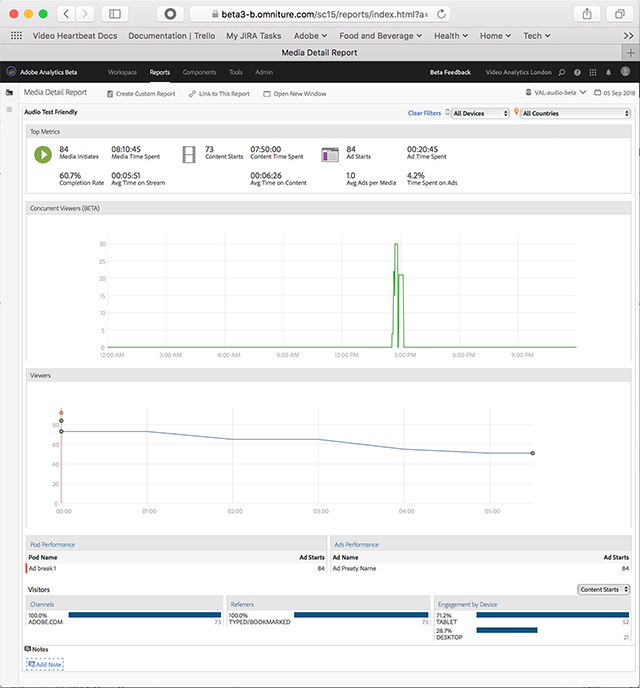

# Detalhes da mídia{#media-detail}

O painel Detalhes da mídia exibe métricas detalhadas para todo o conteúdo, incluindo visualizadores simultâneos, [[!UICONTROL Início do conteúdo]](/help/reporting/metrics/content-starts.md), taxa de conclusão, tempo gasto e [[!UICONTROL Início do anúncio]](/help/reporting/metrics/ad-starts.md).

