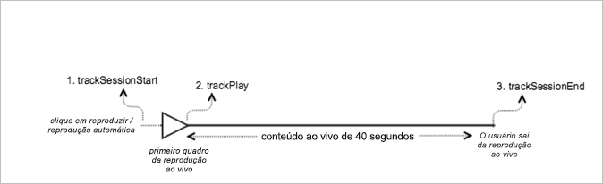

# Conteúdo principal ao vivo {#live-main-content}

## Cenário {#scenario}

Neste cenário, há um ativo ao vivo sem anúncios reproduzidos por 40 segundos após entrar no stream ao vivo.

| Acionador | Método do Heartbeat | Chamadas de rede | Notas   |
|---|---|---|---|
| Cliques do usuário **[!UICONTROL Reproduzir]** | `trackSessionStart` | Início do conteúdo do Analytics, Início do conteúdo do Heartbeat | Pode ser um usuário que clicou na opção **[!UICONTROL Reproduzir]**, ou um evento de reprodução automática. |
| O primeiro quadro da mídia é reproduzido. | `trackPlay` | Heartbeat Content Play | Esse método aciona o temporizador. Os heartbeats são enviados a cada 10 segundos enquanto a reprodução continuar. |
| O conteúdo é reproduzido. |  | Conteúdo Heartbeats |  |
| A sessão foi encerrada. | `trackSessionEnd` |  | `SessionEnd` significa o fim de uma sessão de exibição. Essa API deve ser chamada mesmo se o usuário não consumir a mídia até o fim. |

## Parâmetros {#parameters}

Diversos valores observados nas Chamadas do Adobe Analytics Content Start estarão presentes nas Chamadas do Heartbeat Content Start. Você também pode observar os outros parâmetros que a Adobe utiliza para preencher os diversos relatórios de mídia no Adobe Analytics. Não falaremos de todos aqui; apenas os mais importantes.

### Heartbeat Content Start

| Parâmetro | Valor | Notas |
|---|---|---|
| `s:sc:rsid` | &lt;ID do conjunto de relatórios da Adobe> |  |
| `s:sc:tracking_serve` | &lt;URL do servidor de rastreamento do Analytics> |  |
| `s:user:mid` | `s:user:mid` | Deve corresponder ao valor médio da Chamada de início de conteúdo do Adobe Analytics |
| `s:event:type` | &quot;start&quot; |  |
| `s:asset:type` | &quot;main&quot; |  |
| `s:asset:mediao_id` | &lt;O nome da sua mídia> |  |
| `s:stream:type` | live |  |
| `s:meta:*` | opcional | Metadados personalizados definidos na mídia |

## Conteúdo Heartbeats {#content-heartbeats}

Durante a reprodução da mídia, há um temporizador que enviará um ou mais heartbeats (ou pings) a cada 10 segundos para o conteúdo principal e a cada segundo para os anúncios. Esses heartbeats contêm informações sobre reprodução, anúncios, buffering e várias outras coisas. O conteúdo exato de cada heartbeat está além do escopo desse documento, o mais importante para validar é que os heartbeats são acionados de forma consistente enquanto a reprodução continuar.

Nos heartbeats de conteúdo, procure alguns itens específicos:

| Parâmetro | Valor | Notas |
|---|---|---|
| `s:event:type` | &quot;play&quot; |  |
| `l:event:playhead` | &lt;posição do indicador de reprodução>, por exemplo, 50, 60, 70 | Deve refletir a posição atual do indicador de reprodução. |

## Heartbeat Content Complete {#heartbeat-content-complete}

Não haverá uma chamada completa neste cenário, porque o streaming ao vivo não foi concluído.

## Configurações de valor do indicador de reprodução

Para transmissões AO VIVO, você precisa definir o valor do indicador de reprodução como o número de segundos desde a meia-noite UTC daquele dia, para que, nos relatórios, os analistas possam determinar em que ponto os usuários estão entrando e saindo da transmissão AO VIVO em uma exibição de 24 horas.

### No início

Para mídia AO VIVO, quando um usuário começa a reproduzir a transmissão, é necessário definir o `l:event:playhead` como o número de segundos desde a meia-noite UTC daquele dia. É diferente do VOD, onde você definiria o indicador de reprodução como “0”. Observação: ao usar marcadores de progresso, a duração do conteúdo é necessária e o indicador de reprodução precisa ser atualizado para o número de segundos desde o início do item de mídia, começando com 0.

Por exemplo, digamos que um evento de transmissão AO VIVO comece à meia-noite e tenha uma duração de 24 horas (`a.media.length=86400`; `l:asset:length=86400`). Então, digamos que um usuário comece a reproduzir esse fluxo AO VIVO às 12h. Nesse cenário, você deve definir o `l:event:playhead` como 43200 (12 horas desde a meia-noite UTC daquele dia em segundos).

### Ao pausar

A mesma lógica de &quot;indicador de reprodução em tempo real&quot; aplicada no início da reprodução deve ser aplicada quando o usuário pausa a reprodução. Quando o usuário voltar a reproduzir a transmissão AO VIVO, você deve definir o valor do `l:event:playhead` de acordo com o novo número de segundos desde a meia-noite UTC, _não_ de acordo com o ponto em que o usuário pausou a transmissão AO VIVO.

## Código de exemplo {#sample-code}



### Android

Veja a ordem de chamada da API esperada:

```java
// Set up mediaObject 
MediaObject mediaInfo = MediaHeartbeat.createMediaObject( 
  Configuration.MEDIA_NAME,  
  Configuration.MEDIA_ID,  
  Configuration.MEDIA_LENGTH,  
  MediaHeartbeat.StreamType.LIVE 
); 

HashMap<String, String> mediaMetadata = new HashMap<String, String>(); 
mediaMetadata.put(CUSTOM_VAL_1, CUSTOM_KEY_1); 
mediaMetadata.put(CUSTOM_VAL_2, CUSTOM_KEY_2); 

// 1. Call trackSessionStart() when the user clicks Play or if autoplay is used,  
//    i.e., there is an intent to start playback.  
_mediaHeartbeat.trackSessionStart(mediaInfo, mediaMetadata); 

...... 
...... 

// 2. Call trackPlay() when the playback actually starts, i.e., when the first  
//    frame of main content is rendered on the screen. 
_mediaHeartbeat.trackPlay(); 

....... 
....... 

// 3. Call trackSessionEnd() when user ends the playback session.  
//    Since the user does not watch live media to completion, there  
//    is no need to call trackComplete().  
_mediaHeartbeat.trackSessionEnd(); 
....... 
....... 
```

### iOS

Veja a ordem de chamada da API esperada:

```
// Set up mediaObject 
ADBMediaObject *mediaObject =  
[ADBMediaHeartbeat createMediaObjectWithName:MEDIA_NAME  
                   length:MEDIA_LENGTH  
                   streamType:ADBMediaHeartbeatStreamTypeLIVE]; 
 
NSMutableDictionary *mediaContextData = [[NSMutableDictionary alloc] init]; 
[mediaContextData setObject:CUSTOM_VAL_1 forKey:CUSTOM_KEY_1]; 
[mediaContextData setObject:CUSTOM_VAL_2 forKey:CUSTOM_KEY_2]; 
 
// 1. Call trackSessionStart when the user clicks Play or if autoplay is used,  
//    i.e., there is an intent to start playback. 
[_mediaHeartbeat trackSessionStart:mediaObject data:mediaContextData]; 
...... 
...... 
 
// 2. Call trackPlay when the playback actually starts, i.e., when the first  
//    frame of the main content is rendered on the screen. 
[_mediaHeartbeat trackPlay]; 
....... 
....... 
 
// 3. Call trackSessionEnd when user ends the playback session. Since the user  
//    does not watch live media to completion, there is no need to call  
//    trackComplete. 
[_mediaHeartbeat trackSessionEnd]; 
........ 
........ 
```

### JavaScript

Veja a ordem de chamada da API esperada:

```js
// Set up mediaObject 
var mediaInfo =  
MediaHeartbeat.createMediaObject(Configuration.MEDIA_NAME,  
                                 Configuration.MEDIA_ID,  
                                 Configuration.MEDIA_LENGTH,  
                                 MediaHeartbeat.StreamType.VOD); 

var mediaMetadata = { 
  CUSTOM_KEY_1 : CUSTOM_VAL_1,  
  CUSTOM_KEY_2 : CUSTOM_VAL_2,  
  CUSTOM_KEY_3 : CUSTOM_VAL_3 
}; 

// 1. Call trackSessionStart() when Play is clicked or if autoplay  
//    is used, i.e., there's an intent to start playback. 
this._mediaHeartbeat.trackSessionStart(mediaInfo, mediaMetadata); 

...... 
...... 

// 2. Call trackPlay() when the playback actually starts, i.e., when the  
//    first frame of media is rendered on the screen. 
this._mediaHeartbeat.trackPlay(); 

....... 
....... 

// 3. Call trackSessionEnd() when user ends the playback session.  
//    Since user does not watch live media to completion, there is  
//    no need to call trackComplete(). 
this._mediaHeartbeat.trackSessionEnd(); 

........ 
........ 
```
