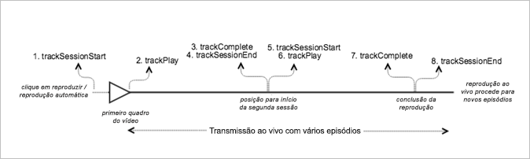

# Conteúdo principal ao vivo com monitoramento sequencial{#live-main-content-with-sequential-tracking}

## Cenário {#scenario}

Neste cenário, há um ativo disponível sem anúncios reproduzido por 40 segundos após a entrada na transmissão ao vivo.

Este cenário é igual ao cenário [Reprodução VOD sem anúncios](/help/sdk-implement/tracking-scenarios/vod-no-intrs-details.md), só que parte do conteúdo é depurado e uma busca é realizada de um ponto a outro do conteúdo principal.

| Acionador | Método do Heartbeat |  Chamadas de rede |  Notas   |
| --- | --- | --- | --- |
| O usuário clica em [!UICONTROL Reproduzir] | trackSessionStart | Início do conteúdo do Analytics, Início do conteúdo do Heartbeat | A biblioteca de avaliações não detecta um anúncio precedente; portanto, essas chamadas de rede são idênticas ao cenário de [Reprodução VOD sem anúncios](/help/sdk-implement/tracking-scenarios/vod-no-intrs-details.md). |
| O primeiro quadro do conteúdo é reproduzido. | trackPlay | Heartbeat Content Play | Quando o conteúdo do capítulo é reproduzido antes do conteúdo principal, as pulsações só são iniciadas com o capítulo. |
| Reproduções de conteúdo |  | Content Heartbeats | Essa chamada de rede é a mesma do cenário de [Reprodução VOD sem anúncios](/help/sdk-implement/tracking-scenarios/vod-no-intrs-details.md). |
| Sessão1 finalizada (episódio1 encerrado) | trackComplete / trackSessionEnd | Heartbeat Content Complete | Complete significa que a sessão1 do 1º episódio foi atingida e assistida por inteiro. Antes de iniciar a sessão do episódio seguinte, é necessário encerrar a sessão atual. |
| Episódio2 iniciado (sessão2 iniciada) | trackSessionStart | Início do conteúdo do Analytics Heartbeat Content Start | Isso ocorre porque o usuário assistiu ao primeiro episódio e em seguida assistiu o segundo |
| 1º quadro da mídia | trackPlay | Heartbeat Content Play (Reprodução do conteúdo do Heartbeat) | Esse método aciona o temporizador; deste ponto em diante, os heartbeats serão enviados a cada 10 segundos durante a reprodução. |
| Reproduções de conteúdo |  | Content Heartbeats |  |
| Sessão encerrada (episódio2 finalizado) | trackComplete / trackSessionEnd | Heartbeat Content Complete | Concluído significa que a sessão2 do 2º episódio foi atingida e assistida por inteiro. Antes de iniciar a sessão do episódio seguinte, é necessário encerrar a sessão atual. |

## Parâmetros {#parameters}

### Heartbeat Content Start

| Parâmetro | Valor | Notas |
|---|---|---|
| `s:sc:rsid` | &lt;ID do conjunto de relatórios da Adobe&gt; |  |
| `s:sc:tracking_serve` | &lt;URL do servidor de rastreamento do Analytics&gt; |  |
| `s:user:mid` | `s:user:mid` | Deve corresponder ao valor médio da Chamada de início de conteúdo do Adobe Analytics |
| `s:event:type` | `"start"` |  |
| `s:asset:type` | `"main"` |  |
| `s:asset:media_id` | &lt;Seu nome de mídia&gt; |  |
| `s:stream:type` | `live` |  |
| `s:meta:*` | *opcional* | Metadados personalizados definidos na mídia |

## Heartbeat Content Play {#heartbeat-content-play}

Isso deve ser quase idêntico à chamada de Heartbeat Content Start, mas com uma diferença no parâmetro "s:event:type". Todos os parâmetros devem ser inseridos aqui.

| Parâmetro | Valor | Notas |
|---|---|---|
| `s:event:type` | `"play"` |  |
| `s:asset:type` | `"main"` |  |

## Content Heartbeats {#content-heartbeats}

Durante a reprodução da mídia, há um temporizador que enviará uma ou mais pulsações a cada 10 segundos para o conteúdo principal e a cada segundo para os anúncios. Esses heartbeats contêm informações sobre reprodução, anúncios, buffers e outros itens. O conteúdo exato de cada heartbeat está além do escopo deste documento. É importante validar o acionamento das pulsações de modo consistente durante a reprodução.

Em heartbeats de conteúdo, procure por itens específicos:

| Parâmetro | Valor | Notas |
|---|---|---|
| `s:event:type` | `"play"` |  |
| `l:event:playhead` | &lt;posição do indicador de reprodução&gt;, por exemplo, 50, 60, 70 | Isso deve refletir a posição atual do indicador de reprodução. |

## Heartbeat Content Complete {#heartbeat-content-complete}

Quando a reprodução de um episódio específico for concluída (quando o indicador ultrapassar o limite do episódio), uma chamada Heartbeat Content Complete será enviada. Essa chamada é semelhante a outras Chamadas de anúncio de heartbeat, mas conta com alguns itens específicos:

| Parâmetro | Valor | Notas |
|---|---|---|
| `s:event:type` | `"complete"` |  |
| `s:asset:type` | `"main"` |  |

## Código de exemplo {#sample-code}



### Android

Veja a ordem de chamada da API esperada:

```java
// Set up mediaObject 
MediaObject mediaInfo = MediaHeartbeat.createMediaObject( 
  Configuration.MEDIA_NAME,  
  Configuration.MEDIA_ID,  
  Configuration.MEDIA_LENGTH,  
  MediaHeartbeat.StreamType.LIVE 
); 

HashMap<String, String> mediaMetadata = new HashMap<String, String>(); 
mediaMetadata.put(CUSTOM_VAL_1, CUSTOM_KEY_1); 
mediaMetadata.put(CUSTOM_VAL_2, CUSTOM_KEY_2); 

// 1. Call trackSessionStart() when the user clicks Play or if autoplay is used,  
//    i.e., when there is an intent to start playback.  
_mediaHeartbeat.trackSessionStart(mediaInfo, mediaMetadata); 

...... 
...... 

// 2. Call trackPlay() when the playback actually starts, i.e., when the first  
//    frame of main content is rendered on the screen.  
_mediaHeartbeat.trackPlay(); 

....... 
....... 

// 3. Call trackComplete() when the playback reaches the end of session,  
//    i.e., when the media completes and finishes playing 1st episode/session.  
_mediaHeartbeat.trackComplete(); 

........ 
........ 

// 4. Call trackSessionEnd() to end session 1 
_mediaHeartbeat.trackSessionEnd(); 

........ 
........ 

// Start tracking session 2 /episode 2 of the same live stream.  
// There is no need to reinstantiate a mediaHeartbeat instance for tracking sesison 2. 
// Set up mediaObject 
MediaObject mediaInfo = MediaHeartbeat.createMediaObject( 
  Configuration.MEDIA_NAME,  
  Configuration.MEDIA_ID,  
  Configuration.MEDIA_LENGTH,  
  MediaHeartbeat.StreamType.LIVE 
); 

HashMap<String, String> mediaMetadata = new HashMap<String, String>(); 
mediaMetadata.put(CUSTOM_VAL_1, CUSTOM_KEY_1); 
mediaMetadata.put(CUSTOM_VAL_2, CUSTOM_KEY_2); 

// 5. Call trackSessionStart() when the playhead reaches a point that denotes the 
//    start of session 2 
_mediaHeartbeat.trackSessionStart(mediaInfo, mediaMetadata); 

...... 
...... 

// 6. Call trackPlay() to start tracking session 2 playback  
_mediaHeartbeat.trackPlay(); 

....... 
....... 

// 7. Call trackComplete() when the playback reaches the end of session 2,  
//    i.e., the media completes and finishes playing.  
_mediaHeartbeat.trackComplete(); 

........ 
........ 

// 8. Call trackSessionEnd() to end session 2 
_mediaHeartbeat.trackSessionEnd(); 

........ 
........ 

// Continue similarly tracking further sessions in the live stream if required 
```

### iOS

Veja a ordem de chamada da API esperada:

```
// Set up mediaObject 
ADBMediaObject *mediaObject =  
[ADBMediaHeartbeat createMediaObjectWithName:MEDIA_NAME  
                   length:MEDIA_LENGTH  
                   streamType:ADBMediaHeartbeatStreamTypeLIVE]; 
  
NSMutableDictionary *mediaContextData = [[NSMutableDictionary alloc] init]; 
[mediaContextData setObject:CUSTOM_VAL_1 forKey:CUSTOM_KEY_1]; 
[mediaContextData setObject:CUSTOM_VAL_2 forKey:CUSTOM_KEY_2]; 
  
// 1. Call trackSessionStart when the user clicks Play or if autoplay is used,  
//    i.e., there is an intent to start playback. 
[_mediaHeartbeat trackSessionStart:mediaObject data:mediaContextData]; 
...... 
...... 
  
// 2. Call trackPlay when the playback actually starts, i.e., when the first  
//    frame of main content is rendered on the screen. 
[_mediaHeartbeat trackPlay]; 
....... 
....... 

// 3. Call trackComplete when the playback reaches the end of session,  
//    i.e., when the media completes and finishes playing the first 
//    episode/session. 
[_mediaHeartbeat trackComplete]; 
....... 
....... 

// 4. Call trackSessionEnd to end session 1 
[_mediaHeartbeat trackSessionEnd]; 
........ 
........ 

// Start tracking session 2 / episode 2 of the same live stream, No need to  
// reinstantiate mediaHeartbeat instance for tracking sesison 2. 

// Set up mediaObject 
ADBMediaObject *mediaObject =  
[ADBMediaHeartbeat createMediaObjectWithName:MEDIA_NAME  
                   length:MEDIA_LENGTH  
                   streamType:ADBMediaHeartbeatStreamTypeLIVE]; 
 
NSMutableDictionary *mediaContextData = [[NSMutableDictionary alloc] init]; 
[mediaContextData setObject:CUSTOM_VAL_1 forKey:CUSTOM_KEY_1]; 
[mediaContextData setObject:CUSTOM_VAL_2 forKey:CUSTOM_KEY_2]; 
 
// 5. Call trackSessionStart when the playhead reaches a point that denotes  
//    start of session 2 
[_mediaHeartbeat trackSessionStart:mediaObject data:mediaContextData]; 
...... 
...... 
 
// 6. Call trackPlay to start tracking session 2 playback 
[_mediaHeartbeat trackPlay]; 
....... 
....... 
 
// 7. Call trackComplete when the playback reaches the end of session 2,  
//    i.e., when the media completes and finishes playing. 
[_mediaHeartbeat trackComplete]; 
........ 
........ 
 
// 8. Call trackSessionEnd to end the session 2 
[_mediaHeartbeat trackSessionEnd]; 
........ 
........ 

// Continue tracking further sessions in live stream similarly if required 
```

### JavaScript

Veja a ordem de chamada da API esperada:

```js
// Set up mediaObject 

var mediaInfo = MediaHeartbeat.createMediaObject( 
  Configuration.MEDIA_NAME,  
  Configuration.MEDIA_ID,  
  Configuration.MEDIA_LENGTH,  
  MediaHeartbeat.StreamType.VOD 
); 

var mediaMetadata = { 
  CUSTOM_KEY_1 : CUSTOM_VAL_1,  
  CUSTOM_KEY_2 : CUSTOM_VAL_2,  
  CUSTOM_KEY_3 : CUSTOM_VAL_3 
}; 

// 1. Call trackSessionStart() when Play is clicked or if autoplay is used,  
//    i.e., there's an intent to start playback. 
this._mediaHeartbeat.trackSessionStart(mediaInfo, mediaMetadata); 

...... 
...... 

// 2. Call trackPlay() when the playback actually starts, i.e., when the  
//    first frame of media is rendered on the screen. 
this._mediaHeartbeat.trackPlay(); 

....... 
....... 

// 3. Call trackComplete() when the playback reaches the end of a session,  
//    i.e., whn playback completes and finishes playing the 1st episode/session. 
this._mediaHeartbeat.trackComplete(); 

........ 
........ 

// 4. Call trackSessionEnd() to end session 1 
this._mediaHeartbeat.trackSessionEnd(); 

........ 
........ 

// Start tracking session 2/episode 2 of the same live stream. There is no need  
// to reinstantiate a mediaHeartbeat instance for tracking sesison 2. 

// Set up mediaObject 
var mediaInfo2 = MediaHeartbeat.createMediaObject( 
  Configuration.MEDIA_NAME,  
  Configuration.MEDIA_ID,  
  Configuration.MEDIA_LENGTH,  
  MediaHeartbeat.StreamType.LIVE 
); 

var mediaMetadata2 = { 
  CUSTOM_KEY_1 : CUSTOM_VAL_1,  
  CUSTOM_KEY_2 : CUSTOM_VAL_2,  
  CUSTOM_KEY_3 : CUSTOM_VAL_3 
}; 

// 5. Call trackSessionStart() when the playhead reaches a point that denotes  
//    the start of session 2 
this._mediaHeartbeat.trackSessionStart(mediaInfo2, mediaMetadata2); 

...... 
...... 

// 6. Call trackPlay() to start tracking session 2 playback 
this._mediaHeartbeat.trackPlay(); 

....... 
....... 

// 7. Call trackComplete() when the playback reaches the end of session 2,  
//    i.e., playback completes and finishes playing. 
this._mediaHeartbeat.trackComplete(); 

........ 
........ 

// 8. Call trackSessionEnd() to end session 2 
this._mediaHeartbeat.trackSessionEnd(); 

........ 
........ 

// Continue tracking further sessions in live stream similarly if required 
```

