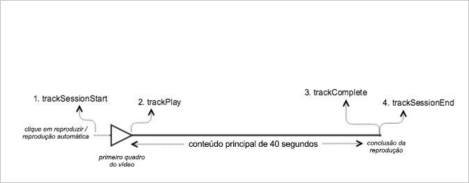

# Reprodução VOD sem anúncios{#vod-playback-with-no-ads}

## Cenário {#section_E4B558253AD84ED59256EDB60CED02AE}

Este cenário inclui um ativo VOD sem anúncios e é reproduzido uma vez do início ao fim.

| Acionador | Método do Heartbeat | Chamadas de rede | Notas  |
|---|---|---|---|
| User clicks **[!UICONTROL Play]** | `trackSessionStart` | Início do conteúdo do Analytics, Início do conteúdo do Heartbeat | Pode ser um usuário que clicou na opção Reproduzir ou um evento de reprodução automática. |
| Primeiro quadro da mídia | `trackPlay` | Heartbeat Content Play | Esse método dispara o timer; a partir desse ponto, as pulsações serão enviadas a cada 10 segundos durante toda a reprodução. |
| Reproduções de conteúdo |  | Content Heartbeats |  |
| O conteúdo é concluído | `trackComplete` | Heartbeat Content Complete | *Concluído* significa que o fim do indicador de reprodução foi atingido. |

## Parâmetros {#section_45D7B10031524411B91E2C569F7818B0}

Vários dos mesmos valores que você vê nas chamadas de Heartbeat também são vistos nas chamadas de Adobe Analytics `Content Start`Content Start. Há muitos parâmetros que a Adobe usa para preencher os diversos relatórios de mídia, mas somente os parâmetros mais importantes estão listados na tabela a seguir:

### Heartbeat Content Start

| Parâmetro | Valor | Notas  |
|---|---|---|
| `s:sc:rsid` | &lt;ID do conjunto de relatórios da Adobe&gt; |  |
| `s:sc:tracking_server` | &lt;URL do servidor de rastreamento do Analytics&gt; |  |
| `s:user:mid` | deve ser configurado | Should match the mid value on the `Adobe Analytics Content Start` call. |
| `s:event:type` | `"start"` |  |
| `s:asset:type` | `"main"` |  |
| `s:asset:media_id` | &lt;Seu nome de mídia&gt; |  |
| `s:meta:*` | opcional | Custom metadata that is set on the media. |

## Heartbeat Content Play {#section_2ABBD51D3A6D45ABA92CC516E414417A}

These parameters should look nearly identical to the `Heartbeat Content Start` call, but the key difference is the `s:event:type` parameter. Todos os outros parâmetros ainda devem existir.

| Parâmetro | Valor | Notas  |
|---|---|---|
| `s:event:type` | `"play"` |  |
| `s:asset:type` | `"main"` |  |

## Content heartbeats {#section_3B5945336E464160A94518231CEE8F53}

Durante a reprodução da mídia, um temporizador envia pelo menos uma pulsação a cada 10 segundos. Essas pulsações contêm informações sobre reprodução, anúncios, buffering e muito mais. O conteúdo exato de cada heartbeat vai além do escopo desse documento, mas a questão crítica é que as pulsações são disparadas consistentemente durante toda a reprodução.

Em heartbeats de conteúdo, procure pelos seguintes parâmetros:

| Parâmetros | Valor | Notas  |
|---|---|---|
| `s:event:type` | `"play"` |  |
| `l:event:playhead` | &lt;posição do indicador de reprodução&gt;, por exemplo, 50,60,70 | Esse parâmetro reflete a posição atual do indicador de reprodução. |

## Heartbeat Content Complete {#section_33BCC4C3181940C39446A57C25D82179}

Quando a reprodução termina, o que significa que o final do indicador de reprodução foi atingido, uma chamada `Heartbeat Content Complete` é enviada. Essa chamada é semelhante a outras chamadas de Heartbeat, mas contém alguns parâmetros específicos:

| Parâmetros | Valor | Notas  |
|---|---|---|
| `s:event:type` | `"complete"` |  |
| `s:asset:type` | `"main"` |  |

## Código de exemplo {#section_glq_vw3_x2b}

Nesse cenário, o conteúdo tem 40 segundos de duração. É reproduzido até o fim, sem interrupção.



### Android

```java
// Set up  mediaObject 
MediaObject mediaInfo = MediaHeartbeat.createMediaObject( 
  Configuration.MEDIA_NAME,  
  Configuration.MEDIA_ID,  
  Configuration.MEDIA_LENGTH,  
  MediaHeartbeat.StreamType.VOD 
); 

HashMap<String, String> mediaMetadata = new HashMap<String, String>(); 
mediaMetadata.put(CUSTOM_VAL_1, CUSTOM_KEY_1); 
mediaMetadata.put(CUSTOM_VAL_2, CUSTOM_KEY_2); 

// 1. Call trackSessionStart() when the user clicks Play or if autoplay  
//    is used, i.e., there's an intent to start playback.  
_mediaHeartbeat.trackSessionStart(mediaInfo, mediaMetadata); 

...... 
...... 

// 2. Call trackPlay() when the playback actually starts,  
//    i.e., the first frame of media is rendered on the screen.  
_mediaHeartbeat.trackPlay(); 

....... 
....... 

// 3. Call trackComplete() when the playback reaches the end,  
//    i.e., when the media completes and finishes playing.  
_mediaHeartbeat.trackComplete(); 

........ 
........ 

// 4. Call trackSessionEnd() when the playback session is over.  
//    This method must be called even if the user does not watch  
//    the media to completion.  
_mediaHeartbeat.trackSessionEnd(); 

........ 
........ 
```

### iOS

```
when the user clicks Play 
ADBMediaObject *mediaObject =  
[ADBMediaHeartbeat createMediaObjectWithName:MEDIA_NAME  
                   length:MEDIA_LENGTH  
                   streamType:ADBMediaHeartbeatStreamTypeVOD]; 

NSMutableDictionary *mediaContextData = [[NSMutableDictionary alloc] init]; 
[mediaContextData setObject:CUSTOM_VAL_1 forKey:CUSTOM_KEY_1]; 
[mediaContextData setObject:CUSTOM_VAL_2 forKey:CUSTOM_KEY_2]; 

// 1. Call trackSessionStart when the user clicks Play or if autoplay is used,  
//    i.e., there's an intent to start playback. 
[_mediaHeartbeat trackSessionStart:mediaObject data:mediaContextData]; 
...... 
...... 

// 2. Call trackPlay when the playback actually starts, i.e., when the  
//    first frame of main content is rendered on the screen. 
[_mediaHeartbeat trackPlay]; 
....... 
....... 

// 3. Call trackComplete when the playback reaches the end, i.e.,  
//    when the media completes and finishes playing. 
[_mediaHeartbeat trackComplete]; 
........ 
........ 

// 4. Call trackSessionEnd when the playback session is over. This method  
//    must be called even if the user does not watch the media to completion. 
[_mediaHeartbeat trackSessionEnd]; 
........ 
........ 
```

### JavaScript

```js
// Set up mediaObject 

var mediaInfo = MediaHeartbeat.createMediaObject(Configuration.MEDIA_NAME, Configuration.MEDIA_ID,  
Configuration.MEDIA_LENGTH,MediaHeartbeat.StreamType.VOD); 
var mediaMetadata = { 
  CUSTOM_KEY_1 : CUSTOM_VAL_1,  
  CUSTOM_KEY_2 : CUSTOM_VAL_2,  
  CUSTOM_KEY_3 : CUSTOM_VAL_3 

}; 

// 1. Call trackSessionStart() when the user clicks play, or when autoplay is used,  
//    i.e., there's an intent to start playback. 
this._mediaHeartbeat.trackSessionStart(mediaInfo, mediaMetadata); 

...... 
...... 

// 2. Call trackPlay() when the main content starts, i.e.,  
//    the first frame of the media content is rendered on the screen. 
this._mediaHeartbeat.trackPlay(); 

....... 
....... 

// 3. Call trackComplete() when the playback reaches the end,  
    i.e., the media completes and finishes playing. 
this._mediaHeartbeat.trackComplete(); 

........ 
........ 

// 4. Call trackSessionEnd() when the playback session is over.  
//    This method must be called even if the user does not  
//    watch the media to completion. 
this._mediaHeartbeat.trackSessionEnd(); 

........ 
........
```

