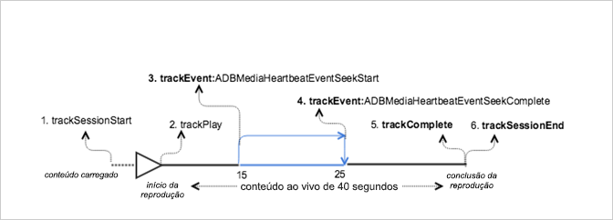

# Reprodução VOD com busca no conteúdo principal{#vod-playback-with-seeking-in-the-main-content}

## Cenário {#scenario}

Esse cenário inclui a busca no conteúdo principal durante a reprodução.

Este cenário é igual ao cenário [Reprodução VOD sem anúncios](/help/sdk-implement/tracking-scenarios/vod-no-intrs-details.md), só que parte do conteúdo é depurado e uma busca é realizada de um ponto a outro do conteúdo principal.

| Acionador  | Método do Heartbeat   | Chamadas de rede   | Notas   |
| --- | --- | --- | --- |
| O usuário clica em [!UICONTROL Reproduzir] | `trackSessionStart` | Início do conteúdo do Analytics, Início do conteúdo do Heartbeat | A biblioteca de avaliações não detecta um anúncio precedente; portanto, essas chamadas de rede são idênticas ao cenário de [Reprodução VOD sem anúncios](/help/sdk-implement/tracking-scenarios/vod-no-intrs-details.md). |
| O primeiro quadro do conteúdo é reproduzido. | `trackPlay` | Heartbeat Content Play | Quando o conteúdo do capítulo é reproduzido antes do conteúdo principal, as pulsações só são iniciadas com o capítulo. |
| Reproduções de conteúdo |  | Content Heartbeats | Essa chamada de rede é a mesma do cenário de [Reprodução VOD sem anúncios](/help/sdk-implement/tracking-scenarios/vod-no-intrs-details.md). |
| O usuário inicia a operação de busca no conteúdo | `trackSeekStart` |  | No heartbeats go out till seek is complete, for example, `trackSeekComplete` |
| A operação de busca é concluída | `trackSeekComplete` |  | As pulsações voltam a ser enviadas, pois a busca foi concluída.  Dica: o valor do indicador de reprodução deve representar o novo indicador de reprodução correto após a busca. |
| O conteúdo é concluído | `trackComplete` | Heartbeat Content Complete | Essa chamada de rede é a mesma do cenário de [Reprodução VOD sem anúncios](/help/sdk-implement/tracking-scenarios/vod-no-intrs-details.md). |
| Sessão finalizada | `trackSessionEnd` |  | `SessionEnd` |

## Código de exemplo {#sample-code}

Nesse cenário, o usuário busca o local no qual o conteúdo principal está sendo reproduzido.



### Android

Para exibir esse cenário no Android, configure o seguinte código:

```java
// Set up mediaObject 
MediaObject mediaInfo = MediaHeartbeat.createMediaObject( 
  Configuration.MEDIA_NAME,  
  Configuration.MEDIA_ID,  
  Configuration.MEDIA_LENGTH,  
  MediaHeartbeat.StreamType.VOD 
); 

HashMap<String, String> mediaMetadata = new HashMap<String, String>(); 
mediaMetadata.put(CUSTOM_KEY_1, CUSTOM_VAL_1); 
mediaMetadata.put(CUSTOM_KEY_2, CUSTOM_VAL_2); 

// 1. Call trackSessionStart() when the user clicks Play or if autoplay is used,  
//    i.e., there is an intent to start playback.  
_mediaHeartbeat.trackSessionStart(mediaInfo, mediaMetadata); 

...... 
...... 

// 2. Call trackPlay() when the playback actually starts, i.e., whn the first frame  
//    of the main content is rendered on the screen.  
_mediaHeartbeat.trackPlay(); 

....... 
....... 

// 3. Track the MediaHeartbeat.Event.SeekStart event when the user begins to seek.  
_mediaHeartbeat.trackEvent(MediaHeartbeat.Event.SeekStart, null, null); 

....... 
....... 

// 4. Track the MediaHeartbeat.Event.SeekComplete event when the user completes seeking 
_mediaHeartbeat.trackEvent(MediaHeartbeat.Event.SeekComplete, null, null); 

....... 
....... 

// 5. Call trackComplete() when the playback reaches the end, i.e., when the media 
//    completes and finishes playing. 
_mediaHeartbeat.trackComplete(); 

........ 
........ 

// 6. Call trackSessionEnd() when the playback session is over. This method must be  
//    called even if the user does not watch the media to completion.  
_mediaHeartbeat.trackSessionEnd(); 

........ 
........ 
```

### iOS

Para exibir esse cenário no iOS, configure o seguinte código:

```
// Set up mediaObject 
ADBMediaObject *mediaObject =  
[ADBMediaHeartbeat createMediaObjectWithName:MEDIA_NAME o 
                   length:MEDIA_LENGTH  
                   streamType:ADBMediaHeartbeatStreamTypeVOD]; 
 
NSMutableDictionary *mediaContextData = [[NSMutableDictionary alloc] init]; 
[mediaContextData setObject:CUSTOM_VAL_1 forKey:CUSTOM_KEY_1]; 
[mediaContextData setObject:CUSTOM_VAL_2 forKey:CUSTOM_KEY_2]; 

// 1. Call trackSessionStart when the user clicks Play or if autoplay is used,  
//    i.e., there is an intent to start playback. 
[_mediaHeartbeat trackSessionStart:mediaObject data:mediaContextData]; 
....... 
....... 

// 2. Call trackPlay when the playback actually starts, i.e., when the 
//    first frame of the main content is rendered on the screen. 
[_mediaHeartbeat trackPlay];  
....... 
....... 

// 3. Track the trackEvent:ADBMediaHeartbeatEventSeekStart event when the user  
//    begins to seek out of the chapter with the intent to skip it. 
[_mediaHeartbeat trackEvent:ADBMediaHeartbeatEventSeekStart  
               mediaObject:nil  
               data:nil]; 
....... 
....... 

// 4. Track the trackEvent:ADBMediaHeartbeatEventSeekComplete event when the  
//    user seeks out of the chapter with the intent to skip it. 
[_mediaHeartbeat trackEvent:ADBMediaHeartbeatEventSeekComplete  
               mediaObject:nil  
               data:nil]; 
....... 
....... 

// 5. Call trackComplete when the playback reaches the end, i.e., completes  
//    and finishes playing. 
[_mediaHeartbeat trackComplete]; 
....... 
....... 

// 6. Call trackSessionEnd when the playback session is over. This method must  
//    be called even if the user does not watch the media to completion. 
[_mediaHeartbeat trackSessionEnd]; 
....... 
....... 
```

### JavaScript

Para exibir este cenário, insira o seguinte texto:

```js
// Set up mediaObject 
var mediaInfo = MediaHeartbeat.createMediaObject( 
  Configuration.MEDIA_NAME,  
  Configuration.MEDIA_ID,  
  Configuration.MEDIA_LENGTH,  
  MediaHeartbeat.StreamType.VOD 

); 

var mediaMetadata = { 
  CUSTOM_KEY_1 : CUSTOM_VAL_1,  
  CUSTOM_KEY_2 : CUSTOM_VAL_2,  
  CUSTOM_KEY_3 : CUSTOM_VAL_3 

}; 

// 1. Call trackSessionStart() when Play is clicked or if autoplay is used,  
//    i.e., there's an intent to start playback. 
this._mediaHeartbeat.trackSessionStart(mediaInfo, mediaMetadata); 

...... 
...... 

// 2. Call trackPlay() when the playback actually starts, i.e., when the  
//    first frame of the ad media is rendered on the screen. 
this._mediaHeartbeat.trackPlay(); 

....... 
....... 

// 3. Track the MediaHeartbeat.Event.SeekStart event when the user  
//    begins to seek. 
this._mediaHeartbeat.trackEvent(MediaHeartbeat.Event.SeekStart); 

....... 
....... 

// 4. Track the MediaHeartbeat.Event.SeekComplete event when the user  
//    completes seeking. 
this._mediaHeartbeat.trackEvent(MediaHeartbeat.Event.SeekComplete); 

....... 
....... 

// 5. Call trackComplete() when the playback reaches the end, i.e., when 
//    playback completes and finishes playing. 
this._mediaHeartbeat.trackComplete(); 

........ 
........ 

// 6. Call trackSessionEnd() when the playback session is over. This method must be called  
//    even if the user does not watch the media to completion. 
this._mediaHeartbeat.trackSessionEnd(); 

........ 
........ 
```

