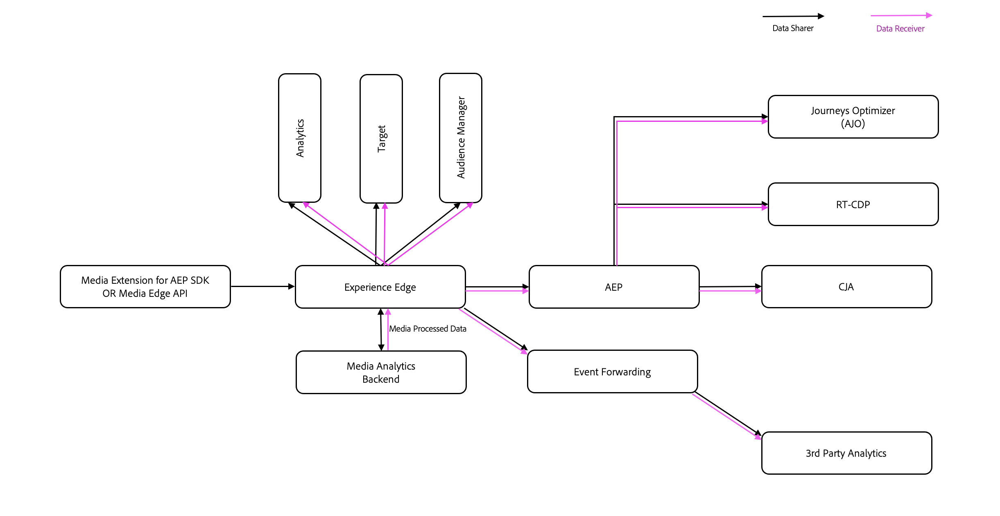

# Federated Media{#federated-media}

>[!AVAILABILITY]
>
>O serviço Federated Analytics está disponível apenas ao usar os recursos de mídia de transmissão com o Adobe Analytics. O Federated Analytics não está disponível no Customer Journey Analytics.

O serviço Federated Analytics fornece um sistema para o compartilhamento de dados de mídia de transmissão (áudio e vídeo) entre dois parceiros.

Os dados de medição padronizados criados pelos serviços de streaming de mídia são a marca da Federated Media, permitindo que os mesmos dados fluam em um único relatório de várias fontes.

Por meio das regras e lógicas que regem a Federated Media, os dados são facilmente controlados e individualizados para atender às necessidades de cada parceria.

A Federated Media torna a medição de áudio e vídeo mais eficiente, simplificada e acionável.

## Benefícios {#benefits}

* **Transparente:** retirar a caixa preta de criação de dados usando a mesma lógica entre empresas
* **Amplo:** entender todo o alcance e impacto do consumo de áudio e vídeo em parcerias, plataformas e dispositivos
* **Seguro:** controlar o compartilhamento de dados do lado do servidor por meio de regras e lógica
* **Padronizado:** falar o mesmo idioma de dados que seus parceiros
* **Acionável:** quantificar os dados de áudio e vídeo para fazer o benchmark de players, monitorar tendências e detectar anomalias pelo Adobe Analytics
* **Centralizado:** coletar dados de medição de áudio e vídeo em um local da Adobe
* **Contratual:** atenda facilmente aos requisitos legais de compartilhamento de dados
* **Em tempo oportuno:** enviar e receber dados em tempo quase real
* **Fácil:** adicionar tags aos players uma vez com SDKs da Adobe, compartilhar dados para muitos parceiros

## Definições {#definitions}

* **Remetente:** cliente gerando dados de análise de áudio e vídeo em players próprios
* **Destinatário:** cliente recebendo dados de análise de áudio e vídeo do remetente

## Requisitos {#requirements}

* **Contrato de transmissão de mídia:** O receptor e o remetente devem ter contratado o Adobe Analytics para fluxos de mídia antes de obter acesso aos dados de áudio e vídeo no Adobe Analytics. Entre em contato com a equipe de conta para obter mais detalhes.
* **Adendo federado:** cada Remetente e Destinatário deve ter um adendo assinado em vigor com a Adobe para enviar ou receber dados. É necessário um adendo por cliente, e não um adendo por parceria. Entre em contato com a equipe de conta para obter mais detalhes.

* **Implementação da Coleção de Mídia de Streaming:** o Remetente deve ter serviços de mídia de streaming implementados em todos os players que farão parte do conjunto de dados federado. Somente dados de mídia de transmissão estão disponíveis para federação. Para obter mais informações, consulte [visão geral dos serviços de streaming de mídia do Adobe](/help/media-overview.md).

* **Contrato de consultoria da Adobe:** para a configuração inicial de regras federadas entre o destinatário e o remetente, é valioso trabalhar com os serviços de consultoria para analisar os dados e criar o contrato de compartilhamento de dados.

## Baixe o formulário de mídia federada

Para participar de Mídia Federada, baixe e conclua o formulário do [Contrato de Regras de Federação](assets/federated_analytics_form.pdf).

## Processo {#process}

1. O Remetente e o Destinatário trabalham juntos para preencher o formulário do Contrato de regras de federação. O formulário do Contrato de regras de federação contém campos especiais para a equipe de engenharia e deve ser editado SOMENTE usando o Adobe Acrobat. [Baixe o Acrobat gratuitamente.](https://get.adobe.com/br/reader/)
1. Os serviços de consultoria fornecem um arquivo de dados de amostra para o Destinatário com dados reais dos players do remetente, para confirmar que regras corretas de compartilhamento de dados são definidas, desde que os arquivos de dados estejam disponíveis.
1. O remetente e o destinatário garantem que o contrato de compartilhamento de dados atenda a todos os requisitos contratuais entre as duas partes.
1. Os serviços de consultoria enviam o formulário preenchido para o Adobe Engineering para configurar as regras de compartilhamento de dados.
1. Os dados são compartilhados com o conjunto de relatórios de desenvolvimento do Adobe Analytics ou com a sequência de dados do Adobe Experience Platform, onde o Destinatário verificará e validará os dados.
1. Quando o Destinatário confirmar que os dados estão corretos, o Adobe Engineering atualiza as regras para apontar para um conjunto de relatórios de produção do Analytics ou para a sequência de dados do Adobe Experience Platform.
1. O destinatário revisará e validará os dados no conjunto de relatórios de produção do Analytics ou na sequência de dados do Adobe Experience Platform.
1. Se ocorrerem alterações no conjunto de dados no futuro, o remetente ou o destinatário poderá enviar um tíquete de atendimento ao cliente para suporte.
