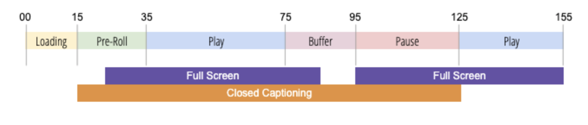

# Sobre o rastreamento do estado do player

Para otimizar a experiência do seu produto e o valor da sua empresa, é importante entender o comportamento do cliente ao exibir vídeos, como analisar o tempo gasto em diferentes estados do player.  Também é importante ter a flexibilidade para criar e medir novos estados e eventos do player, conforme necessário.

O Rastreamento de estado do player oferece a capacidade de capturar a interação do visualizador durante a reprodução usando um conjunto padrão de variáveis de solução para as funções de tela cheia, legendas ocultas, mudo, picture in picture e em foco.  O Rastreamento de estado do player também oferece a flexibilidade para criar estados personalizados do player. Você pode usar variáveis de Rastreamento do estado do player em relatórios no Analysis Workspace.

Para capturar alterações, o Rastreamento de estado do player atualiza os metadados de medição de vídeo. Por exemplo, para determinar o engajamento de vídeo “true”, o Rastreamento de estado do player mede o tempo gasto com o som em relação às visualizações de vídeo passivas ou não engajadas quando o som está desligado ou o tempo gasto no modo Normal versus Tela cheia.

O Rastreamento de estado do player oferece os seguintes benefícios:

* Fornece variáveis padrão que medem estados comuns, como tela cheia ou legendas ocultas
* Fornece variáveis personalizáveis para medir estados personalizados durante uma sessão de reprodução
* Mede o tempo gasto em um estado de player personalizado
* Mede vários estados que podem ser simultâneos

## Requisitos

O Rastreamento do estado do player exige um dos seguintes itens para a coleta de dados:
* Media JS SDK 3.0+
* SDK do Chromecast 3.0 para Soluções da Adobe Marketing Cloud
* Extensão do Media Analytics (para usar com o SDK da Adobe Experience Platform (AEP))
   * Web: Adobe Media Analytics (SDK 3.x) para áudio e vídeo v1.0+
   * Móvel: Adobe Media Analytics para áudio e vídeo v2.0+
* API da coleção de mídia

## Diretrizes

Antes de implementar o Rastreamento do estado do player, considere as seguintes diretrizes.

* O estado do player é calculado em todos os estados de reprodução (sem divisão).
* Você pode medir vários estados do player ao mesmo tempo.
* O número máximo de estados do player que podem ser rastreados durante uma reprodução é 10.
* As métricas de estado do player são enviadas ao Analytics para relatórios somente na chamada Fechamento de mídia.
* O conhecimento do status do aplicativo não é mantido depois que um estado é interrompido. Após o término de um estado, ele deve ser iniciado novamente para continuar o rastreamento. Para cada novo estado de reprodução, o estado do player deve ser reiniciado.
* Os estados do player são capturados para cada sessão de reprodução individual; o estado do player não é calculado entre as reproduções.
