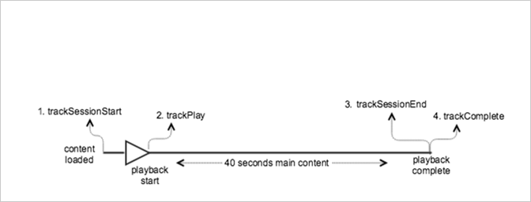

# Reprodução de VOD sem anúncios{#vod-playback-with-no-ads}

## Cenário {#scenario}

Este cenário inclui um ativo de VOD sem anúncios e é reproduzido uma vez do início ao fim.

| Acionador | Método do Heartbeat | Chamadas de rede | Notas   |
|---|---|---|---|
| Cliques do usuário **[!UICONTROL Reproduzir]** | `trackSessionStart` | Início do conteúdo do Analytics, Início do conteúdo do Heartbeat | Pode ser um usuário que clicou na opção Reproduzir ou um evento de reprodução automática. |
| Primeiro quadro do Media | `trackPlay` | Reprodução de conteúdo do Heartbeat | Esse método aciona o temporizador e a partir desse ponto, as pulsações serão enviadas a cada 10 segundos durante a reprodução. |
| Reproduções de conteúdo |  | Content Heartbeats |  |
| O conteúdo é concluído | `trackComplete` | Heartbeat Content Complete | *Concluído* significa que o fim do indicador de reprodução foi atingido. |

## Parâmetros {#parameters}

Vários dos mesmos valores que você vê nas chamadas de Heartbeat também são vistos nas chamadas de Adobe Analytics `Content Start`Content Start. A Adobe usa diversos parâmetros para preencher os diferentes relatórios de mídia, mas apenas os mais importantes estão listados na seguinte tabela:

### Heartbeat Content Start

| Parâmetro | Valor | Notas   |
|---|---|---|
| `s:sc:rsid` | &lt;ID do conjunto de relatórios da Adobe> |  |
| `s:sc:tracking_server` | &lt;URL do servidor de rastreamento do Analytics> |  |
| `s:user:mid` | deve ser configurado | Deve corresponder ao valor médio da chamada `Adobe Analytics Content Start`. |
| `s:event:type` | `"start"` |  |
| `s:asset:type` | `"main"` |  |
| `s:asset:media_id` | &lt;O nome da sua mídia> |  |
| `s:meta:*` | opcional | Metadados personalizados que são configurados na mídia. |

## Reprodução de conteúdo do Heartbeat {#heartbeat-content-play}

Esses parâmetros devem ser quase idênticos à chamada de `Heartbeat Content Start`, mas a principal diferença é o parâmetro `s:event:type`. Todos os outros parâmetros ainda devem existir.

| Parâmetro | Valor | Notas   |
|---|---|---|
| `s:event:type` | `"play"` |  |
| `s:asset:type` | `"main"` |  |

## Conteúdo do Heartbeats {#content-heartbeats}

Durante a reprodução da mídia, um temporizador envia ao menos um heartbeat a cada 10 segundos. Essas pulsações contêm informações sobre reprodução, anúncios, buffering e assim por diante. O conteúdo exato de cada pulsação está além do escopo desse documento, mas o problema crítico é que as pulsações são acionadas de forma consistente enquanto a reprodução continua.

Nas conteúdo do Heartbeats, procure pelos seguintes parâmetros:

| Parâmetros | Valor | Notas   |
|---|---|---|
| `s:event:type` | `"play"` |  |
| `l:event:playhead` | &lt;posição do indicador de reprodução>, por exemplo, 50,60,70 | Esse parâmetro reflete a posição atual do indicador de reprodução. |

## Heartbeat Content Complete {#heartbeat-content-complete}

Quando a reprodução termina, o que significa que o final do indicador de reprodução foi atingido, uma chamada `Heartbeat Content Complete` é enviada. Essa chamada é semelhante a outras chamadas do Heartbeat, mas contém alguns parâmetros específicos:

| Parâmetros | Valor | Notas   |
|---|---|---|
| `s:event:type` | `"complete"` |  |
| `s:asset:type` | `"main"` |  |

## Código de exemplo {#sample-code}

Nesse cenário, o conteúdo tem 40 segundos de duração. Ele é reproduzido até o fim, sem interrupções.



### Android

```java
// Set up  mediaObject 
MediaObject mediaInfo = MediaHeartbeat.createMediaObject( 
  Configuration.MEDIA_NAME,  
  Configuration.MEDIA_ID,  
  Configuration.MEDIA_LENGTH,  
  MediaHeartbeat.StreamType.VOD 
); 

HashMap<String, String> mediaMetadata = new HashMap<String, String>(); 
mediaMetadata.put(CUSTOM_VAL_1, CUSTOM_KEY_1); 
mediaMetadata.put(CUSTOM_VAL_2, CUSTOM_KEY_2); 

// 1. Call trackSessionStart() when the user clicks Play or if autoplay  
//    is used, i.e., there's an intent to start playback.  
_mediaHeartbeat.trackSessionStart(mediaInfo, mediaMetadata); 

...... 
...... 

// 2. Call trackPlay() when the playback actually starts,  
//    i.e., the first frame of media is rendered on the screen.  
_mediaHeartbeat.trackPlay(); 

....... 
....... 

// 3. Call trackSessionEnd() when the playback session ends prior to the  
//    media completing to the finish. This method must be called when   
//    playback ends if the user does not watch the media to completion. When trackSessionEnd is used, trackComplete should not be called. 
_mediaHeartbeat.trackSessionEnd(); 

........ 
........ 

// 4. Call trackComplete() when the playback reaches the end and   
//    completes, i.e., when the media finishes because it is played to completion. When trackComplete is used, trackSessionEnd does not need to be called.
_mediaHeartbeat.trackComplete(); 

........ 
........ 
```

### iOS

```
when the user clicks Play 
ADBMediaObject *mediaObject =  
[ADBMediaHeartbeat createMediaObjectWithName:MEDIA_NAME  
                   length:MEDIA_LENGTH  
                   streamType:ADBMediaHeartbeatStreamTypeVOD]; 

NSMutableDictionary *mediaContextData = [[NSMutableDictionary alloc] init]; 
[mediaContextData setObject:CUSTOM_VAL_1 forKey:CUSTOM_KEY_1]; 
[mediaContextData setObject:CUSTOM_VAL_2 forKey:CUSTOM_KEY_2]; 

// 1. Call trackSessionStart when the user clicks Play or if autoplay is used,  
//    i.e., there's an intent to start playback. 
[_mediaHeartbeat trackSessionStart:mediaObject data:mediaContextData]; 
...... 
...... 

// 2. Call trackPlay when the playback actually starts, i.e., when the  
//    first frame of main content is rendered on the screen. 
[_mediaHeartbeat trackPlay]; 
....... 
....... 

// 3. Call trackComplete when the playback reaches the end, i.e.,  
//    when the media completes and finishes playing. 
[_mediaHeartbeat trackComplete]; 
........ 
........ 

// 4. Call trackSessionEnd when the playback session is over. This method  
//    must be called even if the user does not watch the media to completion. 
[_mediaHeartbeat trackSessionEnd]; 
........ 
........ 
```

### JavaScript

```js
// Set up mediaObject 

var mediaInfo = MediaHeartbeat.createMediaObject(Configuration.MEDIA_NAME, Configuration.MEDIA_ID,  
Configuration.MEDIA_LENGTH,MediaHeartbeat.StreamType.VOD); 
var mediaMetadata = { 
  CUSTOM_KEY_1 : CUSTOM_VAL_1,  
  CUSTOM_KEY_2 : CUSTOM_VAL_2,  
  CUSTOM_KEY_3 : CUSTOM_VAL_3 

}; 

// 1. Call trackSessionStart() when the user clicks play, or when autoplay is used,  
//    i.e., there's an intent to start playback. 
this._mediaHeartbeat.trackSessionStart(mediaInfo, mediaMetadata); 

...... 
...... 

// 2. Call trackPlay() when the main content starts, i.e.,  
//    the first frame of the media content is rendered on the screen. 
this._mediaHeartbeat.trackPlay(); 

....... 
....... 

// 3. Call trackComplete() when the playback reaches the end,  
    i.e., the media completes and finishes playing. 
this._mediaHeartbeat.trackComplete(); 

........ 
........ 

// 4. Call trackSessionEnd() when the playback session is over.  
//    This method must be called even if the user does not  
//    watch the media to completion. 
this._mediaHeartbeat.trackSessionEnd(); 

........ 
........
```
