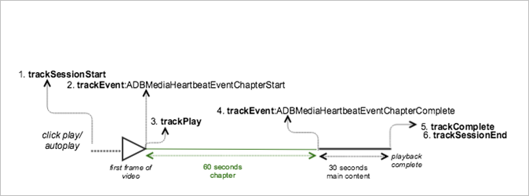

# Reprodução de VOD com um capítulo{#vod-playback-with-one-chapter}

## Cenário {#scenario}

Nesse cenário, uma parte do conteúdo de VOD está marcada como um capítulo.

A menos que seja especificado, as chamadas de rede desse cenário correspondem às chamadas presentes no cenário de [reprodução de VOD sem anúncios](/help/use-cases/tracking-scenarios/vod-no-intrs-details.md). As chamadas de rede ocorrem simultaneamente, mas a carga é diferente.

| Acionador   | Método do Heartbeat   | Chamadas de rede   | Notas   |
|---|---|---|---|
| Cliques do usuário **[!UICONTROL Reproduzir]** | `trackSessionStart` | Início do conteúdo do Analytics, Início do conteúdo do Heartbeat | Ainda não informamos à biblioteca de avaliações que há um anúncio antes da exibição, portanto, essas chamadas de rede ainda são exatamente as mesmas do Single VoD. |
| O capítulo é iniciado. | `trackEvent:ChapterStart` | Heartbeat Chapter Start |  |
| O primeiro quadro do capítulo é reproduzido. | `trackPlay` | Reprodução de conteúdo do Heartbeat | Quando o conteúdo do capítulo é reproduzido antes do conteúdo principal, o Heartbeats começa quando o capítulo é iniciado. |
| O capítulo é reproduzido. |  | Chapter Heartbeats |  |
| O capítulo foi concluído. | `trackEvent:trackChapterComplete` | Heartbeat Chapter Complete | É quando o final do capítulo é atingido. |
| O conteúdo é reproduzido. |  | Content Heartbeats | Essa chamada de rede é a mesma do cenário de [Reprodução de VOD sem anúncios](/help/use-cases/tracking-scenarios/vod-no-intrs-details.md). |
| O conteúdo foi concluído. | `trackComplete` | Heartbeat Content Complete | Essa chamada de rede é a mesma do cenário de [Reprodução de VOD sem anúncios](/help/use-cases/tracking-scenarios/vod-no-intrs-details.md). |
| A sessão foi encerrada. | `trackSessionEnd` |  | `SessionEnd` significa que o final de uma sessão de visualização foi atingido. Essa API deve ser chamada mesmo se o usuário não assistir à mídia até o fim. |

## Parâmetros {#parameters}

Quando a reprodução do capítulo começar, uma chamada `Heartbeat Chapter Start` é enviada. Se o início do capítulo não coincidir com o temporizador de 10 segundos, a chamada `Heartbeat Chapter Start` é atrasada em alguns segundos e é direcionada para o próximo intervalo de 10 segundos.

Quando isso ocorre, uma chamada `Content Heartbeat` é emitida no mesmo intervalo. É possível diferenciar os dois examinando o tipo de evento e o tipo de ativo:

### Heartbeat Chapter Start

| Parâmetro | Valor | Notas |
|---|---|---|
| `s:event:type` | `"chapter_start"` |  |
| `s:asset:type` | `"main"` |  |
| `s:stream:chapter_*` |  | Informações de fluxo específicas aos dados do capítulo. |
| `s:meta:*` |  | Capítulo com dados específicos do contexto. |

## Código de exemplo, capítulo no meio {#sample-code-chapter-in-the-middle}

Nesse cenário, uma parte do conteúdo de VOD é um capítulo.


### Android

Para exibir esse cenário no Android, configure o seguinte código:

```java
// Set up mediaObject 
MediaObject mediaInfo = MediaHeartbeat.createMediaObject( 
  Configuration.MEDIA_NAME,  
  Configuration.MEDIA_ID,  
  Configuration.MEDIA_LENGTH,  
  MediaHeartbeat.StreamType.VOD 
); 

HashMap<String, String> mediaMetadata = new HashMap<String, String>(); 
mediaMetadata.put(CUSTOM_KEY_1, CUSTOM_VAL_1); 
mediaMetadata.put(CUSTOM_KEY_2, CUSTOM_VAL_2); 

// 1. Call trackSessionStart() when the user clicks Play or if autoplay is used,  
//    i.e., there is an intent to start playback.  
_mediaHeartbeat.trackSessionStart(mediaInfo, mediaMetadata); 

...... 
...... 

// 2. Call trackPlay() when the playback actually starts, i.e., first frame of the  
//    ad media is rendered on the screen. 
_mediaHeartbeat.trackPlay(); 

....... 
....... 

// Chapter 
HashMap<String, String> chapterMetadata = new HashMap<String, String>(); 
chapterMetadata.put(CUSTOM_KEY_1, CUSTOM_VAL_1); 
MediaObject chapterDataInfo =  
MediaHeartbeat.createChapterObject(CHAPTER_NAME,  
                                   CHAPTER_POSITION,  
                                   CHAPTER_LENGTH,  
                                   CHAPTER_START_TIME); 

// 3. Track the MediaHeartbeat.Event.ChapterStart event when the chapter starts to play.  
_mediaHeartbeat.trackEvent(MediaHeartbeat.Event.ChapterStart, chapterDataInfo, chapterMetadata); 

....... 
....... 

// 4. Track the MediaHeartbeat.Event.ChapterComplete event when the chapter finishes playing. 
_mediaHeartbeat.trackEvent(MediaHeartbeat.Event.ChapterComplete, null, null); 

....... 
....... 

// 5. Call trackComplete() when the playback reaches the end, i.e., completes and finishes playing. 
_mediaHeartbeat.trackComplete(); 

........ 
........ 

// 6. Call trackSessionEnd() when the playback session is over. This method must be called even  
//    if the user does not watch the media to completion.  
_mediaHeartbeat.trackSessionEnd(); 

........ 
........ 
```

### iOS

Para exibir esse cenário no iOS, configure o seguinte código:

```
when the user clicks Play 
ADBMediaObject *mediaObject =  
[ADBMediaHeartbeat createMediaObjectWithName:MEDIA_NAME  
                   length:MEDIA_LENGTH  
                   streamType:ADBMediaHeartbeatStreamTypeVOD]; 
  
NSMutableDictionary *mediaContextData = [[NSMutableDictionary alloc] init]; 
[mediaContextData setObject:CUSTOM_VAL_1 forKey:CUSTOM_KEY_1]; 
[mediaContextData setObject:CUSTOM_VAL_2 forKey:CUSTOM_KEY_2]; 
 
// 1. Call trackSessionStart when the user clicks Play or if autoplay is used,  
//    i.e., when there is an intent to start playback. 
[_mediaHeartbeat trackSessionStart:mediaObject data:mediaContextData]; 
....... 
....... 

// 2. Call trackPlay when the playback actually starts, i.e., when the  
//    first frame of the main content is rendered on the screen. 
[_mediaHeartbeat trackPlay]; 
....... 
....... 

// Chapter 
NSMutableDictionary *chapterContextData = [[NSMutableDictionary alloc] init]; 
[chapterContextData setObject:CONTEXT_DATA_VALUE forKey:CONTEXT_DATA_KEY]; 

id chapterInfo =  
[ADBMediaHeartbeat createChapterObjectWithName:CHAPTER_NAME  
                   position:CHAPTER_POSITION  
                   length:CHAPTER_LENGTH  
                   startTime:CHAPTER_START_TIME]; 
    
// 3. Track the ADBMediaHeartbeatEventChapterStart event when the chapter  
//    starts to play. 
[_mediaHeartbeat trackEvent:ADBMediaHeartbeatEventChapterStart  
               mediaObject:chapterInfo  
               data:chapterContextData]; 
....... 
....... 

// 4. Track the ADBMediaHeartbeatEventChapterComplete event when the chapter  
//    finishes playing. 
[_mediaHeartbeat trackEvent:ADBMediaHeartbeatEventChapterComplete  
               mediaObject:nil  
               data:nil];  
....... 
....... 
// 5. Call trackComplete when the playback reaches the end, i.e., when the  
//    media completes and finishes playing. 
[_mediaHeartbeat trackComplete]; 
....... 
....... 
// 6. Call trackSessionEnd when the playback session is over. This method must  
//    be called even if the user does not watch the media to completion. 
[_mediaHeartbeat trackSessionEnd]; 
....... 
....... 
```

### JavaScript

Para exibir este cenário em JavaScript, insira o seguinte texto:

```js
// Set up mediaObject 
var mediaInfo = MediaHeartbeat.createMediaObject( 
 Configuration.MEDIA_NAME,  
 Configuration.MEDIA_ID,  
 Configuration.MEDIA_LENGTH,  
 MediaHeartbeat.StreamType.VOD 

); 

var mediaMetadata = { 
  CUSTOM_KEY_1 : CUSTOM_VAL_1,  
  CUSTOM_KEY_2 : CUSTOM_VAL_2,  
  CUSTOM_KEY_3 : CUSTOM_VAL_3 
}; 

// 1. Call trackSessionStart when Play is clicked or if autoplay is used,  
//    i.e., when there's an intent to start playback. 
this._mediaHeartbeat.trackSessionStart(mediaInfo, mediaMetadata); 

...... 
...... 

// Chapter 
var chapterMetadata = { 
  CUSTOM_KEY_1 : CUSTOM_VAL_1 
}; 

var chapterDataInfo =  
MediaHeartbeat.createChapterObject(CHAPTER_NAME,  
                                   CHAPTER_POSITION,  
                                   CHAPTER_LENGTH,  
                                   CHAPTER_START_TIME); 

// 2. Track the MediaHeartbeat.Event.ChapterStart event when the chapter  
//    starts to play. 
this._mediaHeartbeat.trackEvent(MediaHeartbeat.Event.ChapterStart,  
                              chapterDataInfo,  
                              chapterMetadata); 

....... 
....... 

// 3. Call trackPlay() when the playback actually starts, i.e., when the first  
//    frame of the main content is rendered on the screen. 
this._mediaHeartbeat.trackPlay(); 

....... 
....... 

// 4. Track the MediaHeartbeat.Event.ChapterComplete event when the chapter  
//    finishes playing. 
this._mediaHeartbeat.trackEvent(MediaHeartbeat.Event.ChapterComplete); 

....... 
....... 

// 5. Call trackComplete() when the playback reaches the end, i.e., when playback   
//    completes and finishes playing. 
this._mediaHeartbeat.trackComplete(); 

........ 
........ 

// 6. Call trackSessionEnd() when the playback session is over. This method must be  
//    called even if the user does not watch the media to completion. 
this._mediaHeartbeat.trackSessionEnd(); 

........ 
........ 
```

## Código de exemplo, capítulo no início {#sample-code-chapter-at-the-beginning}

Neste cenário, o conteúdo de VOD é reproduzido com um capítulo no início da reprodução.



### Android

Para exibir esse cenário no Android, configure o seguinte código:

```java
// Set up mediaObject 
MediaObject mediaInfo = MediaHeartbeat.createMediaObject( 
  Configuration.MEDIA_NAME,  
  Configuration.MEDIA_ID,  
  Configuration.MEDIA_LENGTH,  
  MediaHeartbeat.StreamType.VOD 
); 

HashMap<String, String> mediaMetadata = new HashMap<String, String>(); 
mediaMetadata.put(CUSTOM_KEY_1, CUSTOM_VAL_1); 
mediaMetadata.put(CUSTOM_KEY_2, CUSTOM_VAL_2); 

// 1. Call trackSessionStart() when the user clicks Play or if autoplay is used,  
//    i.e., there is an intent to start playback.  
_mediaHeartbeat.trackSessionStart(mediaInfo, mediaMetadata); 

...... 
...... 

// 2. Call trackPlay() when the playback actually starts, i.e., first frame of the  
//    main content is rendered on the screen. 
_mediaHeartbeat.trackPlay(); 

....... 
....... 

// Chapter 
HashMap<String, String> chapterMetadata = new HashMap<String, String>(); 
chapterMetadata.put(CUSTOM_KEY_1, CUSTOM_VAL_1); 
MediaObject chapterDataInfo =  
MediaHeartbeat.createChapterObject(CHAPTER_NAME,  
                                   CHAPTER_POSITION,  
                                   CHAPTER_LENGTH,  
                                   CHAPTER_START_TIME); 

// 3. Track the MediaHeartbeat.Event.ChapterStart event when the chapter starts to play.  
_mediaHeartbeat.trackEvent(MediaHeartbeat.Event.ChapterStart, chapterDataInfo, chapterMetadata); 

....... 
....... 

// 4. Track the MediaHeartbeat.Event.ChapterComplete event when the chapter finishes playing. 
_mediaHeartbeat.trackEvent(MediaHeartbeat.Event.ChapterComplete, null, null); 

....... 
....... 

// 5. Call trackComplete() when the playback reaches the end, i.e., when the media completes  
//    and finishes playing. 
_mediaHeartbeat.trackComplete(); 

........ 
........ 

// 6. Call trackSessionEnd() when the playback session is over. This method must be called even  
//    if the user does not watch the media to completion.  
_mediaHeartbeat.trackSessionEnd(); 

........ 
........ 
```

### iOS

Para exibir esse cenário no iOS, configure o seguinte código:

```
when the user clicks Play 
ADBMediaObject *mediaObject =  
[ADBMediaHeartbeat createMediaObjectWithName:MEDIA_NAME  
                   length:MEDIA_LENGTH  
                   streamType:ADBMediaHeartbeatStreamTypeVOD]; 
 
NSMutableDictionary *mediaContextData = [[NSMutableDictionary alloc] init]; 
[mediaContextData setObject:CUSTOM_VAL_1 forKey:CUSTOM_KEY_1]; 
[mediaContextData setObject:CUSTOM_VAL_2 forKey:CUSTOM_KEY_2]; 

// 1. Call trackSessionStart when the user clicks Play or if autoplay is used,  
//    i.e., there is an intent to start playback. 
[_mediaHeartbeat trackSessionStart:mediaObject data:mediaContextData]; 
....... 
....... 

// Chapter 
NSMutableDictionary *chapterContextData = [[NSMutableDictionary alloc] init]; 
[chapterContextData setObject:CONTEXT_DATA_VALUE forKey:CONTEXT_DATA_KEY]; 

id chapterInfo =  
[ADBMediaHeartbeat createChapterObjectWithName:CHAPTER_NAME  
                   position:CHAPTER_POSITION  
                   length:CHAPTER_LENGTH  
                   startTime:CHAPTER_START_TIME]; 
    
// 2. Call ADBMediaHeartbeatEventChapterStart when the chapter starts. 
[_mediaHeartbeat trackEvent:ADBMediaHeartbeatEventChapterStart  
               mediaObject:chapterInfo  
               data:chapterContextData]; 
....... 
....... 

// 3. Call trackPlay when the playback actually starts, i.e., when the 
//    first frame of the main content is rendered on the screen. 
[_mediaHeartbeat trackPlay];  
....... 
....... 

// 4. Call ADBMediaHeartbeatEventChapterComplete when the chapter starts. 
[_mediaHeartbeat trackEvent:ADBMediaHeartbeatEventChapterComplete  
               mediaObject:nil  
               data:nil];  
....... 
....... 

// 5. Call trackComplete when the playback reaches the end, i.e., when the 
//    media completes and finishes playing. 
[_mediaHeartbeat trackComplete]; 
....... 
....... 

// 6. Call trackSessionEnd when the playback session is over. This method  
//    must be called even if the user does not watch the media to completion. 
[_mediaHeartbeat trackSessionEnd]; 
....... 
....... 
```

### JavaScript

Para exibir este cenário em JavaScript, insira o seguinte texto:

```js
// Set up mediaObject 
var mediaInfo = MediaHeartbeat.createMediaObject( 
 Configuration.MEDIA_NAME,  
 Configuration.MEDIA_ID,  
 Configuration.MEDIA_LENGTH,  
 MediaHeartbeat.StreamType.VOD 

); 

var mediaMetadata = { 
  CUSTOM_KEY_1 : CUSTOM_VAL_1,  
  CUSTOM_KEY_2 : CUSTOM_VAL_2,  
  CUSTOM_KEY_3 : CUSTOM_VAL_3 
}; 

// 1. Call trackSessionStart() when Play is clicked or if autoplay is used,  
//    i.e., when there's an intent to start playback. 
this._mediaHeartbeat.trackSessionStart(mediaInfo, mediaMetadata); 

...... 
...... 

// Chapter 
var chapterMetadata = { 
  CUSTOM_KEY_1 : CUSTOM_VAL_1 
}; 

var chapterDataInfo =  
MediaHeartbeat.createChapterObject(CHAPTER_NAME,  
                                   CHAPTER_POSITION,  
                                   CHAPTER_LENGTH,  
                                   CHAPTER_START_TIME); 

// 2. Track the MediaHeartbeat.Event.ChapterStart event when the chapter starts to play. 
this._mediaHeartbeat.trackEvent(MediaHeartbeat.Event.ChapterStart,  
                              chapterDataInfo,  
                              chapterMetadata); 

....... 
....... 

// 3. Call trackPlay() when the playback actually starts, i.e., when the first  
//    frame of the main content is rendered on the screen. 
this._mediaHeartbeat.trackPlay(); 

....... 
....... 

// 4. Track the MediaHeartbeat.Event.ChapterComplete event when the chapter  
//    finishes playing. 
this._mediaHeartbeat.trackEvent(MediaHeartbeat.Event.ChapterComplete); 

....... 
....... 

// 5. Call trackComplete() when the playback reaches the end, i.e., when playback   
//    completes and finishes playing. 
this._mediaHeartbeat.trackComplete(); 

........ 
........ 

// 6. Call trackSessionEnd() when the playback session is over. This method must be  
//    called even if the user does not watch the media to completion. 
this._mediaHeartbeat.trackSessionEnd(); 

........ 
........ 
```
