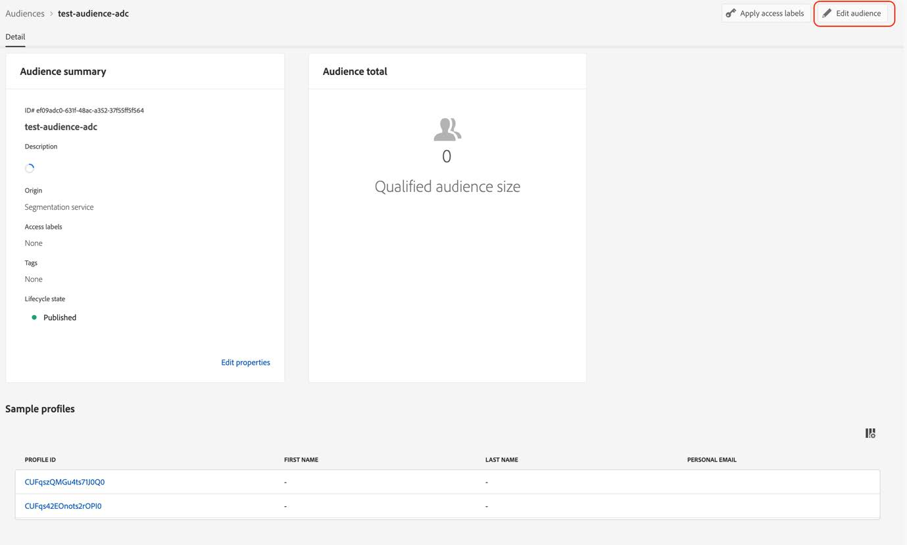

# Migrar públicos-alvo para os novos campos de mídia de transmissão

Este documento descreve como um público-alvo que usa campos do tipo de dados de serviços de mídia de transmissão da Adobe chamado &quot;Mídia&quot; deve ser migrado para usar o novo tipo de dados correspondente chamado &quot;[Detalhes de relatórios de mídia](https://experienceleague.adobe.com/pt-br/docs/experience-platform/xdm/data-types/media-reporting-details)&quot;.&quot;

## Migrar um público-alvo

Para migrar um público do tipo de dados antigo chamado &quot;Mídia&quot; para o novo tipo de dados chamado &quot;[Detalhes de relatórios de mídia](https://experienceleague.adobe.com/pt-br/docs/experience-platform/xdm/data-types/media-reporting-details)&quot;, edite o público e, em cada regra, substitua o campo antigo do tipo de dados obsoleto pelo novo campo correspondente do novo tipo de dados:

1. Localize regras que contenham campos do tipo de dados &quot;Mídia&quot; obsoleto. Todos os campos começam com o caminho `media.mediaTimed`.

1. Duplique essas regras usando campos do novo tipo de dados &quot;[Detalhes de Relatórios de Mídia](https://experienceleague.adobe.com/pt-br/docs/experience-platform/xdm/data-types/media-reporting-details)&quot;.

1. Mantenha ambas as regras em vigor até validar que os públicos-alvo estão funcionando como esperado.

1. Remova as regras que contêm campos do tipo de dados obsoleto &quot;Mídia&quot;.

1. Verifique se os públicos-alvo ainda estão funcionando como esperado.

Consulte o parâmetro [ID de Conteúdo](https://experienceleague.adobe.com/pt-br/docs/media-analytics/using/implementation/variables/audio-video-parameters#content-id) na página [Parâmetros de áudio e vídeo](https://experienceleague.adobe.com/pt-br/docs/media-analytics/using/implementation/variables/audio-video-parameters) para mapear entre os campos antigos e os novos campos. O caminho de campo antigo é encontrado na propriedade &quot;Caminho do campo XDM&quot;, enquanto o novo caminho de campo é encontrado na propriedade &quot;Caminho do campo XDM do relatório&quot;.

## Exemplo

Para facilitar o cumprimento das diretrizes de migração, considere o exemplo a seguir, que contém um público-alvo com uma única regra. Como o público-alvo tem uma única regra, é necessário aplicar as diretrizes de migração apenas uma vez.

1. Selecione o botão [!UICONTROL **Editar público-alvo**] no canto superior direito.

1. Localize as regras configuradas para o público-alvo.

   

   

1. Selecione a regra para abrir sua configuração.

   

1. (Opcional) Para exibir o caminho do campo usado na regra, selecione o botão de informações próximo ao nome do campo.

   

1. Identifique o nome do campo (neste caso, &quot;Inícios da mídia&quot;).

   

1. Consulte a página [Parâmetros de áudio e vídeo](https://experienceleague.adobe.com/pt-br/docs/media-analytics/using/implementation/variables/audio-video-parameters) para mapear entre os campos antigos. O caminho de campo antigo pode ser encontrado na propriedade &quot;Caminho do campo XDM&quot;, enquanto o novo caminho de campo pode ser encontrado na propriedade &quot;Caminho do campo XDM do relatório&quot;. Por exemplo, para o parâmetro [Inícios da mídia](https://experienceleague.adobe.com/pt-br/docs/media-analytics/using/implementation/variables/audio-video-parameters#media-starts), o correspondente para `media.mediaTimed.impressions.value` é `mediaReporting.sessionDetails.isViewed`.

   

1. Adicione a mesma regra da existente usando o novo campo.

   

   

   

1. Selecione [!UICONTROL **Salvar**] para salvar a audiência. Você pode manter essa configuração pelo tempo necessário para validar se o público-alvo ainda está funcionando como esperado.

1. Após a conclusão da validação, remova o campo antigo e selecione [!UICONTROL **Salvar**] para salvar o público-alvo.

   

1. Valide o público-alvo novamente.

   O processo de migração de público-alvo foi concluído.
