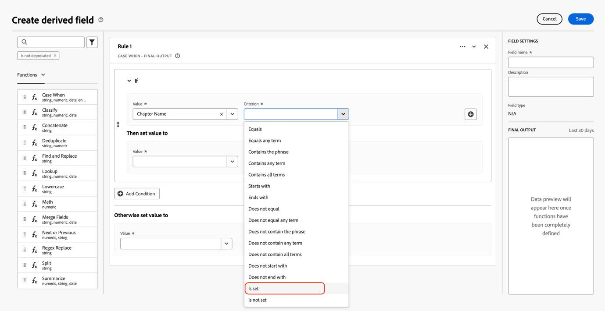

# Migrar o Customer Journey Analytics para usar os novos campos de mídia de transmissão

Este documento descreve como uma configuração do Customer Journey Analytics que usa o tipo de dados de serviços de mídia de transmissão Adobe chamado &quot;Mídia&quot; deve ser atualizada para usar o novo tipo de dados correspondente chamado &quot;[Detalhes de Relatórios de Mídia](https://experienceleague.adobe.com/en/docs/experience-platform/xdm/data-types/media-reporting-details)&quot;.&quot;

## Migrar Customer Journey Analytics

Para migrar uma configuração do Customer Journey Analytics do tipo de dados antigo chamado &quot;Mídia&quot; para o novo tipo de dados chamado &quot;[Detalhes do relatório de mídia](https://experienceleague.adobe.com/en/docs/experience-platform/xdm/data-types/media-reporting-details)&quot;, atualize as seguintes configurações que estão usando o tipo de dados antigo:

* Visualizações de dados

* Campos derivados

### Migrar visualizações de dados

Para migrar as visualizações de dados para o novo tipo de dados:

1. Localize todas as visualizações de dados usando o tipo de dados obsoleto &quot;Mídia&quot;. Todos estes são campos cujo caminho começa com `media.mediaTimed`.

1. Realize uma das seguintes ações:

   * Nessas visualizações de dados, insira os campos do novo tipo de dados &quot;Detalhes de relatórios de mídia&quot;.

   * Crie um campo derivado que use o novo tipo de dados &quot;Detalhes de relatórios de mídia&quot; se estiver definido, ou que retorne ao tipo de dados &quot;Mídia&quot; antigo se o tipo de dados &quot;Detalhes de relatórios de mídia&quot; não estiver definido.

### Migrar campos derivados

Para migrar campos derivados para o novo tipo de dados:

1. Localize todos os campos derivados usando o tipo de dados obsoleto &quot;Mídia&quot;. Todos esses são campos derivados que contêm campos para os quais o caminho começa com `media.mediaTimed`.

1. Substitua todos os campos antigos no campo derivado pelo novo campo correspondente de &quot;Detalhes de relatórios de mídia&quot;.

Consulte o parâmetro [ID de Conteúdo](https://experienceleague.adobe.com/en/docs/media-analytics/using/implementation/variables/audio-video-parameters#content-id) na página [Parâmetros de áudio e vídeo](https://experienceleague.adobe.com/pt-br/docs/media-analytics/using/implementation/variables/audio-video-parameters) para mapear entre os campos antigos e os novos campos. O caminho de campo antigo é encontrado na propriedade &quot;Caminho do campo XDM&quot;, enquanto o novo caminho de campo é encontrado na propriedade &quot;Caminho do campo XDM do relatório&quot;.

## Exemplo

Para facilitar o cumprimento das diretrizes de migração, considere o exemplo a seguir que contém uma visualização de dados com campos do tipo de dados obsoleto antigo &quot;Mídia&quot;. Nessa visualização de dados, é necessário adicionar os novos campos correspondentes.

### Atualizar a visualização de dados

Você pode usar qualquer uma das seguintes opções para atualizar a visualização de dados:

#### Opção 1

1. Localize uma métrica ou uma dimensão que esteja usando o campo antigo do tipo de dados obsoleto.

   

1. Verifique o novo campo correspondente na seção [Chapter offset](https://experienceleague.adobe.com/en/docs/media-analytics/using/implementation/variables/chapter-parameters#chapter-offset) do artigo [Chapter parameters](https://experienceleague.adobe.com/pt-br/docs/media-analytics/using/implementation/variables/chapter-parameters).

1. Localize o novo campo correspondente na visualização de dados.

   

1. Arraste o novo campo para a métrica ou dimensão.

1. Repita esse processo para todas as métricas e dimensões que usam campos do tipo de dados obsoleto &quot;Mídia&quot;.

#### Opção 2

Essa opção cria um campo derivado que seleciona o valor do campo antigo ou o valor do novo campo com base no qual existe para um evento específico. Esse campo derivado substitui o tipo de dados antigo &quot;Mídia&quot; em qualquer projeto em que estiver sendo usado.

Se você quiser criar um campo derivado para o &quot;Nome do capítulo&quot; que usa o novo tipo de dados &quot;Detalhes de relatórios de mídia&quot;, se estiver definido, ou que retorna ao tipo de dados &quot;Mídia&quot; antigo, se o tipo de dados &quot;Detalhes de relatórios de mídia&quot; não estiver definido:

1. Arraste uma cláusula &quot;Case When&quot; para os campos derivados.

   

1. Preencha a cláusula [!UICONTROL **If**] usando o valor do **Caminho do Campo XDM do Relatório**, conforme mostrado no parâmetro [Nome do capítulo](https://experienceleague.adobe.com/en/docs/media-analytics/using/implementation/variables/chapter-parameters#chapter-name) na página [Parâmetros de capítulo](https://experienceleague.adobe.com/pt-br/docs/media-analytics/using/implementation/variables/chapter-parameters).

   

   

   

   

1. Preencha o valor de fallback usando o campo antigo do tipo de dados obsoleto &quot;Mídia&quot;.

   

   

   Essa é a definição final do campo derivado.

   

1. Para atualizar os campos derivados, localize um campo derivado que esteja usando os campos obsoletos antigos (caminho que começa com `media.mediaTimed`).

   

1. Passe o mouse sobre o campo derivado que você deseja atualizar e selecione o ícone [!UICONTROL **Editar**].

1. Localize todos os campos do tipo de dados antigo (caminho que começa com `media.mediaTimed`) e substitua-os pelo novo campo correspondente.

   

1. Verifique o novo campo correspondente na seção [Nome do Conteúdo (variável)](https://experienceleague.adobe.com/en/docs/media-analytics/using/implementation/variables/audio-video-parameters#content-name-variable) no artigo [Parâmetros de mídia de streaming](https://experienceleague.adobe.com/en/docs/media-analytics/using/implementation/variables/audio-video-parameters#content-name-variable).

1. Substitua o campo antigo pelo novo campo.

   

1. Repita esse processo para todos os campos derivados usando campos do tipo de dados obsoleto antigo &quot;Mídia&quot;.

   A migração da configuração do CJA foi concluída.
