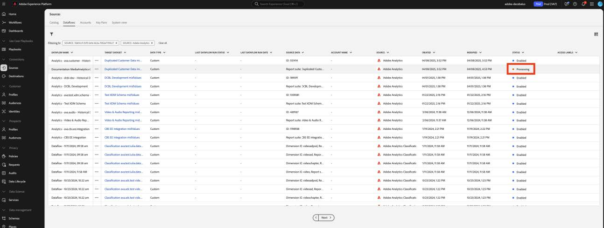
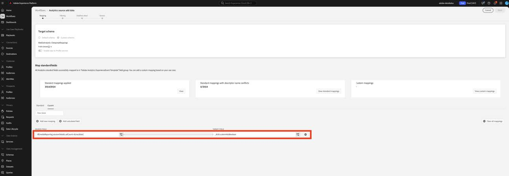

# Migrar Preparo de dados para campos personalizados para os novos campos de mídia de transmissão

Este documento descreve o processo de migração do serviço de Preparo de dados que existe sobre os fluxos de coleta de dados do Adobe ativados para dados de coleta de mídia de transmissão do Adobe. A migração converte um mapeamento de Preparo de Dados do tipo de dados da Coleção de Mídia de Streaming do Adobe chamado &quot;Mídia&quot; para usar o novo tipo de dados correspondente chamado &quot;[Detalhes de Relatórios de Mídia](https://experienceleague.adobe.com/pt-br/docs/experience-platform/xdm/data-types/media-reporting-details)&quot;.&quot;

## Migrar preparação de dados para campos personalizados

Para migrar os mapeamentos de Preparo de dados do tipo de dados antigo chamado &quot;Mídia&quot; para o novo tipo de dados chamado &quot;[Detalhes de Relatórios de Mídia](https://experienceleague.adobe.com/pt-br/docs/experience-platform/xdm/data-types/media-reporting-details)&quot;, edite os mapeamentos de Preparo de Dados:

>[!IMPORTANT]
>
>Para evitar a perda de dados, verifique se o conector de origem do Analytics foi implantado usando os novos campos `mediaReporting` antes de concluir as etapas desta seção.

1. Na Adobe Experience Platform, na seção [!UICONTROL **Fontes**], vá para a guia [!UICONTROL **Fluxos de Dados**].

1. Localize o fluxo de dados responsável pela importação de dados de mídia de transmissão do Adobe Analytics para o Adobe Experience Platform por meio da Coleção de dados da Adobe.

1. Selecione [!UICONTROL **Atualizar fluxo de dados**] para modificar a configuração do Preparo de dados substituindo cada mapeamento de origem personalizado que contenha um campo obsoleto pelo novo campo correspondente do novo objeto XDM.

1. Localize os mapeamentos que contêm campos de origem do objeto &quot;Mídia&quot; obsoleto.

1. Substitua essas fontes usando campos do novo objeto &quot;Detalhes de relatórios de mídia&quot;.

1. Valide se os mapeamentos ainda estão funcionando como esperado.

Consulte o parâmetro [ID de Conteúdo](https://experienceleague.adobe.com/pt-br/docs/media-analytics/using/implementation/variables/audio-video-parameters#content-id) na página [Parâmetros de áudio e vídeo](https://experienceleague.adobe.com/pt-br/docs/media-analytics/using/implementation/variables/audio-video-parameters) para mapear entre os campos antigos e os novos campos. O caminho de campo antigo é encontrado na propriedade &quot;Caminho do campo XDM&quot;, enquanto o novo caminho de campo é encontrado na propriedade &quot;Caminho do campo XDM do relatório&quot;.

## Exemplo

Para facilitar o cumprimento das diretrizes de migração, considere o exemplo de fluxo de dados a seguir que contém um único mapeamento. Nesse caso, você precisa aplicar as diretrizes de migração apenas uma vez.

1. Na Adobe Experience Platform, na seção [!UICONTROL **Fontes**], vá para a guia [!UICONTROL **Fluxos de Dados**].

1. Localize o fluxo de dados responsável pela importação de dados de mídia de transmissão do Adobe Analytics para o Adobe Experience Platform por meio da Coleção de dados da Adobe.

1. Selecione **[!UICONTROL Atualizar fluxo de dados]** para inserir a interface de edição conforme mostrado na imagem abaixo.

   

1. Na guia **[!UICONTROL Mapeamento]**, selecione **[!UICONTROL Personalizado]**.

1. Identifique os mapeamentos personalizados que dependem dos campos `media.mediaTimed` como fontes.

   

   Neste exemplo, como você criou um grupo de campos personalizados no esquema na organização de desenvolvimento, o campo de destino está abaixo de `_dcbl`. O caminho do grupo de campos personalizados é diferente com base no nome da organização.

1. Para cada mapeamento que usa o objeto `media.mediaTimed`, encontre seu correspondente no objeto `mediaReporting` usando esta documentação.

   Por exemplo, para Rede, o correspondente para `media.mediaTimed.primaryAssetViewDetails`.broadcastNetwork é `mediaReporting.sessionDetails.network`.

   

1. No campo **[!UICONTROL Source field]**, substitua o caminho `media.mediaTimed` pelo caminho `mediaReporting`. O campo de destino permanece inalterado.

   

1. Selecione **[!UICONTROL Avançar]** para salvar as alterações.

   O status é exibido como **[!UICONTROL Processando]**. Depois que as alterações forem aplicadas, o status será exibido como **[!UICONTROL Habilitado]**.

   

## Exemplo com tipos de dados diferentes

No exemplo acima, todos os tipos de dados envolvidos eram String, então a substituição de mapeamento era direta.

Se o tipo de dados do campo de origem for diferente do tipo de dados do campo de destino, você precisará seguir as diretrizes do [Guia de solução de problemas de Preparo de Dados](https://experienceleague.adobe.com/pt-br/docs/experience-platform/data-prep/troubleshooting-guide), [Manuseio de formatos de dados com Preparo de Dados](https://experienceleague.adobe.com/pt-br/docs/experience-platform/data-prep/data-handling) e [Funções de mapeamento de Preparo de Dados](https://experienceleague.adobe.com/pt-br/docs/experience-platform/data-prep/data-handling).

Por exemplo, se o tipo de origem for uma string e o tipo de destino for um booleano, o Preparo de dados poderá analisar automaticamente o valor e converter o valor de origem em um booleano.

Se o tipo de origem for um número e o tipo de destino for um booleano, você precisará usar funções de manipulação de dados:

Mapeando com `media.mediaTimed` para um campo personalizado.

Mapeando com `mediaReporting` para o mesmo campo personalizado:

