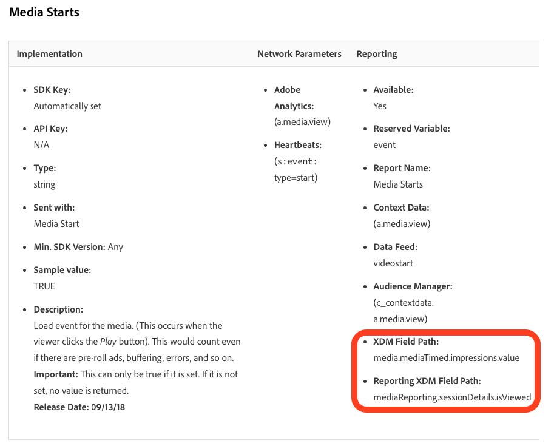

# Migrar perfis para os novos campos de mídia de streaming

Este documento descreve o processo de migração do serviço de filtragem de perfil que existe sobre os fluxos de coleta de dados do Adobe ativados para o Adobe Analytics para dados de mídia de streaming. A migração converte o serviço de filtragem de perfis de usar o tipo de dados Coleção de mídia de streaming da Adobe chamado &quot;Mídia&quot; para usar o novo tipo de dados correspondente chamado &quot;[Detalhes de relatórios de mídia](https://experienceleague.adobe.com/en/docs/experience-platform/xdm/data-types/media-reporting-details).&quot;

## Migrar perfis

Para migrar a filtragem de perfil do tipo de dados antigo chamado &quot;Mídia&quot; para o novo tipo de dados chamado &quot;[Detalhes de Relatórios de Mídia](https://experienceleague.adobe.com/en/docs/experience-platform/xdm/data-types/media-reporting-details)&quot;, edite as regras de filtragem de perfil existentes:

1. Na Adobe Experience Platform, na seção [!UICONTROL **Fontes**], vá para a guia [!UICONTROL **Fluxos de Dados**].

1. Localize o fluxo de dados responsável pela importação de dados de mídia de transmissão do Adobe Analytics para o Adobe Experience Platform por meio da coleção de dados do Adobe.

1. Selecione [!UICONTROL **Atualizar fluxo de dados**] para modificar a configuração da filtragem de perfil, substituindo cada regra personalizada que contenha um campo obsoleto pelo novo campo correspondente do novo objeto XDM.

1. Localize os filtros que contêm campos do objeto &quot;Mídia&quot; obsoleto.

1. Anexe esses filtros adicionando campos do novo objeto &quot;Detalhes de relatórios de mídia&quot;.

1. Use um operador OR entre os dois campos;

1. Valide se os perfis ainda estão funcionando como esperado.

Consulte o parâmetro [ID de Conteúdo](https://experienceleague.adobe.com/en/docs/media-analytics/using/implementation/variables/audio-video-parameters#content-id) na página [Parâmetros de áudio e vídeo](https://experienceleague.adobe.com/pt-br/docs/media-analytics/using/implementation/variables/audio-video-parameters) para mapear entre os campos antigos e os novos campos. O caminho de campo antigo pode ser encontrado na propriedade &quot;Caminho do campo XDM&quot;, enquanto o novo caminho de campo pode ser encontrado na propriedade &quot;Caminho do campo XDM do relatório&quot;.

## Exemplo

Para facilitar o cumprimento das diretrizes de migração, considere o exemplo de fluxo de dados a seguir que contém uma única regra de filtragem de perfil. Nesse caso, como há apenas uma única regra, é necessário aplicar as diretrizes de migração apenas uma vez.

1. Na Adobe Experience Platform, na seção [!UICONTROL **Fontes**], vá para a guia [!UICONTROL **Fluxos de Dados**].

1.Localize o fluxo de dados responsável pela importação de dados de mídia de transmissão do Adobe Analytics para o Adobe Experience Platform via Adobe Analytics.

1. Selecione **[!UICONTROL Atualizar fluxo de dados]** para inserir a interface de edição conforme mostrado na imagem abaixo.

   

1. Selecione **[!UICONTROL Avançar]** para ir para a guia Filtragem.

   

1. Na guia **[!UICONTROL Filtragem]**, identifique as regras de filtragem que dependem dos campos `media.mediaTimed`.

   

   Para cada filtro que usa o objeto media.mediaTimed, encontre seu correspondente no objeto `mediaReporting` usando a página [Parâmetros de áudio e vídeo](https://experienceleague.adobe.com/pt-br/docs/media-analytics/using/implementation/variables/audio-video-parameters) para mapear entre os campos antigos e os novos campos. O caminho de campo antigo é encontrado na propriedade &quot;Caminho do campo XDM&quot;, enquanto o novo caminho de campo é encontrado na propriedade &quot;Caminho do campo XDM do relatório&quot;. Por exemplo, para [Inícios da mídia](https://experienceleague.adobe.com/en/docs/media-analytics/using/implementation/variables/audio-video-parameters#media-starts), o correspondente para `media.mediaTimed.impressions.value` é `mediaReporting.sessionDetails.isViewed`.

   

1. Arraste o campo `mediaReporting` relevante para a regra de filtragem e use o operador OR entre as duas regras. Adicione a mesma regra da existente ao usar o novo campo.

   

1. Selecione **[!UICONTROL Avançar]** para salvar as alterações.
